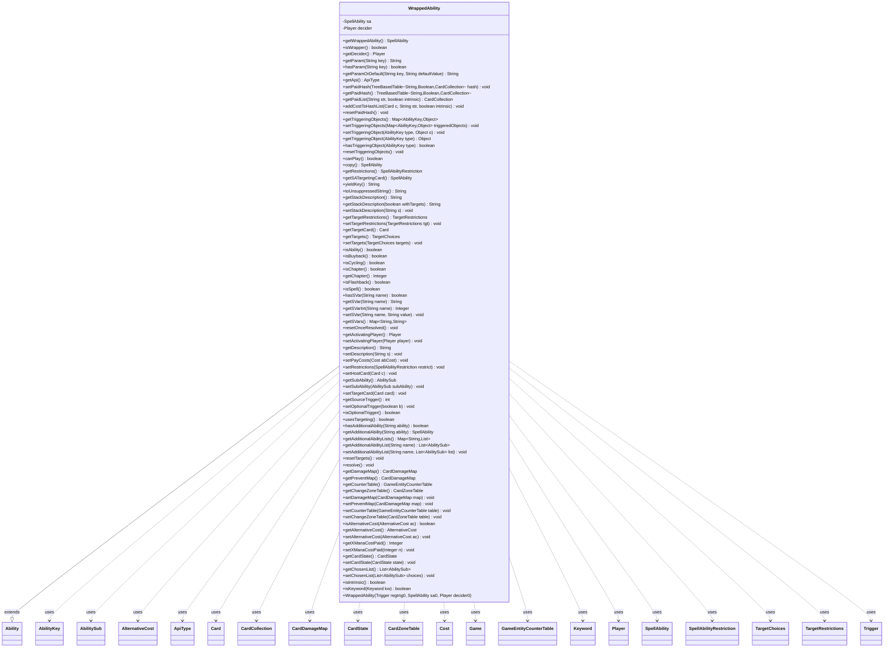

---
aliases:
  - WrappedAbility
tags:
  - java/class
  - module/forge-game
  - pkg/forge/game/trigger
fqn: forge.game.trigger.WrappedAbility
package: forge.game.trigger
module: forge-game
kind: Class
---

# WrappedAbility

**Package:** `forge.game.trigger`   **Module:** `forge-game`   **Kind:** Class



## Relationships
**Extends:**
- [[forge.game.spellability.Ability|Ability]]
**Uses:**
- [[forge.game.Game|Game]]
- [[forge.game.GameEntityCounterTable|GameEntityCounterTable]]
- [[forge.game.ability.AbilityKey|AbilityKey]]
- [[forge.game.ability.ApiType|ApiType]]
- [[forge.game.card.Card|Card]]
- [[forge.game.card.CardCollection|CardCollection]]
- [[forge.game.card.CardDamageMap|CardDamageMap]]
- [[forge.game.card.CardState|CardState]]
- [[forge.game.card.CardZoneTable|CardZoneTable]]
- [[forge.game.cost.Cost|Cost]]
- [[forge.game.keyword.Keyword|Keyword]]
- [[forge.game.player.Player|Player]]
- [[forge.game.spellability.AbilitySub|AbilitySub]]
- [[forge.game.spellability.AlternativeCost|AlternativeCost]]
- [[forge.game.spellability.SpellAbility|SpellAbility]]
- [[forge.game.spellability.SpellAbilityRestriction|SpellAbilityRestriction]]
- [[forge.game.spellability.TargetChoices|TargetChoices]]
- [[forge.game.spellability.TargetRestrictions|TargetRestrictions]]
- [[forge.game.trigger.Trigger|Trigger]]

## Design Description

WrappedAbility is a `SpellAbility` decorator that wraps a triggered ability so its intervening "if" requirements can be re-evaluated at resolution time rather than only when the trigger fires. Extending `Ability`, it holds the wrapped `SpellAbility` and a `decider` Player, and forwards virtually every `SpellAbility` accessor and mutator—parameters, targeting, paid-cost hashes, triggering objects, SVars, damage/counter/zone tables—to the delegate so the wrapper is transparent to all callers, while overriding `getStackDescription`/`yieldKey`/`toUnsuppressedString` to augment text with trigger information.

The core method is `resolve()`, which collaborates with the `Trigger` and `Game` to run requirement and resolved-limit checks, applies any `ResolvingCheck` parameter, prompts the `decider` (re-choosing a controller if it left the game) to confirm optional triggers, and only then plays the wrapped ability off-stack. The deliberately exhaustive delegation reflects the design intent noted in the source: it must cover every `SpellAbility` method to handle hardcoded overriding abilities.

## Source
`forge-game/src/main/java/forge/game/trigger/WrappedAbility.java`

```java
package forge.game.trigger;

import java.util.List;
import java.util.Map;

import com.google.common.collect.Maps;
import com.google.common.collect.TreeBasedTable;

import forge.card.mana.ManaCost;
import forge.game.Game;
import forge.game.GameEntityCounterTable;
import forge.game.ability.AbilityKey;
import forge.game.ability.ApiType;
import forge.game.ability.SpellAbilityEffect;
import forge.game.card.Card;
import forge.game.card.CardCollection;
import forge.game.card.CardDamageMap;
import forge.game.card.CardState;
import forge.game.card.CardZoneTable;
import forge.game.cost.Cost;
import forge.game.keyword.Keyword;
import forge.game.player.Player;
import forge.game.spellability.Ability;
import forge.game.spellability.AbilitySub;
import forge.game.spellability.AlternativeCost;
import forge.game.spellability.SpellAbility;
import forge.game.spellability.SpellAbilityRestriction;
import forge.game.spellability.TargetChoices;
import forge.game.spellability.TargetRestrictions;

// Wrapper ability that checks the requirements again just before
// resolving, for intervening if clauses.
// Yes, it must wrap ALL SpellAbility methods in order to handle
// possible corner cases.
// (The trigger can have a hardcoded OverridingAbility which can make
// use of any of the methods)
public class WrappedAbility extends Ability {

    private final SpellAbility sa;
    private Player decider;

    public WrappedAbility(final Trigger regtrig0, final SpellAbility sa0, final Player decider0) {
        super(sa0.getHostCard(), ManaCost.ZERO);
        setTrigger(regtrig0);
        sa = sa0;
        sa.setTrigger(regtrig0);
        decider = decider0;
    }

    public SpellAbility getWrappedAbility() {
        return sa;
    }

    @Override
    public boolean isWrapper() {
        return true;
    }

    public Player getDecider() {
        return decider;
    }

    @Override
    public String getParam(String key) { return sa.getParam(key); }

    @Override
    public boolean hasParam(String key) { return sa.hasParam(key); }

    @Override
    public String getParamOrDefault(String key, String defaultValue) { return sa.getParamOrDefault(key, defaultValue); }

    @Override
    public ApiType getApi() {
        return sa.getApi();
    }

    @Override
    public void setPaidHash(final TreeBasedTable<String, Boolean, CardCollection> hash) {
        sa.setPaidHash(hash);
    }

    @Override
    public TreeBasedTable<String, Boolean, CardCollection> getPaidHash() {
        return sa.getPaidHash();
    }

    @Override
    public CardCollection getPaidList(final String str, boolean intrinsic) {
        return sa.getPaidList(str, intrinsic);
    }

    @Override
    public void addCostToHashList(final Card c, final String str, final boolean intrinsic) {
        sa.addCostToHashList(c, str, intrinsic);
    }

    @Override
    public void resetPaidHash() {
        sa.resetPaidHash();
    }

    @Override
    public Map<AbilityKey, Object> getTriggeringObjects() {
        return sa.getTriggeringObjects();
    }

    @Override
    public void setTriggeringObjects(final Map<AbilityKey, Object> triggeredObjects) {
        sa.setTriggeringObjects(triggeredObjects);
    }

    @Override
    public void setTriggeringObject(final AbilityKey type, final Object o) {
        sa.setTriggeringObject(type, o);
    }

    @Override
    public Object getTriggeringObject(final AbilityKey type) {
        return sa.getTriggeringObject(type);
    }

    @Override
    public boolean hasTriggeringObject(final AbilityKey type) {
        return sa.hasTriggeringObject(type);
    }

    @Override
    public void resetTriggeringObjects() {
        sa.resetTriggeringObjects();
    }

    @Override
    public boolean canPlay() {
        return sa.canPlay();
    }

    @Override
    public SpellAbility copy() {
        return sa.copy();
    }

    @Override
    public SpellAbilityRestriction getRestrictions() {
        return sa.getRestrictions();
    }

    @Override
    public SpellAbility getSATargetingCard() {
        return sa.getSATargetingCard();
    }

    // key for autoyield - if there is a trigger use its description as the wrapper now has triggering information in its description
    @Override
    public String yieldKey() {
        if (getTrigger() != null) {
            if (getHostCard() != null) {
                return getHostCard().toString() + ": " + getTrigger().toString();
            }
            return getTrigger().toString();
        }
        return super.yieldKey();
    }

    // include triggering information so that different effects look different
    // this information is in the stack description so just use that
    // a real solution would include only the triggering information that actually is used, but that's a major change
    @Override
    public String toUnsuppressedString() {
        String desc = this.getStackDescription(false); /* use augmented stack description as string for wrapped things */
        String card = getHostCard().toString();
        if (!desc.contains(card) && desc.contains(" this ")) { /* a hack for Evolve and similar that don't have CARDNAME */
                return card + ": " + desc;
        }
        return desc;
    }

    @Override
    public String getStackDescription() {
        return getStackDescription(true);
    }

    public String getStackDescription(boolean withTargets) {
        final Trigger regtrig = getTrigger();
        if (regtrig == null) return "";
        final StringBuilder sb =
                new StringBuilder(regtrig.replaceAbilityText(regtrig.toString(true), this, true));
        if (!regtrig.getTriggerRemembered().isEmpty()) {
            sb.append(" (").append(regtrig.getTriggerRemembered()).append(")");
        }

        // prevent text growing too long when SA target other in a chain and also potential StackOverflow
        if (withTargets) {
            List<TargetChoices> allTargets = sa.getAllTargetChoices();
            if (!allTargets.isEmpty() && !ApiType.Charm.equals(sa.getApi())) {
                sb.append(" (Targeting: ");
                sb.append(allTargets);
                sb.append(")");
            }
        }

        String important = regtrig.getImportantStackObjects(this);
        if (!important.isEmpty()) {
            sb.append(" [");
            sb.append(important);
            sb.append("]");
        }

        return sb.toString();
    }

    @Override
    public void setStackDescription(final String s) {
        sa.setStackDescription(s);
    }

    @Override
    public TargetRestrictions getTargetRestrictions() {
        return sa.getTargetRestrictions();
    }
    @Override
    public void setTargetRestrictions(final TargetRestrictions tgt) {
        sa.setTargetRestrictions(tgt);
    }

    @Override
    public Card getTargetCard() {
        return sa.getTargetCard();
    }

    @Override
    public TargetChoices getTargets() {
        return sa.getTargets();
    }
    @Override
    public void setTargets(TargetChoices targets) {
        sa.setTargets(targets);
    }

    @Override
    public boolean isAbility() {
        return sa.isAbility();
    }

    @Override
    public boolean isBuyback() {
        return sa.isBuyback();
    }

    @Override
    public boolean isCycling() {
        return sa.isCycling();
    }

    @Override
    public boolean isChapter() {
        return sa.isChapter();
    }

    @Override
    public Integer getChapter() {
        return sa.getChapter();
    }

    @Override
    public boolean isFlashback() {
        return sa.isFlashback();
    }

    @Override
    public boolean isSpell() {
        return sa.isSpell();
    }

    @Override
    public boolean hasSVar(String name) {
        return sa.hasSVar(name);
    }

    @Override
    public String getSVar(String name) {
        return sa.getSVar(name);
    }

    @Override
    public Integer getSVarInt(String name) {
        return sa.getSVarInt(name);
    }

    @Override
    public void setSVar(final String name, final String value) {
        sa.setSVar(name, value);
    }

    @Override
    public Map<String, String> getSVars() {
        return sa.getSVars();
    }

    @Override
    public void resetOnceResolved() {
        // Fixing an issue with Targeting + Paying Mana
        // sa.resetOnceResolved();
    }

    @Override
    public Player getActivatingPlayer() {
        return sa.getActivatingPlayer();
    }
    @Override
    public void setActivatingPlayer(final Player player) {
        sa.setActivatingPlayer(player);
    }

    @Override
    public String getDescription() {
        return sa.getDescription();
    }
    @Override
    public void setDescription(final String s) {
        sa.setDescription(s);
    }

    @Override
    public void setPayCosts(final Cost abCost) {
        sa.setPayCosts(abCost);
    }

    @Override
    public void setRestrictions(final SpellAbilityRestriction restrict) {
        sa.setRestrictions(restrict);
    }

    @Override
    public void setHostCard(final Card c) {
        sa.setHostCard(c);
    }

    @Override
    public AbilitySub getSubAbility() {
        return sa.getSubAbility();
    }
    @Override
    public void setSubAbility(final AbilitySub subAbility) {
        sa.setSubAbility(subAbility);
    }

    @Override
    public void setTargetCard(final Card card) {
        sa.setTargetCard(card);
    }

    @Override
    public int getSourceTrigger() {
        return sa.getSourceTrigger();
    }

    @Override
    public void setOptionalTrigger(final boolean b) {
        sa.setOptionalTrigger(b);
    }

    @Override
    public boolean isOptionalTrigger() {
        return sa.isOptionalTrigger();
    }

    @Override
    public boolean usesTargeting() {
        return sa.usesTargeting();
    }

    @Override
    public boolean hasAdditionalAbility(String ability) {
        return sa.hasAdditionalAbility(ability);
    }

    @Override
    public SpellAbility getAdditionalAbility(String ability) {
        return sa.getAdditionalAbility(ability);
    }

    public Map<String, List<AbilitySub>> getAdditionalAbilityLists() {
        return sa.getAdditionalAbilityLists();
    }
    public List<AbilitySub> getAdditionalAbilityList(final String name) {
        return sa.getAdditionalAbilityList(name);
    }
    public void setAdditionalAbilityList(final String name, final List<AbilitySub> list) {
        sa.setAdditionalAbilityList(name, list);
    }

    @Override
    public void resetTargets() {
        sa.resetTargets();
    }

    // //////////////////////////////////////
    // THIS ONE IS ALL THAT MATTERS
    // //////////////////////////////////////
    @Override
    public void resolve() {
        final Game game = getActivatingPlayer().getGame();
        final Trigger regtrig = getTrigger();

        if (!(TriggerType.Always.equals(regtrig.getMode())) && !regtrig.hasParam("NoResolvingCheck")) {
            // Most State triggers don't have "Intervening If"
            if (!regtrig.requirementsCheck(game)) {
                return;
            }
            // Since basic requirements check only cares about whether it's "Activated"
            // Also check on triggered object specific requirements on resolution (e.g. evolve)
            if (!regtrig.meetsRequirementsOnTriggeredObjects(game, getTriggeringObjects())) {
                return;
            }
        }

        if (!regtrig.checkResolvedLimit(getActivatingPlayer())) {
            return;
        }

        if (regtrig.hasParam("ResolvingCheck")) {
            // rare cases: Hidden Predators (state trigger, but have "Intervening If" to check IsPresent2) etc.
            Map<String, String> recheck = Maps.newHashMap();
            String key = regtrig.getParam("ResolvingCheck");
            recheck.put(key, regtrig.getParam(key));
            if (!meetsCommonRequirements(recheck)) {
                return;
            }
        }

        if (decider != null) {
            if (!decider.isInGame()) {
                decider = SpellAbilityEffect.getNewChooser(sa, decider);
            }
            if (!decider.getController().confirmTrigger(this)) {
                return;
            }
        }

        getActivatingPlayer().getController().playSpellAbilityNoStack(sa, false);
    }

    @Override
    public CardDamageMap getDamageMap() {
        return sa.getDamageMap();
    }
    @Override
    public CardDamageMap getPreventMap() {
        return sa.getPreventMap();
    }
    @Override
    public GameEntityCounterTable getCounterTable() {
        return sa.getCounterTable();
    }
    @Override
    public CardZoneTable getChangeZoneTable() {
        return sa.getChangeZoneTable();
    }
    @Override
    public void setDamageMap(final CardDamageMap map) {
        sa.setDamageMap(map);
    }
    @Override
    public void setPreventMap(final CardDamageMap map) {
        sa.setPreventMap(map);
    }
    @Override
    public void setCounterTable(final GameEntityCounterTable table) {
        sa.setCounterTable(table);
    }
    @Override
    public void setChangeZoneTable(final CardZoneTable table) {
        sa.setChangeZoneTable(table);
    }

    public boolean isAlternativeCost(AlternativeCost ac) {
        return sa.isAlternativeCost(ac);
    }

    public AlternativeCost getAlternativeCost() {
        return sa.getAlternativeCost();
    }

    public void setAlternativeCost(AlternativeCost ac) {
        sa.setAlternativeCost(ac);
    }

    public Integer getXManaCostPaid() {
        return sa.getXManaCostPaid();
    }
    public void setXManaCostPaid(final Integer n) {
        sa.setXManaCostPaid(n);
    }

    public CardState getCardState() {
        return sa.getCardState();
    }
    public void setCardState(CardState state) {
        sa.setCardState(state);
    }

    public List<AbilitySub> getChosenList() {
        return sa.getChosenList();
    }
    public void setChosenList(List<AbilitySub> choices) {
        sa.setChosenList(choices);
    }

    public boolean isIntrinsic() {
        return sa.isIntrinsic();
    }

    public boolean isKeyword(Keyword kw) {
        return sa.isKeyword(kw);
    }
}
```

## Python
`forge/game/trigger/WrappedAbility.py`

```python
from forge.card.mana.ManaCost import ManaCost
from forge.game.Game import Game
from forge.game.GameEntityCounterTable import GameEntityCounterTable
from forge.game.ability.AbilityKey import AbilityKey
from forge.game.ability.ApiType import ApiType
from forge.game.ability.SpellAbilityEffect import SpellAbilityEffect
from forge.game.card.Card import Card
from forge.game.card.CardCollection import CardCollection
from forge.game.card.CardDamageMap import CardDamageMap
from forge.game.card.CardState import CardState
from forge.game.card.CardZoneTable import CardZoneTable
from forge.game.cost.Cost import Cost
from forge.game.keyword.Keyword import Keyword
from forge.game.player.Player import Player
from forge.game.spellability.Ability import Ability
from forge.game.spellability.AbilitySub import AbilitySub
from forge.game.spellability.AlternativeCost import AlternativeCost
from forge.game.spellability.SpellAbility import SpellAbility
from forge.game.spellability.SpellAbilityRestriction import SpellAbilityRestriction
from forge.game.spellability.TargetChoices import TargetChoices
from forge.game.spellability.TargetRestrictions import TargetRestrictions
from forge.game.trigger.Trigger import Trigger
from forge.game.trigger.TriggerType import TriggerType


# Wrapper ability that checks the requirements again just before
# resolving, for intervening if clauses.
# Yes, it must wrap ALL SpellAbility methods in order to handle
# possible corner cases.
# (The trigger can have a hardcoded OverridingAbility which can make
# use of any of the methods)
class WrappedAbility(Ability):

    def __init__(self, regtrig0: Trigger, sa0: SpellAbility, decider0: Player):
        super().__init__(sa0.getHostCard(), ManaCost.ZERO)
        self.setTrigger(regtrig0)
        self.sa = sa0
        self.sa.setTrigger(regtrig0)
        self.decider = decider0

    def getWrappedAbility(self) -> SpellAbility:
        return self.sa

    def isWrapper(self) -> bool:
        return True

    def getDecider(self) -> Player:
        return self.decider

    def getParam(self, key: str) -> str:
        return self.sa.getParam(key)

    def hasParam(self, key: str) -> bool:
        return self.sa.hasParam(key)

    def getParamOrDefault(self, key: str, defaultValue: str) -> str:
        return self.sa.getParamOrDefault(key, defaultValue)

    def getApi(self) -> ApiType:
        return self.sa.getApi()

    def setPaidHash(self, hash) -> None:
        self.sa.setPaidHash(hash)

    def getPaidHash(self):
        return self.sa.getPaidHash()

    def getPaidList(self, str_: str, intrinsic: bool) -> CardCollection:
        return self.sa.getPaidList(str_, intrinsic)

    def addCostToHashList(self, c: Card, str_: str, intrinsic: bool) -> None:
        self.sa.addCostToHashList(c, str_, intrinsic)

    def resetPaidHash(self) -> None:
        self.sa.resetPaidHash()

    def getTriggeringObjects(self) -> dict[AbilityKey, object]:
        return self.sa.getTriggeringObjects()

    def setTriggeringObjects(self, triggeredObjects: dict[AbilityKey, object]) -> None:
        self.sa.setTriggeringObjects(triggeredObjects)

    def setTriggeringObject(self, type: AbilityKey, o: object) -> None:
        self.sa.setTriggeringObject(type, o)

    def getTriggeringObject(self, type: AbilityKey) -> object:
        return self.sa.getTriggeringObject(type)

    def hasTriggeringObject(self, type: AbilityKey) -> bool:
        return self.sa.hasTriggeringObject(type)

    def resetTriggeringObjects(self) -> None:
        self.sa.resetTriggeringObjects()

    def canPlay(self) -> bool:
        return self.sa.canPlay()

    def copy(self) -> SpellAbility:
        return self.sa.copy()

    def getRestrictions(self) -> SpellAbilityRestriction:
        return self.sa.getRestrictions()

    def getSATargetingCard(self) -> SpellAbility:
        return self.sa.getSATargetingCard()

    # key for autoyield - if there is a trigger use its description as the wrapper now has triggering information in its description
    def yieldKey(self) -> str:
        if self.getTrigger() is not None:
            if self.getHostCard() is not None:
                return self.getHostCard().toString() + ": " + self.getTrigger().toString()
            return self.getTrigger().toString()
        return super().yieldKey()

    # include triggering information so that different effects look different
    # this information is in the stack description so just use that
    # a real solution would include only the triggering information that actually is used, but that's a major change
    def toUnsuppressedString(self) -> str:
        desc = self.getStackDescription(False)  # use augmented stack description as string for wrapped things
        card = self.getHostCard().toString()
        if card not in desc and " this " in desc:  # a hack for Evolve and similar that don't have CARDNAME
            return card + ": " + desc
        return desc

    def getStackDescription(self, withTargets: bool = True) -> str:
        regtrig = self.getTrigger()
        if regtrig is None:
            return ""
        sb = [regtrig.replaceAbilityText(regtrig.toString(True), self, True)]
        if not regtrig.getTriggerRemembered().isEmpty():
            sb.append(" (")
            sb.append(str(regtrig.getTriggerRemembered()))
            sb.append(")")

        # prevent text growing too long when SA target other in a chain and also potential StackOverflow
        if withTargets:
            allTargets = self.sa.getAllTargetChoices()
            if not allTargets.isEmpty() and not ApiType.Charm == self.sa.getApi():
                sb.append(" (Targeting: ")
                sb.append(str(allTargets))
                sb.append(")")

        important = regtrig.getImportantStackObjects(self)
        if not important.isEmpty():
            sb.append(" [")
            sb.append(important)
            sb.append("]")

        return "".join(sb)

    def setStackDescription(self, s: str) -> None:
        self.sa.setStackDescription(s)

    def getTargetRestrictions(self) -> TargetRestrictions:
        return self.sa.getTargetRestrictions()

    def setTargetRestrictions(self, tgt: TargetRestrictions) -> None:
        self.sa.setTargetRestrictions(tgt)

    def getTargetCard(self) -> Card:
        return self.sa.getTargetCard()

    def getTargets(self) -> TargetChoices:
        return self.sa.getTargets()

    def setTargets(self, targets: TargetChoices) -> None:
        self.sa.setTargets(targets)

    def isAbility(self) -> bool:
        return self.sa.isAbility()

    def isBuyback(self) -> bool:
        return self.sa.isBuyback()

    def isCycling(self) -> bool:
        return self.sa.isCycling()

    def isChapter(self) -> bool:
        return self.sa.isChapter()

    def getChapter(self) -> int:
        return self.sa.getChapter()

    def isFlashback(self) -> bool:
        return self.sa.isFlashback()

    def isSpell(self) -> bool:
        return self.sa.isSpell()

    def hasSVar(self, name: str) -> bool:
        return self.sa.hasSVar(name)

    def getSVar(self, name: str) -> str:
        return self.sa.getSVar(name)

    def getSVarInt(self, name: str) -> int:
        return self.sa.getSVarInt(name)

    def setSVar(self, name: str, value: str) -> None:
        self.sa.setSVar(name, value)

    def getSVars(self) -> dict[str, str]:
        return self.sa.getSVars()

    def resetOnceResolved(self) -> None:
        # Fixing an issue with Targeting + Paying Mana
        # self.sa.resetOnceResolved()
        pass

    def getActivatingPlayer(self) -> Player:
        return self.sa.getActivatingPlayer()

    def setActivatingPlayer(self, player: Player) -> None:
        self.sa.setActivatingPlayer(player)

    def getDescription(self) -> str:
        return self.sa.getDescription()

    def setDescription(self, s: str) -> None:
        self.sa.setDescription(s)

    def setPayCosts(self, abCost: Cost) -> None:
        self.sa.setPayCosts(abCost)

    def setRestrictions(self, restrict: SpellAbilityRestriction) -> None:
        self.sa.setRestrictions(restrict)

    def setHostCard(self, c: Card) -> None:
        self.sa.setHostCard(c)

    def getSubAbility(self) -> AbilitySub:
        return self.sa.getSubAbility()

    def setSubAbility(self, subAbility: AbilitySub) -> None:
        self.sa.setSubAbility(subAbility)

    def setTargetCard(self, card: Card) -> None:
        self.sa.setTargetCard(card)

    def getSourceTrigger(self) -> int:
        return self.sa.getSourceTrigger()

    def setOptionalTrigger(self, b: bool) -> None:
        self.sa.setOptionalTrigger(b)

    def isOptionalTrigger(self) -> bool:
        return self.sa.isOptionalTrigger()

    def usesTargeting(self) -> bool:
        return self.sa.usesTargeting()

    def hasAdditionalAbility(self, ability: str) -> bool:
        return self.sa.hasAdditionalAbility(ability)

    def getAdditionalAbility(self, ability: str) -> SpellAbility:
        return self.sa.getAdditionalAbility(ability)

    def getAdditionalAbilityLists(self) -> dict[str, list]:
        return self.sa.getAdditionalAbilityLists()

    def getAdditionalAbilityList(self, name: str) -> list[AbilitySub]:
        return self.sa.getAdditionalAbilityList(name)

    def setAdditionalAbilityList(self, name: str, list: list[AbilitySub]) -> None:
        self.sa.setAdditionalAbilityList(name, list)

    def resetTargets(self) -> None:
        self.sa.resetTargets()

    # //////////////////////////////////////
    # THIS ONE IS ALL THAT MATTERS
    # //////////////////////////////////////
    def resolve(self) -> None:
        game = self.getActivatingPlayer().getGame()
        regtrig = self.getTrigger()

        if not (TriggerType.Always == regtrig.getMode()) and not regtrig.hasParam("NoResolvingCheck"):
            # Most State triggers don't have "Intervening If"
            if not regtrig.requirementsCheck(game):
                return
            # Since basic requirements check only cares about whether it's "Activated"
            # Also check on triggered object specific requirements on resolution (e.g. evolve)
            if not regtrig.meetsRequirementsOnTriggeredObjects(game, self.getTriggeringObjects()):
                return

        if not regtrig.checkResolvedLimit(self.getActivatingPlayer()):
            return

        if regtrig.hasParam("ResolvingCheck"):
            # rare cases: Hidden Predators (state trigger, but have "Intervening If" to check IsPresent2) etc.
            recheck = {}
            key = regtrig.getParam("ResolvingCheck")
            recheck[key] = regtrig.getParam(key)
            if not self.meetsCommonRequirements(recheck):
                return

        if self.decider is not None:
            if not self.decider.isInGame():
                self.decider = SpellAbilityEffect.getNewChooser(self.sa, self.decider)
            if not self.decider.getController().confirmTrigger(self):
                return

        self.getActivatingPlayer().getController().playSpellAbilityNoStack(self.sa, False)

    def getDamageMap(self) -> CardDamageMap:
        return self.sa.getDamageMap()

    def getPreventMap(self) -> CardDamageMap:
        return self.sa.getPreventMap()

    def getCounterTable(self) -> GameEntityCounterTable:
        return self.sa.getCounterTable()

    def getChangeZoneTable(self) -> CardZoneTable:
        return self.sa.getChangeZoneTable()

    def setDamageMap(self, map: CardDamageMap) -> None:
        self.sa.setDamageMap(map)

    def setPreventMap(self, map: CardDamageMap) -> None:
        self.sa.setPreventMap(map)

    def setCounterTable(self, table: GameEntityCounterTable) -> None:
        self.sa.setCounterTable(table)

    def setChangeZoneTable(self, table: CardZoneTable) -> None:
        self.sa.setChangeZoneTable(table)

    def isAlternativeCost(self, ac: AlternativeCost) -> bool:
        return self.sa.isAlternativeCost(ac)

    def getAlternativeCost(self) -> AlternativeCost:
        return self.sa.getAlternativeCost()

    def setAlternativeCost(self, ac: AlternativeCost) -> None:
        self.sa.setAlternativeCost(ac)

    def getXManaCostPaid(self) -> int:
        return self.sa.getXManaCostPaid()

    def setXManaCostPaid(self, n: int) -> None:
        self.sa.setXManaCostPaid(n)

    def getCardState(self) -> CardState:
        return self.sa.getCardState()

    def setCardState(self, state: CardState) -> None:
        self.sa.setCardState(state)

    def getChosenList(self) -> list[AbilitySub]:
        return self.sa.getChosenList()

    def setChosenList(self, choices: list[AbilitySub]) -> None:
        self.sa.setChosenList(choices)

    def isIntrinsic(self) -> bool:
        return self.sa.isIntrinsic()

    def isKeyword(self, kw: Keyword) -> bool:
        return self.sa.isKeyword(kw)
```
