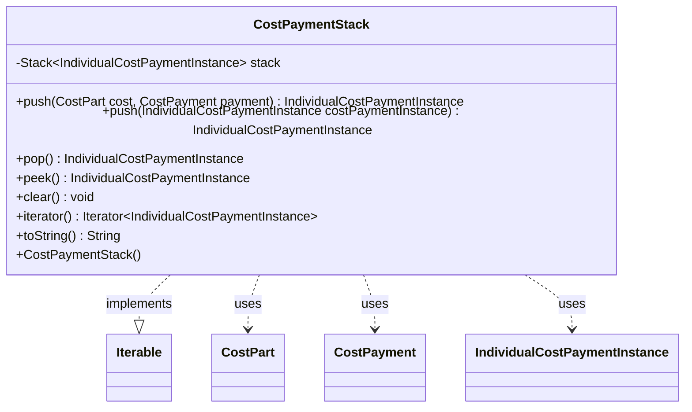

---
aliases:
  - CostPaymentStack
tags:
  - java/class
  - module/forge-game
  - pkg/forge/game/zone
fqn: forge.game.zone.CostPaymentStack
package: forge.game.zone
module: forge-game
kind: Class
---

# CostPaymentStack

**Package:** `forge.game.zone` &nbsp; **Module:** `forge-game` &nbsp; **Kind:** Class



## Relationships
**Uses:**
- [[forge.game.cost.CostPart|CostPart]]
- [[forge.game.cost.CostPayment|CostPayment]]
- [[forge.game.cost.IndividualCostPaymentInstance|IndividualCostPaymentInstance]]

## Source
`forge-game/src/main/java/forge/game/zone/CostPaymentStack.java`

```java
package forge.game.zone;

import java.util.Iterator;
import java.util.Stack;

import forge.game.cost.CostPart;
import forge.game.cost.CostPayment;
import forge.game.cost.IndividualCostPaymentInstance;

/*
 * simple stack wrapper class for tracking cost payments (mainly for triggers to use)
 */
public class CostPaymentStack implements Iterable<IndividualCostPaymentInstance> {

    private Stack<IndividualCostPaymentInstance> stack;

    public CostPaymentStack() {
        stack = new Stack<>();
    }

    public IndividualCostPaymentInstance push(final CostPart cost, final CostPayment payment) {
        return this.push(new IndividualCostPaymentInstance(cost, payment));
    }

    public IndividualCostPaymentInstance push(IndividualCostPaymentInstance costPaymentInstance) {
        return stack.push(costPaymentInstance);
    }

    public IndividualCostPaymentInstance pop() {
        return stack.pop();
    }

    public IndividualCostPaymentInstance peek() {
        if (stack.empty()) {
            return null;
        }

        return stack.peek();
    }

    public void clear() {
        stack.clear();
    }

    @Override
    public Iterator<IndividualCostPaymentInstance> iterator() {
        return stack.iterator();
    }

    @Override
    public String toString() {
        return stack.toString();
    }
}
```
