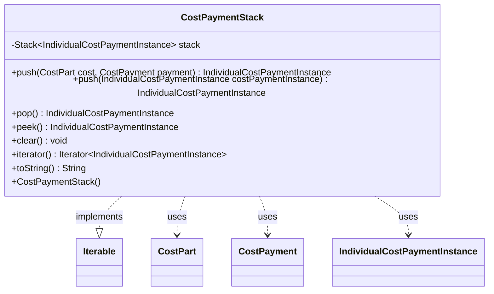

---
aliases:
  - CostPaymentStack
tags:
  - java/class
  - module/forge-game
  - pkg/forge/game/zone
fqn: forge.game.zone.CostPaymentStack
package: forge.game.zone
module: forge-game
kind: Class
---

# CostPaymentStack

**Package:** `forge.game.zone` &nbsp; **Module:** `forge-game` &nbsp; **Kind:** Class



## Relationships
**Uses:**
- [[forge.game.cost.CostPart|CostPart]]
- [[forge.game.cost.CostPayment|CostPayment]]
- [[forge.game.cost.IndividualCostPaymentInstance|IndividualCostPaymentInstance]]

## Design Description

CostPaymentStack is a lightweight LIFO wrapper around `java.util.Stack` that tracks the cost payments currently being resolved during a Magic turn, existing primarily so trigger logic can inspect the in-progress payment context. Each entry is an `IndividualCostPaymentInstance` pairing a `CostPart` with its governing `CostPayment`; the convenience `push(CostPart, CostPayment)` overload constructs that instance internally, while the second overload accepts a pre-built one.

By implementing `Iterable<IndividualCostPaymentInstance>`, it lets callers walk the pending payments without exposing the underlying stack, and its `peek()` deliberately returns null rather than throwing on an empty stack, simplifying caller checks. Delegating `clear()`, `pop()`, and `toString()` straight to the wrapped stack keeps the class a thin, intent-revealing abstraction over standard collection behavior.

## Source
`forge-game/src/main/java/forge/game/zone/CostPaymentStack.java`

```java
package forge.game.zone;

import java.util.Iterator;
import java.util.Stack;

import forge.game.cost.CostPart;
import forge.game.cost.CostPayment;
import forge.game.cost.IndividualCostPaymentInstance;

/*
 * simple stack wrapper class for tracking cost payments (mainly for triggers to use)
 */
public class CostPaymentStack implements Iterable<IndividualCostPaymentInstance> {

    private Stack<IndividualCostPaymentInstance> stack;

    public CostPaymentStack() {
        stack = new Stack<>();
    }

    public IndividualCostPaymentInstance push(final CostPart cost, final CostPayment payment) {
        return this.push(new IndividualCostPaymentInstance(cost, payment));
    }

    public IndividualCostPaymentInstance push(IndividualCostPaymentInstance costPaymentInstance) {
        return stack.push(costPaymentInstance);
    }

    public IndividualCostPaymentInstance pop() {
        return stack.pop();
    }

    public IndividualCostPaymentInstance peek() {
        if (stack.empty()) {
            return null;
        }

        return stack.peek();
    }

    public void clear() {
        stack.clear();
    }

    @Override
    public Iterator<IndividualCostPaymentInstance> iterator() {
        return stack.iterator();
    }

    @Override
    public String toString() {
        return stack.toString();
    }
}
```

## Python
`forge/game/zone/CostPaymentStack.py`

```python
package forge.game.zone, but the module path for the class is forge.game.zone.CostPaymentStack.

The output should be only Python source.

Let me write it.from typing import Iterator

from forge.game.cost.CostPart import CostPart
from forge.game.cost.CostPayment import CostPayment
from forge.game.cost.IndividualCostPaymentInstance import IndividualCostPaymentInstance


# simple stack wrapper class for tracking cost payments (mainly for triggers to use)
class CostPaymentStack:

    def __init__(self):
        self.stack: list[IndividualCostPaymentInstance] = []

    def push(self, cost, payment=None) -> IndividualCostPaymentInstance:
        if payment is not None:
            return self.push(IndividualCostPaymentInstance(cost, payment))
        costPaymentInstance = cost
        self.stack.append(costPaymentInstance)
        return costPaymentInstance

    def pop(self) -> IndividualCostPaymentInstance:
        return self.stack.pop()

    def peek(self) -> IndividualCostPaymentInstance:
        if not self.stack:
            return None

        return self.stack[-1]

    def clear(self) -> None:
        self.stack.clear()

    def __iter__(self) -> Iterator[IndividualCostPaymentInstance]:
        return iter(self.stack)

    def __str__(self) -> str:
        return str(self.stack)
```
