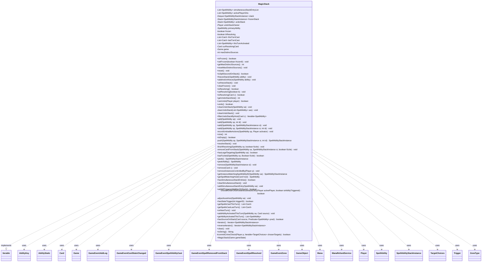

---
aliases:
  - MagicStack
tags:
  - java/class
  - module/forge-game
  - pkg/forge/game/zone
fqn: forge.game.zone.MagicStack
package: forge.game.zone
module: forge-game
kind: Class
---

# MagicStack

**Package:** `forge.game.zone`   **Module:** `forge-game`   **Kind:** Class



## Relationships
**Uses:**
- [[forge.game.Game|Game]]
- [[forge.game.GameObject|GameObject]]
- [[forge.game.ability.AbilityKey|AbilityKey]]
- [[forge.game.card.Card|Card]]
- [[forge.game.event.GameEventAddLog|GameEventAddLog]]
- [[forge.game.event.GameEventCardStatsChanged|GameEventCardStatsChanged]]
- [[forge.game.event.GameEventSpellAbilityCast|GameEventSpellAbilityCast]]
- [[forge.game.event.GameEventSpellRemovedFromStack|GameEventSpellRemovedFromStack]]
- [[forge.game.event.GameEventSpellResolved|GameEventSpellResolved]]
- [[forge.game.event.GameEventZone|GameEventZone]]
- [[forge.game.mana.Mana|Mana]]
- [[forge.game.mana.ManaRefundService|ManaRefundService]]
- [[forge.game.player.Player|Player]]
- [[forge.game.spellability.AbilityStatic|AbilityStatic]]
- [[forge.game.spellability.SpellAbility|SpellAbility]]
- [[forge.game.spellability.SpellAbilityStackInstance|SpellAbilityStackInstance]]
- [[forge.game.spellability.TargetChoices|TargetChoices]]
- [[forge.game.trigger.Trigger|Trigger]]
- [[forge.game.zone.ZoneType|ZoneType]]

## Design Description

The MagicStack class implements the rules engine's game stack — the LIFO zone where spells and abilities wait to resolve in Magic: the Gathering. As a member of the `forge.game.zone` package owned by a single `Game`, it manages a deque of `SpellAbilityStackInstance` objects, with parallel structures for frozen entries, simultaneously-triggered abilities awaiting ordering, and an undoable-action stack for cost reversal. Its core responsibility spans the full lifecycle: adding spells/abilities (routing mana abilities straight to resolution), freezing during casting, ordering simultaneous triggers per the comprehensive rules, and resolving entries top-down with fizzle (illegal-target) detection.

By implementing `Iterable<SpellAbilityStackInstance>`, it exposes the stack for inspection while controlling all mutation internally. It collaborates heavily with `SpellAbility`, `Card`, `Player`, and `Trigger`, firing `GameEvent` notifications to keep views synchronized and invoking the `TriggerHandler` so cast, resolve, and becomes-target triggers fire at the rules-mandated moments. Notable design intent includes tracking per-turn cast history for storm/cast-count effects and an infinite-loop safeguard that draws the game past 999 stack entries.

## Source
`forge-game/src/main/java/forge/game/zone/MagicStack.java`

```java
/*
 * Forge: Play Magic: the Gathering.
 * Copyright (C) 2011  Forge Team
 *
 * This program is free software: you can redistribute it and/or modify
 * it under the terms of the GNU General Public License as published by
 * the Free Software Foundation, either version 3 of the License, or
 * (at your option) any later version.
 *
 * This program is distributed in the hope that it will be useful,
 * but WITHOUT ANY WARRANTY; without even the implied warranty of
 * MERCHANTABILITY or FITNESS FOR A PARTICULAR PURPOSE.  See the
 * GNU General Public License for more details.
 *
 * You should have received a copy of the GNU General Public License
 * along with this program.  If not, see <http://www.gnu.org/licenses/>.
 */
package forge.game.zone;

import com.google.common.collect.Lists;
import com.google.common.collect.Sets;

import forge.game.*;
import forge.game.ability.AbilityKey;
import forge.game.ability.AbilityUtils;
import forge.game.ability.ApiType;
import forge.game.ability.effects.PlayEffect;
import forge.game.card.Card;
import forge.game.card.CardCopyService;
import forge.game.event.*;
import forge.game.keyword.Keyword;
import forge.game.mana.Mana;
import forge.game.mana.ManaRefundService;
import forge.game.player.Player;
import forge.game.player.PlayerPredicates;
import forge.game.spellability.AbilityStatic;
import forge.game.spellability.SpellAbility;
import forge.game.spellability.SpellAbilityStackInstance;
import forge.game.spellability.SpellAbilityView;
import forge.game.spellability.TargetChoices;
import forge.game.trigger.Trigger;
import forge.game.trigger.TriggerType;
import forge.util.IterableUtil;
import forge.util.TextUtil;

import java.util.*;
import java.util.Map.Entry;
import java.util.concurrent.LinkedBlockingDeque;
import java.util.function.Predicate;
import java.util.stream.Collectors;

/**
 * <p>
 * MagicStack class.
 * </p>
 *
 * @author Forge
 * @version $Id$
 */
public class MagicStack /* extends MyObservable */ implements Iterable<SpellAbilityStackInstance> {
    private final List<SpellAbility> simultaneousStackEntryList = Lists.newArrayList();
    private final List<SpellAbility> activePlayerSAs = Lists.newArrayList();

    // They don't provide a LIFO queue, so had to use a deque
    private final Deque<SpellAbilityStackInstance> stack = new LinkedBlockingDeque<>();
    private final Stack<SpellAbilityStackInstance> frozenStack = new Stack<>();
    private final Stack<SpellAbility> undoStack = new Stack<>();
    private Player undoStackOwner;

    private SpellAbility primaryAbility = null;
    private boolean frozen = false;
    private boolean bResolving = false;

    private final List<Card> thisTurnCast = Lists.newArrayList();
    private List<Card> lastTurnCast = Lists.newArrayList();
    private final List<SpellAbility> thisTurnActivated = Lists.newArrayList();

    private Card curResolvingCard = null;

    private final Game game;

    public MagicStack(Game gameState) {
        game = gameState;
    }

    public final boolean isFrozen() {
        return frozen;
    }
    public final void setFrozen(final boolean frozen0) {
        frozen = frozen0;
    }

    private int maxDistinctSources = 0;
    public int getMaxDistinctSources() { return maxDistinctSources; }
    public void resetMaxDistinctSources() { maxDistinctSources = 0; }

    public final void reset() {
        clear();
        simultaneousStackEntryList.clear();
        frozen = false;
        primaryAbility = null;
        lastTurnCast.clear();
        thisTurnCast.clear();
        curResolvingCard = null;
        frozenStack.clear();
        clearUndoStack();
        game.updateStackForView();
    }

    public final boolean isSplitSecondOnStack() {
        for (SpellAbilityStackInstance si : stack) {
            if (si.isSpell() && si.getSourceCard().hasKeyword(Keyword.SPLIT_SECOND)) {
                return true;
            }
        }
        return false;
    }

    public final void freezeStack(SpellAbility ability) {
        if (primaryAbility == null) {
            // Only the first ability to freeze the stack is considered the primary ability
            primaryAbility = ability;
        }
        frozen = true;
    }

    public final void addAndUnfreeze(final SpellAbility ability) {
        final Card source = ability.getHostCard();

        // if the ability is a spell, but not a copied spell and its not already
        // on the stack zone, move there
        // Why is this happening here instead of add()?
        if (ability.isSpell() && !source.isCopiedSpell()) {
            if (!source.isInZone(ZoneType.Stack)) {
                ability.setHostCard(game.getAction().moveToStack(source, ability));
            }
            if (ability.equals(source.getCastSA())) {
                SpellAbility cause = ability.copy(source, true);

                cause.setLastStateBattlefield(game.getLastStateBattlefield());
                cause.setLastStateGraveyard(game.getLastStateGraveyard());

                source.setCastSA(cause);
            }
            source.cleanupExiledWith();
        }

        add(ability);
        if (primaryAbility == null || ability.equals(primaryAbility)) {
            unfreezeStack();
        } // else is for mana abilities
    }

    public final void unfreezeStack() {
        frozen = false;
        primaryAbility = null;

        // Add all Frozen Abilities onto the stack
        while (!frozenStack.isEmpty()) {
            final SpellAbilityStackInstance si = frozenStack.pop();
            add(si.getSpellAbility(), si);
        }
        // Add all waiting triggers onto the stack
        game.getTriggerHandler().resetActiveTriggers();
        game.getTriggerHandler().runWaitingTriggers();
    }

    public final void clearFrozen() {
        // TODO: frozen triggered abilities and undoable costs have nasty consequences
        frozen = false;
        frozenStack.clear();
    }

    public final boolean isResolving() {
        return bResolving;
    }
    public final void setResolving(final boolean b) {
        bResolving = b;
    }

    public final boolean isResolving(Card c) {
        if (!isResolving() || curResolvingCard == null) {
            return false;
        }
        return c.equals(curResolvingCard);
    }

    public int getUndoStackSize() {
        return undoStack.size();
    }

    public final boolean canUndo(Player player) {
        return undoStackOwner == player;
    }
    public final boolean undo() {
        if (undoStack.isEmpty()) { return false; }

        SpellAbility sa = undoStack.peek();
        if (sa.undo()) {
            clearUndoStack(sa);
            new ManaRefundService(sa).refundManaPaid();
        } else {
            clearUndoStack(sa);
            for (Mana pay : sa.getPayingMana()) {
                clearUndoStack(pay.getManaAbility().getSourceSA());
            }
        }
        return true;
    }
    public final void clearUndoStack(SpellAbility sa) {
        if (sa == null) {
            return;
        }
        clearUndoStack(Lists.newArrayList(sa));
    }
    private void clearUndoStack(List<SpellAbility> sas) {
        for (SpellAbility sa : sas) {
            // reset in case a trigger stopped it on a previous activation
            sa.setUndoable(true);
            int idx = undoStack.lastIndexOf(sa);
            if (idx != -1) {
                undoStack.remove(idx);
            }
        }
        if (undoStack.isEmpty()) {
            undoStackOwner = null;
        }
    }
    public final void clearUndoStack() {
        if (undoStackOwner == null) { return; }
        clearUndoStack(Lists.newArrayList(undoStack));
        undoStackOwner = null;
    }
    public Iterable<SpellAbility> filterUndoStackByHost(final Card c) {
        return IterableUtil.filter(undoStack, CardTraitPredicates.isHostCard(c));
    }

    public final void add(SpellAbility sp) {
        add(sp, null, SpellAbilityStackInstance.nextId());
    }
    public final void add(SpellAbility sp, int id) {
        add(sp, null, id);
    }

    public final void add(SpellAbility sp, SpellAbilityStackInstance si) {
        add(sp, si, si.getId());
    }

    public final void add(SpellAbility sp, SpellAbilityStackInstance si, int id) {
        final Card source = sp.getHostCard();

        // if activating player slips through the cracks, assign activating
        // Player to the controller here
        if (sp.getActivatingPlayer() == null) {
            sp.setActivatingPlayer(source.getController());
            System.out.println(source.getName() + " - activatingPlayer not set before adding to stack.");
        }
        Player activator = sp.getActivatingPlayer();

        // Stop infinite loop. E.g. Scalelord Reckoner mirrormatch with only triggering targets is a draw.
        if (game.getStack().size() > 999) {
            for (Player p : game.getPlayers()) {
                p.intentionalDraw();
            }
            game.setGameOver(GameEndReason.Draw);
            return;
        }

        recordUndoableActions(sp, activator);

        if (sp.isManaAbility()) { // Mana Abilities go straight through
            // this can matter, if e.g. Vhal, Candlekeep Researcher toughness changes from tapping
            game.getAction().checkStaticAbilities();

            if (!sp.isCopied() && !sp.isTrigger()) {
                // Copied abilities aren't activated, so they shouldn't change these values
                addAbilityActivatedThisTurn(sp, source);
            }

            Map<AbilityKey, Object> runParams = AbilityKey.newMap();
            runParams.put(AbilityKey.Activator, activator);
            runParams.put(AbilityKey.SpellAbility, sp);
            game.getTriggerHandler().runTrigger(TriggerType.SpellAbilityCast, runParams, true);
            if (sp.isActivatedAbility()) {
                game.getTriggerHandler().runTrigger(TriggerType.AbilityCast, runParams, true);
            }

            AbilityUtils.resolve(sp);

            runParams = AbilityKey.mapFromCard(source);
            runParams.put(AbilityKey.SpellAbility, sp);
            game.getTriggerHandler().runTrigger(TriggerType.AbilityResolves, runParams, false);

            game.fireEvent(new GameEventAddLog(GameLogEntryType.MANA, source + " - " + sp));
            sp.resetOnceResolved();

            // parts are paid sequentially, so collect directly or some trigger might get lost
            if (game.costPaymentStack.peek() != null) {
                game.getTriggerHandler().collectTriggerForWaiting();
            }
            return;
        }

        if (sp.isSpell()) {
            source.setController(activator, 0);

            if (source.isFaceDown() && !sp.isCastFaceDown()) {
                source.turnFaceUp(null);
            }

            // force the card be altered for alt states
            source.setSplitStateToPlayAbility(sp);

            // copied always add to stack zone
            if (source.isCopiedSpell()) {
                game.getStackZone().add(source);
            }
        }

        if (!sp.isCopied() && !hasLegalTargeting(sp)) {
            String str = source + " - [Couldn't add to stack, failed to target] - " + sp.getDescription();
            System.err.println(str + sp.getAllTargetChoices());
            game.fireEvent(new GameEventAddLog(GameLogEntryType.STACK_ADD, str));
            return;
        }

        if (sp instanceof AbilityStatic || (sp.isTrigger() && sp.getTrigger().getOverridingAbility() instanceof AbilityStatic)) {
            AbilityUtils.resolve(sp);
            // AbilityStatic should do nothing below
            return;
        }

        if (si == null && sp.isActivatedAbility() && !sp.isCopied()) {
            // if not already copied use a fresh instance
            SpellAbility original = sp;
            sp = sp.copy(sp.getHostCard(), activator, false, true);
            sp.setOriginalAbility(original);
            original.clearTargets();
            original.setXManaCostPaid(null);
            if (original.getApi() == ApiType.Charm) {
                // reset chain
                original.setSubAbility(null);
            }
        }

        if (frozen && !sp.hasParam("IgnoreFreeze") && !sp.isCastFromPlayEffect()) {
            si = new SpellAbilityStackInstance(sp, id);
            frozenStack.push(si);
            return;
        }

        if (sp.isAbility() && !sp.isCopied() && !sp.isTrigger()) {
            addAbilityActivatedThisTurn(sp, source);
        }

        // The ability is added to stack HERE
        si = push(sp, si, id);

        // Copied spells aren't cast per se so triggers shouldn't run for them.
        Map<AbilityKey, Object> runParams = AbilityKey.newMap();

        if (sp.isSpell() && !sp.isCopied()) {
            final Card lki = CardCopyService.getLKICopy(source);
            runParams.put(AbilityKey.CardLKI, lki);
            thisTurnCast.add(lki);
            sp.getActivatingPlayer().addSpellCastThisTurn();

            // Add expend mana
            Map<Player, Long> expendPlayers = sp.getPayingMana().stream().collect(Collectors.groupingBy(Mana::getPlayer, Collectors.counting()));

            for (Entry<Player, Long> entry : expendPlayers.entrySet()) {
                entry.getKey().addExpentThisTurn((int)(long)entry.getValue(), sp);
            }
        }

        runParams.put(AbilityKey.Activator, activator);
        runParams.put(AbilityKey.SpellAbility, sp);
        runParams.put(AbilityKey.CurrentStormCount, thisTurnCast.size());
        runParams.put(AbilityKey.CurrentCastSpells, Lists.newArrayList(thisTurnCast));

        if (!sp.isCopied()) {
            // Run SpellAbilityCast triggers
            game.getTriggerHandler().runTrigger(TriggerType.SpellAbilityCast, runParams, true);

            sp.applyPayingManaEffects();

            // Run SpellCast triggers
            if (sp.isSpell()) {
                if (source.isCommander() && source.getCastFrom() != null && ZoneType.Command == source.getCastFrom().getZoneType()
                        && source.getOwner().equals(activator)) {
                    activator.incCommanderCast(source);
                }
                game.getTriggerHandler().runTrigger(TriggerType.SpellCast, runParams, true);
            }

            // Run AbilityCast triggers
            if (sp.isActivatedAbility()) {
                game.getTriggerHandler().runTrigger(TriggerType.AbilityCast, runParams, true);
            }

            if (sp.getMaxWaterbend() != null) {
                activator.triggerElementalBend(TriggerType.Waterbend);
            }

            // Run Cycled triggers
            if (sp.isCycling()) {
                activator.addCycled(sp);
            }

            if (sp.isCrew() && source.getType().hasSubtype("Vehicle")) {
                Iterable<Card> crews = sp.getPaidList("Tapped", true);
                if (crews != null) {
                    for (Card c : crews) {
                        Map<AbilityKey, Object> crewParams = AbilityKey.mapFromCard(source);
                        crewParams.put(AbilityKey.Crew, c);
                        game.getTriggerHandler().runTrigger(TriggerType.Crewed, crewParams, false);
                    }
                }
            }
            if (sp.isKeyword(Keyword.SADDLE) && source.getType().hasSubtype("Mount")) {
                Iterable<Card> crews = sp.getPaidList("Tapped", true);
                if (crews != null) {
                    for (Card c : crews) {
                        Map<AbilityKey, Object> saddleParams = AbilityKey.mapFromCard(source);
                        saddleParams.put(AbilityKey.Crew, c);
                        game.getTriggerHandler().runTrigger(TriggerType.Saddled, saddleParams, false);
                    }
                }
            }
            if (sp.isKeyword(Keyword.STATION) && (source.getType().hasSubtype("Spacecraft") || (source.getType().hasSubtype("Planet")))) {
                Iterable<Card> crews = sp.getPaidList("Tapped", true);
                if (crews != null) {
                    for (Card c : crews) {
                        Map<AbilityKey, Object> stationParams = AbilityKey.mapFromCard(source);
                        stationParams.put(AbilityKey.Crew, c);
                        game.getTriggerHandler().runTrigger(TriggerType.Stationed, stationParams, false);
                    }
                }
            }
        } else {
            // Run Copy triggers
            if (sp.isSpell()) {
                game.getTriggerHandler().runTrigger(TriggerType.SpellCopy, runParams, false);
            }
            game.getTriggerHandler().runTrigger(TriggerType.SpellAbilityCopy, runParams, false);
        }
        if (sp.isSpell()) {
            game.getTriggerHandler().runTrigger(TriggerType.SpellCastOrCopy, runParams, false);
        }

        // Run BecomesTarget triggers
        // Create a new object, since the triggers aren't happening right away
        List<TargetChoices> chosenTargets = sp.getAllTargetChoices();
        if (!chosenTargets.isEmpty()) {
            SpellAbility s = sp;
            if (si != null) {
                s = si.getSpellAbility();
                chosenTargets = s.getAllTargetChoices();
            }
            Set<GameObject> distinctObjects = Sets.newHashSet();
            for (final TargetChoices tc : chosenTargets) {
                for (final GameObject tgt : tc) {
                    // Track distinct objects so Becomes targets don't trigger for things like:
                    // Seeds of Strength
                    if (!distinctObjects.add(tgt)) {
                        continue;
                    }

                    runParams = AbilityKey.newMap();
                    runParams.put(AbilityKey.SourceSA, s);
                    runParams.put(AbilityKey.Target, tgt);
                    if (tgt instanceof Card c) {
                        if (!c.hasBecomeTargetThisTurn()) {
                            runParams.put(AbilityKey.FirstTime, null);
                        }
                        if (c.isValiant(activator)) {
                            runParams.put(AbilityKey.Valiant, null);
                        }
                        c.addTargetFromThisTurn(activator);
                    }
                    game.getTriggerHandler().runTrigger(TriggerType.BecomesTarget, runParams, false);
                }
            }
            runParams = AbilityKey.newMap();
            runParams.put(AbilityKey.SourceSA, s);
            runParams.put(AbilityKey.Targets, distinctObjects);
            runParams.put(AbilityKey.Cause, s.getHostCard());
            game.getTriggerHandler().runTrigger(TriggerType.BecomesTargetOnce, runParams, false);
        }

        if (commitCrimeCheck(activator, chosenTargets)) {
            activator.commitCrime();
        }

        game.fireEvent(new GameEventZone(ZoneType.Stack, sp, EventValueChangeType.Added));

        if (!game.getCardsPlayerCanActivateInStack().isEmpty()) {
            // This is a bit of a hack that forces the update of externally activatable cards in flashback zone (e.g. Lightning Storm).
            game.getPlayers().forEach(Player::updateFlashbackForView);
        }
    }

    private void recordUndoableActions(SpellAbility sp, Player activator) {
        // either push onto or clear undo stack based on whether spell/ability is undoable
        if (sp.isUndoable()) {
            if (!canUndo(activator)) {
                clearUndoStack(); //clear if undo stack owner changes
                undoStackOwner = activator;
            }
            undoStack.push(sp);
        } else {
            clearUndoStack();
        }
    }

    public final int size() {
        return stack.size();
    }

    public final boolean isEmpty() {
        return stack.isEmpty();
    }

    // Push should only be used by add.
    private SpellAbilityStackInstance push(final SpellAbility sp, SpellAbilityStackInstance si, int id) {
        if (null == sp.getActivatingPlayer()) {
            sp.setActivatingPlayer(sp.getHostCard().getController());
            System.out.println(sp.getHostCard().getName() + " - activatingPlayer not set before adding to stack.");
        }

        if (sp.isSpell() && sp.getMayPlay() != null) {
            sp.getMayPlay().incMayPlayTurn();
            if (sp.getMayPlay().hasParam("ReplaceGraveyard")) {
                PlayEffect.addReplaceGraveyardEffect(sp.getHostCard(), sp.getMayPlay().getHostCard(), sp, sp, sp.getMayPlay().getParam("ReplaceGraveyard"));
            }
        }
        si = si == null ? new SpellAbilityStackInstance(sp, id) : si;

        stack.addFirst(si);
        int stackIndex = stack.size() - 1;

        int distinctSources = 0;
        Set<Integer> sources = new TreeSet<>();
        for (SpellAbilityStackInstance s : stack) {
            if (s.isSpell()) {
                distinctSources++;
            } else {
                sources.add(s.getSourceCard().getId());
            }
        }
        distinctSources += sources.size();
        if (distinctSources > maxDistinctSources) maxDistinctSources = distinctSources;

        // 2012-07-21 the following comparison needs to move below the pushes but somehow screws up priority
        // When it's down there. That makes absolutely no sense to me, so i'm putting it back for now
        if (!(sp.isTrigger() || (sp instanceof AbilityStatic))) {
            // when something is added we need to setPriority
            game.getPhaseHandler().setPriority(sp.getActivatingPlayer());
        }

        sp.getHostCard().getGame().getAction().checkStaticAbilities(false);
        sp.getHostCard().getGame().getTriggerHandler().resetActiveTriggers();

        game.updateStackForView();
        game.fireEvent(new GameEventSpellAbilityCast(sp, si, stackIndex));
        return si;
    }

    public final void resolveStack() {
        // freeze the stack while we're in the middle of resolving
        freezeStack(null);
        setResolving(true);

        // The SpellAbility isn't removed from the Stack until it finishes resolving
        // temporarily reverted removing SAs after resolution
        final SpellAbility sa = peekAbility();

        // abilities already on stack won't get changed text from host
        if (sa.isSpell()) {
            sa.changeText();
        }

        // ActivePlayer gains priority first after Resolve
        game.getPhaseHandler().resetPriority();

        final Card source = sa.getHostCard();
        curResolvingCard = source;

        boolean thisHasFizzled = hasFizzled(sa, null);

        if (!thisHasFizzled) {
            game.copyLastState();
        }

        // Change controller of activating player if it was set in SA
        if (sa.getControlledByPlayer() != null) {
            sa.getActivatingPlayer().addController(sa.getControlledByPlayer().getLeft(), sa.getControlledByPlayer().getRight());
        }

        if (thisHasFizzled) { // Fizzle
            if (sa.isBestow()) {
                // 702.102e: if its target is illegal, the effect making it an Aura spell ends.
                // It continues resolving as a creature spell.
                source.unanimateBestow();
                SpellAbility first = source.getFirstSpellAbility();
                // need to set activating player
                first.setActivatingPlayer(sa.getActivatingPlayer());
                game.fireEvent(new GameEventCardStatsChanged(source));
                AbilityUtils.resolve(first);
            } else if (sa.isMutate()) {
                SpellAbility first = source.getFirstSpellAbility();
                // need to set activating player
                first.setActivatingPlayer(sa.getActivatingPlayer());
                game.fireEvent(new GameEventCardStatsChanged(source));
                AbilityUtils.resolve(first);
            }
        } else if (sa.getApi() != null) {
            AbilityUtils.handleRemembering(sa);
            AbilityUtils.resolve(sa);
            final Map<AbilityKey, Object> runParams = AbilityKey.mapFromCard(source);
            runParams.put(AbilityKey.SpellAbility, sa);
            game.getTriggerHandler().runTrigger(TriggerType.AbilityResolves, runParams, false);
        } else {
            sa.resolve();
            // do creatures ETB from here?
        }

        // Change controller back if it was changed
        if (sa.getControlledByPlayer() != null) {
            sa.getActivatingPlayer().removeController(sa.getControlledByPlayer().getLeft());
            // Cleanup controlled by player states
            sa.setControlledByPlayer(-1, null);
            sa.setManaCostBeingPaid(null);
        }

        game.fireEvent(new GameEventSpellResolved(sa, thisHasFizzled));

        game.getAction().checkStaticAbilities();

        finishResolving(sa, thisHasFizzled);

        game.copyLastState();
        if (isEmpty() && !hasSimultaneousStackEntries()) {
            // assuming that if the stack is empty, no reason to hold on to old LKI data (everything is a new object)
            game.clearChangeZoneLKIInfo();
        }
    }

    private void finishResolving(final SpellAbility sa, final boolean fizzle) {
        // SpellAbility is removed from the stack here
        // temporarily removed removing SA after resolution
        final SpellAbilityStackInstance si = getInstanceMatchingSpellAbilityID(sa);

        // remove SA and card from the stack
        removeCardFromStack(sa, si, fizzle);

        if (si != null) {
            remove(si);
        }

        // After SA resolves we have to do a handful of things
        setResolving(false);
        unfreezeStack();
        sa.resetOnceResolved();

        game.getPhaseHandler().onStackResolved();

        curResolvingCard = null;
    }

    private void removeCardFromStack(final SpellAbility sa, final SpellAbilityStackInstance si, final boolean fizzle) {
        Card source = sa.getHostCard();

        // need to update active trigger
        game.getTriggerHandler().resetActiveTriggers();

        if (sa.isAbility()) {
            // do nothing
            return;
        }

        if (source.isCopiedSpell() && source.isInZone(ZoneType.Stack)) {
            game.getAction().ceaseToExist(source, true);
            return;
        }

        if ((source.isInstant() || source.isSorcery() || fizzle) &&
                source.isInZone(ZoneType.Stack)) {
            // If Spell and still on the Stack then let it goto the graveyard or replace its own movement
            Map<AbilityKey, Object> params = AbilityKey.newMap();
            params.put(AbilityKey.StackSa, sa);
            params.put(AbilityKey.Fizzle, fizzle);
            game.getAction().moveToGraveyard(source, null, params);
        }
    }

    public final boolean hasLegalTargeting(final SpellAbility sa) {
        if (sa == null) {
            return true;
        }
        if (!sa.isTargetNumberValid()) {
            return false;
        }
        return hasLegalTargeting(sa.getSubAbility());
    }

    private boolean hasFizzled(final SpellAbility sa, Boolean fizzle) {
        List<GameObject> toRemove = Lists.newArrayList();
        if (sa.usesTargeting() && !sa.isZeroTargets()) {
            if (fizzle == null) {
                // don't overwrite previous result
                fizzle = true;
            }
            // Some targets were chosen, fizzling for this subability is now possible
            // With multi-targets, as long as one target is still legal,
            // we'll try to go through as much as possible
            for (final GameObject o : sa.getTargets()) {
                boolean invalidTarget = false;
                if (o instanceof Card) {
                    final Card card = (Card) o;
                    Card current = game.getCardState(card);
                    if (current != null) {
                        invalidTarget = !current.equalsWithGameTimestamp(card);
                    }
                    invalidTarget = invalidTarget || !sa.canTarget(card, true);
                } else if (o instanceof SpellAbility) {
                    SpellAbilityStackInstance si = getInstanceMatchingSpellAbilityID((SpellAbility)o);
                    invalidTarget = si == null ? true : !sa.canTarget(si.getSpellAbility(), true);
                } else {
                    invalidTarget = !sa.canTarget(o, true);
                }

                if (invalidTarget) {
                    toRemove.add(o);
                } else {
                    fizzle = false;
                }

                if (sa.hasParam("CantFizzle")) {
                    // Gilded Drake cannot be countered by rules if the
                    // targeted card is not valid
                    fizzle = false;
                }
            }
        }
        if (sa.getSubAbility() != null) {
            fizzle = hasFizzled(sa.getSubAbility(), fizzle);
        }

        // Remove targets
        if (sa.usesTargeting() && !sa.isZeroTargets()) {
            sa.getTargets().removeAll(toRemove);
        }
        return fizzle != null && fizzle;
    }

    public final SpellAbilityStackInstance peek() {
        return stack.peekFirst();
    }

    public final SpellAbility peekAbility() {
        return stack.peekFirst().getSpellAbility();
    }

    public final void remove(final SpellAbilityStackInstance si) {
        stack.remove(si);
        frozenStack.remove(si);
        game.updateStackForView();
        game.fireEvent(new GameEventSpellRemovedFromStack(SpellAbilityView.get(si.getSpellAbility())));
    }

    public final void remove(final Card c) {
        for (SpellAbilityStackInstance si : stack) {
            if (c.equals(si.getSourceCard()) && si.isSpell()) {
                remove(si);
            }
        }
    }

    public final void removeInstancesControlledBy(final Player p) {
        for (SpellAbilityStackInstance si : stack) {
            if (si.getActivatingPlayer().equals(p)) {
                remove(si);
            }
        }
        for (SpellAbility sa : Lists.newArrayList(simultaneousStackEntryList)) {
            Player activator = sa.getActivatingPlayer();
            if (activator == null) {
                if (sa.getHostCard().getController().equals(p)) {
                    simultaneousStackEntryList.remove(sa);
                }
            } else if (activator.equals(p)) {
                simultaneousStackEntryList.remove(sa);
            }
        }
    }

    public final SpellAbilityStackInstance getInstanceMatchingSpellAbilityID(final SpellAbility sa) {
        for (final SpellAbilityStackInstance si : stack) {
            if (sa.getId() == si.getSpellAbility().getId()) {
                return si;
            }
        }
        return null;
    }

    public final SpellAbility getSpellMatchingHost(final Card host) {
        for (final SpellAbilityStackInstance si : stack) {
            if (si.isSpell() && host.equals(si.getSpellAbility().getHostCard())) {
                return si.getSpellAbility();
            }
        }
        return null;
    }

    public final boolean hasSimultaneousStackEntries() {
        return !simultaneousStackEntryList.isEmpty();
    }

    public final void clearSimultaneousStack() {
        simultaneousStackEntryList.clear();
    }

    public final void addSimultaneousStackEntry(final SpellAbility sa) {
        simultaneousStackEntryList.add(sa);
    }

    public boolean addAllTriggeredAbilitiesToStack() {
        if (!hasSimultaneousStackEntries()) {
            return false;
        }

        Player playerTurn = game.getPhaseHandler().getPlayerTurn();
        if (playerTurn == null) {
            // caused by DevTools before first turn
            return false;
        }
        if (!playerTurn.isInGame()) {
            playerTurn = game.getNextPlayerAfter(playerTurn);
        }
        List<Player> players = game.getPlayersInTurnOrder(playerTurn);

        boolean result = false;
        // CR 603.3b
        for (Player p : players) {
            result |= chooseOrderOfSimultaneousStackEntry(p, false);
        }
        for (Player p : players) {
            result |= chooseOrderOfSimultaneousStackEntry(p, true);
        }

        return result;
    }

    private boolean chooseOrderOfSimultaneousStackEntry(final Player activePlayer, boolean isAbilityTriggered) {
        if (!activePlayer.isInGame()) {
            return false;
        }
        if (!hasSimultaneousStackEntries()) {
            return false;
        }
        activePlayerSAs.clear();
        for (SpellAbility sa : simultaneousStackEntryList) {
            if (isAbilityTriggered != (sa.isTrigger() && sa.getTrigger().getMode() == TriggerType.AbilityTriggered)) {
                continue;
            }

            Player activator = sa.getActivatingPlayer();
            if (activator == null) {
                activator = sa.getHostCard().getController();
            }

            if (activator.equals(activePlayer)) {
                adjustAuraHost(sa);
                activePlayerSAs.add(sa);
            }
        }
        simultaneousStackEntryList.removeAll(activePlayerSAs);

        if (activePlayerSAs.isEmpty()) {
            return false;
        }

        activePlayer.getController().orderAndPlaySimultaneousSa(activePlayerSAs);
        activePlayerSAs.clear();
        return true;
    }

    // CR 400.7f Abilities of Auras that trigger when the enchanted permanent leaves the battlefield
    // can find the new object that Aura became in its owner’s graveyard
    private void adjustAuraHost(SpellAbility sa) {
        final Card host = sa.getHostCard();
        final Trigger trig = sa.getTrigger();
        final Card newHost = game.getCardState(host);
        if (host.isAura() && newHost.isInZone(ZoneType.Graveyard) && trig.getMode() == TriggerType.ChangesZone && "Battlefield".equals(trig.getParam("Origin"))
                && trig.hasParam("ValidCard") && trig.getParam("ValidCard").startsWith("Card.EnchantedBy")) {
            sa.setHostCard(newHost);
        }
    }

    public final boolean hasStateTrigger(final int triggerID) {
        for (final SpellAbilityStackInstance sasi : stack) {
            if (sasi.isStateTrigger(triggerID)) {
                return true;
            }
        }

        for (final SpellAbilityStackInstance sasi : frozenStack) {
            if (sasi.isStateTrigger(triggerID)) {
                return true;
            }
        }

        for (final SpellAbility sa : simultaneousStackEntryList) {
            if (sa.getSourceTrigger() == triggerID) {
                return true;
            }
        }

        for (final SpellAbility sa : activePlayerSAs) {
            if (sa.getSourceTrigger() == triggerID) {
                return true;
            }
        }
        return false;
    }

    public final List<Card> getSpellsCastThisTurn() {
        return thisTurnCast;
    }
    public final List<Card> getSpellsCastLastTurn() {
        return lastTurnCast;
    }

    public final void onNextTurn() {
        final Player active = game.getPhaseHandler().getPlayerTurn();
        game.getStackZone().resetCardsAddedThisTurn();
        this.thisTurnActivated.clear();
        active.resetSpellCastSinceBegOfYourLastTurn();
        if (thisTurnCast.isEmpty()) {
            lastTurnCast = Lists.newArrayList();
            return;
        }
        for (Player player : game.getPlayers()) {
            player.addSpellCastSinceBegOfYourLastTurn(thisTurnCast);
        }
        lastTurnCast = Lists.newArrayList(thisTurnCast);
        thisTurnCast.clear();
        game.updateStackForView();
    }

    public void addAbilityActivatedThisTurn(SpellAbility sa, final Card source) {
        source.addAbilityActivated(sa);
        thisTurnActivated.add(sa.copy(CardCopyService.getLKICopy(source), true));
    }

    public List<SpellAbility> getAbilityActivatedThisTurn() {
        return thisTurnActivated;
    }

    public final boolean hasSourceOnStack(final Card source, final Predicate<SpellAbility> pred) {
        if (source == null) {
            return false;
        }
        for (SpellAbilityStackInstance si : stack) {
            if (si.isTrigger() && si.getSourceCard().equals(source)) {
                if (pred == null || pred.test(si.getSpellAbility())) {
                    return true;
                }
            }
        }
        for (SpellAbility sa : simultaneousStackEntryList) {
            if (sa.isTrigger() && sa.getHostCard().equals(source)) {
                if (pred == null || pred.test(sa)) {
                    return true;
                }
            }
        }
        return false;
    }

    @Override
    public Iterator<SpellAbilityStackInstance> iterator() {
        return stack.iterator();
    }

    public Iterator<SpellAbilityStackInstance> reverseIterator() {
        return stack.descendingIterator();
    }

    public void clear() {
        if (stack.isEmpty()) { return; }
        stack.clear();
        game.updateStackForView();
        game.fireEvent(new GameEventSpellRemovedFromStack(null));
    }

    @Override
    public String toString() {
        return TextUtil.concatNoSpace(simultaneousStackEntryList.toString(),"==", frozenStack.toString(), "==", stack.toString());
    }

    static protected boolean commitCrimeCheck(Player p, Iterable<TargetChoices> chosenTargets) {
        List<ZoneType> zoneList = List.of(ZoneType.Battlefield, ZoneType.Graveyard, ZoneType.Stack);

        for (TargetChoices tc : chosenTargets) {
            if (IterableUtil.any(tc.getTargetPlayers(), PlayerPredicates.isOpponentOf(p))) {
                return true;
            }
            for (SpellAbility sp : tc.getTargetSpells()) {
                if (sp.getActivatingPlayer().isOpponentOf(p)) {
                    return true;
                }
            }

            for (Card c : tc.getTargetCards()) {
                if (c.isInZones(zoneList) && c.getController().isOpponentOf(p)) {
                    return true;
                }
            }
        }
        return false;
    }
}
```

## Python
`forge/game/zone/MagicStack.py`

```python
from collections import deque

from forge.game.Game import Game
from forge.game.GameObject import GameObject
from forge.game.GameEndReason import GameEndReason
from forge.game.GameLogEntryType import GameLogEntryType
from forge.game.EventValueChangeType import EventValueChangeType
from forge.game.CardTraitPredicates import CardTraitPredicates
from forge.game.ability.AbilityKey import AbilityKey
from forge.game.ability.AbilityUtils import AbilityUtils
from forge.game.ability.ApiType import ApiType
from forge.game.ability.effects.PlayEffect import PlayEffect
from forge.game.card.Card import Card
from forge.game.card.CardCopyService import CardCopyService
from forge.game.event.GameEventAddLog import GameEventAddLog
from forge.game.event.GameEventCardStatsChanged import GameEventCardStatsChanged
from forge.game.event.GameEventSpellAbilityCast import GameEventSpellAbilityCast
from forge.game.event.GameEventSpellRemovedFromStack import GameEventSpellRemovedFromStack
from forge.game.event.GameEventSpellResolved import GameEventSpellResolved
from forge.game.event.GameEventZone import GameEventZone
from forge.game.keyword.Keyword import Keyword
from forge.game.mana.Mana import Mana
from forge.game.mana.ManaRefundService import ManaRefundService
from forge.game.player.Player import Player
from forge.game.player.PlayerPredicates import PlayerPredicates
from forge.game.spellability.AbilityStatic import AbilityStatic
from forge.game.spellability.SpellAbility import SpellAbility
from forge.game.spellability.SpellAbilityStackInstance import SpellAbilityStackInstance
from forge.game.spellability.SpellAbilityView import SpellAbilityView
from forge.game.spellability.TargetChoices import TargetChoices
from forge.game.trigger.Trigger import Trigger
from forge.game.trigger.TriggerType import TriggerType
from forge.game.zone.ZoneType import ZoneType
from forge.util.IterableUtil import IterableUtil
from forge.util.TextUtil import TextUtil

import sys

_UNSET = object()


class MagicStack:
    def __init__(self, gameState):
        self.simultaneousStackEntryList = []
        self.activePlayerSAs = []

        # They don't provide a LIFO queue, so had to use a deque
        self.stack = deque()
        self.frozenStack = []
        self.undoStack = []
        self.undoStackOwner = None

        self.primaryAbility = None
        self.frozen = False
        self.bResolving = False

        self.thisTurnCast = []
        self.lastTurnCast = []
        self.thisTurnActivated = []

        self.curResolvingCard = None

        self.game = gameState

        self.maxDistinctSources = 0

    def isFrozen(self):
        return self.frozen

    def setFrozen(self, frozen0):
        self.frozen = frozen0

    def getMaxDistinctSources(self):
        return self.maxDistinctSources

    def resetMaxDistinctSources(self):
        self.maxDistinctSources = 0

    def reset(self):
        self.clear()
        self.simultaneousStackEntryList.clear()
        self.frozen = False
        self.primaryAbility = None
        self.lastTurnCast.clear()
        self.thisTurnCast.clear()
        self.curResolvingCard = None
        self.frozenStack.clear()
        self.clearUndoStack()
        self.game.updateStackForView()

    def isSplitSecondOnStack(self):
        for si in self.stack:
            if si.isSpell() and si.getSourceCard().hasKeyword(Keyword.SPLIT_SECOND):
                return True
        return False

    def freezeStack(self, ability):
        if self.primaryAbility is None:
            # Only the first ability to freeze the stack is considered the primary ability
            self.primaryAbility = ability
        self.frozen = True

    def addAndUnfreeze(self, ability):
        source = ability.getHostCard()

        # if the ability is a spell, but not a copied spell and its not already
        # on the stack zone, move there
        # Why is this happening here instead of add()?
        if ability.isSpell() and not source.isCopiedSpell():
            if not source.isInZone(ZoneType.Stack):
                ability.setHostCard(self.game.getAction().moveToStack(source, ability))
            if ability.equals(source.getCastSA()):
                cause = ability.copy(source, True)

                cause.setLastStateBattlefield(self.game.getLastStateBattlefield())
                cause.setLastStateGraveyard(self.game.getLastStateGraveyard())

                source.setCastSA(cause)
            source.cleanupExiledWith()

        self.add(ability)
        if self.primaryAbility is None or ability.equals(self.primaryAbility):
            self.unfreezeStack()
        # else is for mana abilities

    def unfreezeStack(self):
        self.frozen = False
        self.primaryAbility = None

        # Add all Frozen Abilities onto the stack
        while self.frozenStack:
            si = self.frozenStack.pop()
            self.add(si.getSpellAbility(), si)
        # Add all waiting triggers onto the stack
        self.game.getTriggerHandler().resetActiveTriggers()
        self.game.getTriggerHandler().runWaitingTriggers()

    def clearFrozen(self):
        # TODO: frozen triggered abilities and undoable costs have nasty consequences
        self.frozen = False
        self.frozenStack.clear()

    def isResolving(self, c=_UNSET):
        if c is _UNSET:
            return self.bResolving
        if not self.isResolving() or self.curResolvingCard is None:
            return False
        return c.equals(self.curResolvingCard)

    def setResolving(self, b):
        self.bResolving = b

    def getUndoStackSize(self):
        return len(self.undoStack)

    def canUndo(self, player):
        return self.undoStackOwner == player

    def undo(self):
        if not self.undoStack:
            return False

        sa = self.undoStack[-1]
        if sa.undo():
            self.clearUndoStack(sa)
            ManaRefundService(sa).refundManaPaid()
        else:
            self.clearUndoStack(sa)
            for pay in sa.getPayingMana():
                self.clearUndoStack(pay.getManaAbility().getSourceSA())
        return True

    def clearUndoStack(self, sa=_UNSET):
        if sa is _UNSET:
            if self.undoStackOwner is None:
                return
            self.clearUndoStack(list(self.undoStack))
            self.undoStackOwner = None
            return
        if isinstance(sa, list):
            for s in sa:
                # reset in case a trigger stopped it on a previous activation
                s.setUndoable(True)
                idx = self._lastIndexOf(self.undoStack, s)
                if idx != -1:
                    del self.undoStack[idx]
            if not self.undoStack:
                self.undoStackOwner = None
            return
        if sa is None:
            return
        self.clearUndoStack([sa])

    @staticmethod
    def _lastIndexOf(lst, item):
        idx = -1
        for i, x in enumerate(lst):
            if x == item:
                idx = i
        return idx

    def filterUndoStackByHost(self, c):
        return IterableUtil.filter(self.undoStack, CardTraitPredicates.isHostCard(c))

    def add(self, sp, si=_UNSET, id=_UNSET):
        if si is _UNSET and id is _UNSET:
            self.add(sp, None, SpellAbilityStackInstance.nextId())
            return
        if id is _UNSET:
            if isinstance(si, int):
                self.add(sp, None, si)
            else:
                self.add(sp, si, si.getId())
            return

        source = sp.getHostCard()

        # if activating player slips through the cracks, assign activating
        # Player to the controller here
        if sp.getActivatingPlayer() is None:
            sp.setActivatingPlayer(source.getController())
            print(source.getName() + " - activatingPlayer not set before adding to stack.")
        activator = sp.getActivatingPlayer()

        # Stop infinite loop. E.g. Scalelord Reckoner mirrormatch with only triggering targets is a draw.
        if self.game.getStack().size() > 999:
            for p in self.game.getPlayers():
                p.intentionalDraw()
            self.game.setGameOver(GameEndReason.Draw)
            return

        self.recordUndoableActions(sp, activator)

        if sp.isManaAbility():  # Mana Abilities go straight through
            # this can matter, if e.g. Vhal, Candlekeep Researcher toughness changes from tapping
            self.game.getAction().checkStaticAbilities()

            if not sp.isCopied() and not sp.isTrigger():
                # Copied abilities aren't activated, so they shouldn't change these values
                self.addAbilityActivatedThisTurn(sp, source)

            runParams = AbilityKey.newMap()
            runParams.put(AbilityKey.Activator, activator)
            runParams.put(AbilityKey.SpellAbility, sp)
            self.game.getTriggerHandler().runTrigger(TriggerType.SpellAbilityCast, runParams, True)
            if sp.isActivatedAbility():
                self.game.getTriggerHandler().runTrigger(TriggerType.AbilityCast, runParams, True)

            AbilityUtils.resolve(sp)

            runParams = AbilityKey.mapFromCard(source)
            runParams.put(AbilityKey.SpellAbility, sp)
            self.game.getTriggerHandler().runTrigger(TriggerType.AbilityResolves, runParams, False)

            self.game.fireEvent(GameEventAddLog(GameLogEntryType.MANA, str(source) + " - " + str(sp)))
            sp.resetOnceResolved()

            # parts are paid sequentially, so collect directly or some trigger might get lost
            if self.game.costPaymentStack.peek() is not None:
                self.game.getTriggerHandler().collectTriggerForWaiting()
            return

        if sp.isSpell():
            source.setController(activator, 0)

            if source.isFaceDown() and not sp.isCastFaceDown():
                source.turnFaceUp(None)

            # force the card be altered for alt states
            source.setSplitStateToPlayAbility(sp)

            # copied always add to stack zone
            if source.isCopiedSpell():
                self.game.getStackZone().add(source)

        if not sp.isCopied() and not self.hasLegalTargeting(sp):
            str_ = str(source) + " - [Couldn't add to stack, failed to target] - " + sp.getDescription()
            print(str_ + str(sp.getAllTargetChoices()), file=sys.stderr)
            self.game.fireEvent(GameEventAddLog(GameLogEntryType.STACK_ADD, str_))
            return

        if isinstance(sp, AbilityStatic) or (sp.isTrigger() and isinstance(sp.getTrigger().getOverridingAbility(), AbilityStatic)):
            AbilityUtils.resolve(sp)
            # AbilityStatic should do nothing below
            return

        if si is None and sp.isActivatedAbility() and not sp.isCopied():
            # if not already copied use a fresh instance
            original = sp
            sp = sp.copy(sp.getHostCard(), activator, False, True)
            sp.setOriginalAbility(original)
            original.clearTargets()
            original.setXManaCostPaid(None)
            if original.getApi() == ApiType.Charm:
                # reset chain
                original.setSubAbility(None)

        if self.frozen and not sp.hasParam("IgnoreFreeze") and not sp.isCastFromPlayEffect():
            si = SpellAbilityStackInstance(sp, id)
            self.frozenStack.append(si)
            return

        if sp.isAbility() and not sp.isCopied() and not sp.isTrigger():
            self.addAbilityActivatedThisTurn(sp, source)

        # The ability is added to stack HERE
        si = self.push(sp, si, id)

        # Copied spells aren't cast per se so triggers shouldn't run for them.
        runParams = AbilityKey.newMap()

        if sp.isSpell() and not sp.isCopied():
            lki = CardCopyService.getLKICopy(source)
            runParams.put(AbilityKey.CardLKI, lki)
            self.thisTurnCast.append(lki)
            sp.getActivatingPlayer().addSpellCastThisTurn()

            # Add expend mana
            expendPlayers = {}
            for m in sp.getPayingMana():
                player = m.getPlayer()
                expendPlayers[player] = expendPlayers.get(player, 0) + 1

            for player, count in expendPlayers.items():
                player.addExpentThisTurn(int(count), sp)

        runParams.put(AbilityKey.Activator, activator)
        runParams.put(AbilityKey.SpellAbility, sp)
        runParams.put(AbilityKey.CurrentStormCount, len(self.thisTurnCast))
        runParams.put(AbilityKey.CurrentCastSpells, list(self.thisTurnCast))

        if not sp.isCopied():
            # Run SpellAbilityCast triggers
            self.game.getTriggerHandler().runTrigger(TriggerType.SpellAbilityCast, runParams, True)

            sp.applyPayingManaEffects()

            # Run SpellCast triggers
            if sp.isSpell():
                if source.isCommander() and source.getCastFrom() is not None and ZoneType.Command == source.getCastFrom().getZoneType() \
                        and source.getOwner().equals(activator):
                    activator.incCommanderCast(source)
                self.game.getTriggerHandler().runTrigger(TriggerType.SpellCast, runParams, True)

            # Run AbilityCast triggers
            if sp.isActivatedAbility():
                self.game.getTriggerHandler().runTrigger(TriggerType.AbilityCast, runParams, True)

            if sp.getMaxWaterbend() is not None:
                activator.triggerElementalBend(TriggerType.Waterbend)

            # Run Cycled triggers
            if sp.isCycling():
                activator.addCycled(sp)

            if sp.isCrew() and source.getType().hasSubtype("Vehicle"):
                crews = sp.getPaidList("Tapped", True)
                if crews is not None:
                    for c in crews:
                        crewParams = AbilityKey.mapFromCard(source)
                        crewParams.put(AbilityKey.Crew, c)
                        self.game.getTriggerHandler().runTrigger(TriggerType.Crewed, crewParams, False)
            if sp.isKeyword(Keyword.SADDLE) and source.getType().hasSubtype("Mount"):
                crews = sp.getPaidList("Tapped", True)
                if crews is not None:
                    for c in crews:
                        saddleParams = AbilityKey.mapFromCard(source)
                        saddleParams.put(AbilityKey.Crew, c)
                        self.game.getTriggerHandler().runTrigger(TriggerType.Saddled, saddleParams, False)
            if sp.isKeyword(Keyword.STATION) and (source.getType().hasSubtype("Spacecraft") or (source.getType().hasSubtype("Planet"))):
                crews = sp.getPaidList("Tapped", True)
                if crews is not None:
                    for c in crews:
                        stationParams = AbilityKey.mapFromCard(source)
                        stationParams.put(AbilityKey.Crew, c)
                        self.game.getTriggerHandler().runTrigger(TriggerType.Stationed, stationParams, False)
        else:
            # Run Copy triggers
            if sp.isSpell():
                self.game.getTriggerHandler().runTrigger(TriggerType.SpellCopy, runParams, False)
            self.game.getTriggerHandler().runTrigger(TriggerType.SpellAbilityCopy, runParams, False)
        if sp.isSpell():
            self.game.getTriggerHandler().runTrigger(TriggerType.SpellCastOrCopy, runParams, False)

        # Run BecomesTarget triggers
        # Create a new object, since the triggers aren't happening right away
        chosenTargets = sp.getAllTargetChoices()
        if chosenTargets:
            s = sp
            if si is not None:
                s = si.getSpellAbility()
                chosenTargets = s.getAllTargetChoices()
            distinctObjects = set()
            for tc in chosenTargets:
                for tgt in tc:
                    # Track distinct objects so Becomes targets don't trigger for things like:
                    # Seeds of Strength
                    if tgt in distinctObjects:
                        continue
                    distinctObjects.add(tgt)

                    runParams = AbilityKey.newMap()
                    runParams.put(AbilityKey.SourceSA, s)
                    runParams.put(AbilityKey.Target, tgt)
                    if isinstance(tgt, Card):
                        c = tgt
                        if not c.hasBecomeTargetThisTurn():
                            runParams.put(AbilityKey.FirstTime, None)
                        if c.isValiant(activator):
                            runParams.put(AbilityKey.Valiant, None)
                        c.addTargetFromThisTurn(activator)
                    self.game.getTriggerHandler().runTrigger(TriggerType.BecomesTarget, runParams, False)
            runParams = AbilityKey.newMap()
            runParams.put(AbilityKey.SourceSA, s)
            runParams.put(AbilityKey.Targets, distinctObjects)
            runParams.put(AbilityKey.Cause, s.getHostCard())
            self.game.getTriggerHandler().runTrigger(TriggerType.BecomesTargetOnce, runParams, False)

        if MagicStack.commitCrimeCheck(activator, chosenTargets):
            activator.commitCrime()

        self.game.fireEvent(GameEventZone(ZoneType.Stack, sp, EventValueChangeType.Added))

        if self.game.getCardsPlayerCanActivateInStack():
            # This is a bit of a hack that forces the update of externally activatable cards in flashback zone (e.g. Lightning Storm).
            for p in self.game.getPlayers():
                p.updateFlashbackForView()

    def recordUndoableActions(self, sp, activator):
        # either push onto or clear undo stack based on whether spell/ability is undoable
        if sp.isUndoable():
            if not self.canUndo(activator):
                self.clearUndoStack()  # clear if undo stack owner changes
                self.undoStackOwner = activator
            self.undoStack.append(sp)
        else:
            self.clearUndoStack()

    def size(self):
        return len(self.stack)

    def isEmpty(self):
        return len(self.stack) == 0

    # Push should only be used by add.
    def push(self, sp, si, id):
        if sp.getActivatingPlayer() is None:
            sp.setActivatingPlayer(sp.getHostCard().getController())
            print(sp.getHostCard().getName() + " - activatingPlayer not set before adding to stack.")

        if sp.isSpell() and sp.getMayPlay() is not None:
            sp.getMayPlay().incMayPlayTurn()
            if sp.getMayPlay().hasParam("ReplaceGraveyard"):
                PlayEffect.addReplaceGraveyardEffect(sp.getHostCard(), sp.getMayPlay().getHostCard(), sp, sp, sp.getMayPlay().getParam("ReplaceGraveyard"))
        si = SpellAbilityStackInstance(sp, id) if si is None else si

        self.stack.appendleft(si)
        stackIndex = len(self.stack) - 1

        distinctSources = 0
        sources = set()
        for s in self.stack:
            if s.isSpell():
                distinctSources += 1
            else:
                sources.add(s.getSourceCard().getId())
        distinctSources += len(sources)
        if distinctSources > self.maxDistinctSources:
            self.maxDistinctSources = distinctSources

        # 2012-07-21 the following comparison needs to move below the pushes but somehow screws up priority
        # When it's down there. That makes absolutely no sense to me, so i'm putting it back for now
        if not (sp.isTrigger() or isinstance(sp, AbilityStatic)):
            # when something is added we need to setPriority
            self.game.getPhaseHandler().setPriority(sp.getActivatingPlayer())

        sp.getHostCard().getGame().getAction().checkStaticAbilities(False)
        sp.getHostCard().getGame().getTriggerHandler().resetActiveTriggers()

        self.game.updateStackForView()
        self.game.fireEvent(GameEventSpellAbilityCast(sp, si, stackIndex))
        return si

    def resolveStack(self):
        # freeze the stack while we're in the middle of resolving
        self.freezeStack(None)
        self.setResolving(True)

        # The SpellAbility isn't removed from the Stack until it finishes resolving
        # temporarily reverted removing SAs after resolution
        sa = self.peekAbility()

        # abilities already on stack won't get changed text from host
        if sa.isSpell():
            sa.changeText()

        # ActivePlayer gains priority first after Resolve
        self.game.getPhaseHandler().resetPriority()

        source = sa.getHostCard()
        self.curResolvingCard = source

        thisHasFizzled = self.hasFizzled(sa, None)

        if not thisHasFizzled:
            self.game.copyLastState()

        # Change controller of activating player if it was set in SA
        if sa.getControlledByPlayer() is not None:
            sa.getActivatingPlayer().addController(sa.getControlledByPlayer().getLeft(), sa.getControlledByPlayer().getRight())

        if thisHasFizzled:  # Fizzle
            if sa.isBestow():
                # 702.102e: if its target is illegal, the effect making it an Aura spell ends.
                # It continues resolving as a creature spell.
                source.unanimateBestow()
                first = source.getFirstSpellAbility()
                # need to set activating player
                first.setActivatingPlayer(sa.getActivatingPlayer())
                self.game.fireEvent(GameEventCardStatsChanged(source))
                AbilityUtils.resolve(first)
            elif sa.isMutate():
                first = source.getFirstSpellAbility()
                # need to set activating player
                first.setActivatingPlayer(sa.getActivatingPlayer())
                self.game.fireEvent(GameEventCardStatsChanged(source))
                AbilityUtils.resolve(first)
        elif sa.getApi() is not None:
            AbilityUtils.handleRemembering(sa)
            AbilityUtils.resolve(sa)
            runParams = AbilityKey.mapFromCard(source)
            runParams.put(AbilityKey.SpellAbility, sa)
            self.game.getTriggerHandler().runTrigger(TriggerType.AbilityResolves, runParams, False)
        else:
            sa.resolve()
            # do creatures ETB from here?

        # Change controller back if it was changed
        if sa.getControlledByPlayer() is not None:
            sa.getActivatingPlayer().removeController(sa.getControlledByPlayer().getLeft())
            # Cleanup controlled by player states
            sa.setControlledByPlayer(-1, None)
            sa.setManaCostBeingPaid(None)

        self.game.fireEvent(GameEventSpellResolved(sa, thisHasFizzled))

        self.game.getAction().checkStaticAbilities()

        self.finishResolving(sa, thisHasFizzled)

        self.game.copyLastState()
        if self.isEmpty() and not self.hasSimultaneousStackEntries():
            # assuming that if the stack is empty, no reason to hold on to old LKI data (everything is a new object)
            self.game.clearChangeZoneLKIInfo()

    def finishResolving(self, sa, fizzle):
        # SpellAbility is removed from the stack here
        # temporarily removed removing SA after resolution
        si = self.getInstanceMatchingSpellAbilityID(sa)

        # remove SA and card from the stack
        self.removeCardFromStack(sa, si, fizzle)

        if si is not None:
            self.remove(si)

        # After SA resolves we have to do a handful of things
        self.setResolving(False)
        self.unfreezeStack()
        sa.resetOnceResolved()

        self.game.getPhaseHandler().onStackResolved()

        self.curResolvingCard = None

    def removeCardFromStack(self, sa, si, fizzle):
        source = sa.getHostCard()

        # need to update active trigger
        self.game.getTriggerHandler().resetActiveTriggers()

        if sa.isAbility():
            # do nothing
            return

        if source.isCopiedSpell() and source.isInZone(ZoneType.Stack):
            self.game.getAction().ceaseToExist(source, True)
            return

        if (source.isInstant() or source.isSorcery() or fizzle) and \
                source.isInZone(ZoneType.Stack):
            # If Spell and still on the Stack then let it goto the graveyard or replace its own movement
            params = AbilityKey.newMap()
            params.put(AbilityKey.StackSa, sa)
            params.put(AbilityKey.Fizzle, fizzle)
            self.game.getAction().moveToGraveyard(source, None, params)

    def hasLegalTargeting(self, sa):
        if sa is None:
            return True
        if not sa.isTargetNumberValid():
            return False
        return self.hasLegalTargeting(sa.getSubAbility())

    def hasFizzled(self, sa, fizzle):
        toRemove = []
        if sa.usesTargeting() and not sa.isZeroTargets():
            if fizzle is None:
                # don't overwrite previous result
                fizzle = True
            # Some targets were chosen, fizzling for this subability is now possible
            # With multi-targets, as long as one target is still legal,
            # we'll try to go through as much as possible
            for o in sa.getTargets():
                invalidTarget = False
                if isinstance(o, Card):
                    card = o
                    current = self.game.getCardState(card)
                    if current is not None:
                        invalidTarget = not current.equalsWithGameTimestamp(card)
                    invalidTarget = invalidTarget or not sa.canTarget(card, True)
                elif isinstance(o, SpellAbility):
                    si = self.getInstanceMatchingSpellAbilityID(o)
                    invalidTarget = True if si is None else not sa.canTarget(si.getSpellAbility(), True)
                else:
                    invalidTarget = not sa.canTarget(o, True)

                if invalidTarget:
                    toRemove.append(o)
                else:
                    fizzle = False

                if sa.hasParam("CantFizzle"):
                    # Gilded Drake cannot be countered by rules if the
                    # targeted card is not valid
                    fizzle = False
        if sa.getSubAbility() is not None:
            fizzle = self.hasFizzled(sa.getSubAbility(), fizzle)

        # Remove targets
        if sa.usesTargeting() and not sa.isZeroTargets():
            sa.getTargets().removeAll(toRemove)
        return fizzle is not None and fizzle

    def peek(self):
        return self.stack[0] if self.stack else None

    def peekAbility(self):
        return self.stack[0].getSpellAbility()

    def remove(self, x):
        if isinstance(x, Card):
            c = x
            for si in list(self.stack):
                if c.equals(si.getSourceCard()) and si.isSpell():
                    self.remove(si)
            return
        si = x
        if si in self.stack:
            self.stack.remove(si)
        if si in self.frozenStack:
            self.frozenStack.remove(si)
        self.game.updateStackForView()
        self.game.fireEvent(GameEventSpellRemovedFromStack(SpellAbilityView.get(si.getSpellAbility())))

    def removeInstancesControlledBy(self, p):
        for si in list(self.stack):
            if si.getActivatingPlayer().equals(p):
                self.remove(si)
        for sa in list(self.simultaneousStackEntryList):
            activator = sa.getActivatingPlayer()
            if activator is None:
                if sa.getHostCard().getController().equals(p):
                    self.simultaneousStackEntryList.remove(sa)
            elif activator.equals(p):
                self.simultaneousStackEntryList.remove(sa)

    def getInstanceMatchingSpellAbilityID(self, sa):
        for si in self.stack:
            if sa.getId() == si.getSpellAbility().getId():
                return si
        return None

    def getSpellMatchingHost(self, host):
        for si in self.stack:
            if si.isSpell() and host.equals(si.getSpellAbility().getHostCard()):
                return si.getSpellAbility()
        return None

    def hasSimultaneousStackEntries(self):
        return len(self.simultaneousStackEntryList) != 0

    def clearSimultaneousStack(self):
        self.simultaneousStackEntryList.clear()

    def addSimultaneousStackEntry(self, sa):
        self.simultaneousStackEntryList.append(sa)

    def addAllTriggeredAbilitiesToStack(self):
        if not self.hasSimultaneousStackEntries():
            return False

        playerTurn = self.game.getPhaseHandler().getPlayerTurn()
        if playerTurn is None:
            # caused by DevTools before first turn
            return False
        if not playerTurn.isInGame():
            playerTurn = self.game.getNextPlayerAfter(playerTurn)
        players = self.game.getPlayersInTurnOrder(playerTurn)

        result = False
        # CR 603.3b
        for p in players:
            result |= self.chooseOrderOfSimultaneousStackEntry(p, False)
        for p in players:
            result |= self.chooseOrderOfSimultaneousStackEntry(p, True)

        return result

    def chooseOrderOfSimultaneousStackEntry(self, activePlayer, isAbilityTriggered):
        if not activePlayer.isInGame():
            return False
        if not self.hasSimultaneousStackEntries():
            return False
        self.activePlayerSAs.clear()
        for sa in self.simultaneousStackEntryList:
            if isAbilityTriggered != (sa.isTrigger() and sa.getTrigger().getMode() == TriggerType.AbilityTriggered):
                continue

            activator = sa.getActivatingPlayer()
            if activator is None:
                activator = sa.getHostCard().getController()

            if activator.equals(activePlayer):
                self.adjustAuraHost(sa)
                self.activePlayerSAs.append(sa)
        self.simultaneousStackEntryList = [x for x in self.simultaneousStackEntryList if x not in self.activePlayerSAs]

        if not self.activePlayerSAs:
            return False

        activePlayer.getController().orderAndPlaySimultaneousSa(self.activePlayerSAs)
        self.activePlayerSAs.clear()
        return True

    # CR 400.7f Abilities of Auras that trigger when the enchanted permanent leaves the battlefield
    # can find the new object that Aura became in its owner's graveyard
    def adjustAuraHost(self, sa):
        host = sa.getHostCard()
        trig = sa.getTrigger()
        newHost = self.game.getCardState(host)
        if host.isAura() and newHost.isInZone(ZoneType.Graveyard) and trig.getMode() == TriggerType.ChangesZone and "Battlefield" == trig.getParam("Origin") \
                and trig.hasParam("ValidCard") and trig.getParam("ValidCard").startswith("Card.EnchantedBy"):
            sa.setHostCard(newHost)

    def hasStateTrigger(self, triggerID):
        for sasi in self.stack:
            if sasi.isStateTrigger(triggerID):
                return True

        for sasi in self.frozenStack:
            if sasi.isStateTrigger(triggerID):
                return True

        for sa in self.simultaneousStackEntryList:
            if sa.getSourceTrigger() == triggerID:
                return True

        for sa in self.activePlayerSAs:
            if sa.getSourceTrigger() == triggerID:
                return True
        return False

    def getSpellsCastThisTurn(self):
        return self.thisTurnCast

    def getSpellsCastLastTurn(self):
        return self.lastTurnCast

    def onNextTurn(self):
        active = self.game.getPhaseHandler().getPlayerTurn()
        self.game.getStackZone().resetCardsAddedThisTurn()
        self.thisTurnActivated.clear()
        active.resetSpellCastSinceBegOfYourLastTurn()
        if not self.thisTurnCast:
            self.lastTurnCast = []
            return
        for player in self.game.getPlayers():
            player.addSpellCastSinceBegOfYourLastTurn(self.thisTurnCast)
        self.lastTurnCast = list(self.thisTurnCast)
        self.thisTurnCast.clear()
        self.game.updateStackForView()

    def addAbilityActivatedThisTurn(self, sa, source):
        source.addAbilityActivated(sa)
        self.thisTurnActivated.append(sa.copy(CardCopyService.getLKICopy(source), True))

    def getAbilityActivatedThisTurn(self):
        return self.thisTurnActivated

    def hasSourceOnStack(self, source, pred):
        if source is None:
            return False
        for si in self.stack:
            if si.isTrigger() and si.getSourceCard().equals(source):
                if pred is None or pred.test(si.getSpellAbility()):
                    return True
        for sa in self.simultaneousStackEntryList:
            if sa.isTrigger() and sa.getHostCard().equals(source):
                if pred is None or pred.test(sa):
                    return True
        return False

    def iterator(self):
        return iter(self.stack)

    def __iter__(self):
        return iter(self.stack)

    def reverseIterator(self):
        return reversed(self.stack)

    def clear(self):
        if not self.stack:
            return
        self.stack.clear()
        self.game.updateStackForView()
        self.game.fireEvent(GameEventSpellRemovedFromStack(None))

    def __str__(self):
        return TextUtil.concatNoSpace(str(self.simultaneousStackEntryList), "==", str(self.frozenStack), "==", str(self.stack))

    @staticmethod
    def commitCrimeCheck(p, chosenTargets):
        zoneList = [ZoneType.Battlefield, ZoneType.Graveyard, ZoneType.Stack]

        for tc in chosenTargets:
            if IterableUtil.any(tc.getTargetPlayers(), PlayerPredicates.isOpponentOf(p)):
                return True
            for sp in tc.getTargetSpells():
                if sp.getActivatingPlayer().isOpponentOf(p):
                    return True

            for c in tc.getTargetCards():
                if c.isInZones(zoneList) and c.getController().isOpponentOf(p):
                    return True
        return False
```
