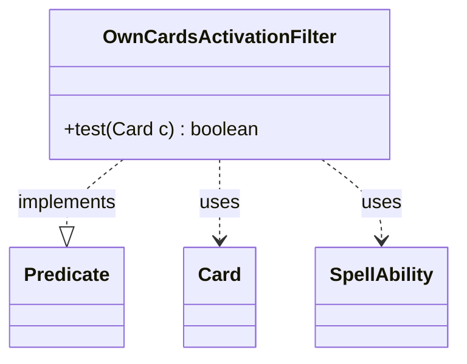

---
aliases:
  - OwnCardsActivationFilter
tags:
  - java/class
  - module/forge-game
  - pkg/forge/game/zone
fqn: forge.game.zone.PlayerZone.OwnCardsActivationFilter
package: forge.game.zone
module: forge-game
kind: Class
---

# OwnCardsActivationFilter

**Package:** `forge.game.zone`   **Module:** `forge-game`   **Kind:** Class



## Relationships
**Uses:**
- [[forge.game.card.Card|Card]]
- [[forge.game.spellability.SpellAbility|SpellAbility]]

## Design Description

OwnCardsActivationFilter is a private inner `Predicate<Card>` of `PlayerZone`, used to decide which cards in a player's zone the owning player may currently act on. Its single `test` method returns true when a card is visible to or playable by its controller, or when the enclosing zone enables an alternative cast—Flashback, Retrace, Jump-Start, Escape, or Disturb from the graveyard, and foretell or adventure from exile—falling back to a scan of each card's `SpellAbility` restrictions for one matching the current zone.

By living inside `PlayerZone` it leans on the outer instance's `is(ZoneType)` checks, tying activation eligibility to zone context. The explicit keyword checks reflect deliberate design intent: alternative spell abilities created at play time are not stored on the card or in the `mayPlay` map, so they must be detected directly rather than discovered through the normal ability enumeration.

## Source
`forge-game/src/main/java/forge/game/zone/PlayerZone.java` — declaration excerpt

```java
    private final class OwnCardsActivationFilter implements Predicate<Card> {
        @Override
        public boolean test(final Card c) {
            if (c.mayPlayerLook(c.getController())) {
                return true;
            }

            if (!c.mayPlay(c.getController()).isEmpty()) {
                return true;
            }

            // Keywords like Flashback/Escape create alternative SAs at play time,
            // not stored on the card or in the mayPlay map. Check directly.
            if (PlayerZone.this.is(ZoneType.Graveyard) && (c.hasKeyword(Keyword.FLASHBACK)
                    || c.hasKeyword(Keyword.RETRACE) || c.hasKeyword(Keyword.JUMP_START)
                    || c.hasKeyword(Keyword.ESCAPE) || c.hasKeyword(Keyword.DISTURB))) {
                return true;
            }
            if (PlayerZone.this.is(ZoneType.Exile) && (c.isForetold() || c.isOnAdventure())) {
                return true;
            }

            for (final SpellAbility sa : c.getSpellAbilities()) {
                if (PlayerZone.this.is(sa.getRestrictions().getZone())) {
                    return true;
                }
            }
            return false;
        }
    }
```

## Python
`forge/game/zone/PlayerZone/OwnCardsActivationFilter.py`

```python
from forge.game.card.Card import Card
from forge.game.spellability.SpellAbility import SpellAbility
from forge.game.zone.ZoneType import ZoneType
from forge.game.keyword.Keyword import Keyword


class OwnCardsActivationFilter:
    def __init__(self, outer):
        self.PlayerZone_this = outer

    def test(self, c: Card) -> bool:
        if c.mayPlayerLook(c.getController()):
            return True

        if not c.mayPlay(c.getController()).isEmpty():
            return True

        # Keywords like Flashback/Escape create alternative SAs at play time,
        # not stored on the card or in the mayPlay map. Check directly.
        if getattr(self.PlayerZone_this, "is")(ZoneType.Graveyard) and (
            c.hasKeyword(Keyword.FLASHBACK)
            or c.hasKeyword(Keyword.RETRACE)
            or c.hasKeyword(Keyword.JUMP_START)
            or c.hasKeyword(Keyword.ESCAPE)
            or c.hasKeyword(Keyword.DISTURB)
        ):
            return True
        if getattr(self.PlayerZone_this, "is")(ZoneType.Exile) and (
            c.isForetold() or c.isOnAdventure()
        ):
            return True

        for sa in c.getSpellAbilities():
            if getattr(self.PlayerZone_this, "is")(sa.getRestrictions().getZone()):
                return True
        return False
```
