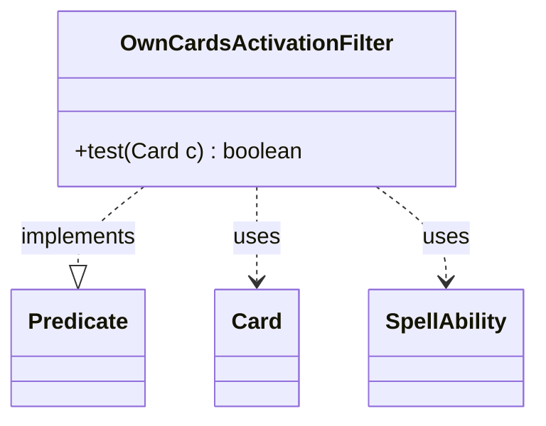

---
aliases:
  - OwnCardsActivationFilter
tags:
  - java/class
  - module/forge-game
  - pkg/forge/game/zone
fqn: forge.game.zone.PlayerZone.OwnCardsActivationFilter
package: forge.game.zone
module: forge-game
kind: Class
---

# OwnCardsActivationFilter

**Package:** `forge.game.zone` &nbsp; **Module:** `forge-game` &nbsp; **Kind:** Class



## Relationships
**Uses:**
- [[forge.game.card.Card|Card]]
- [[forge.game.spellability.SpellAbility|SpellAbility]]

## Source
`forge-game/src/main/java/forge/game/zone/PlayerZone.java` — declaration excerpt

```java
    private final class OwnCardsActivationFilter implements Predicate<Card> {
        @Override
        public boolean test(final Card c) {
            if (c.mayPlayerLook(c.getController())) {
                return true;
            }

            if (!c.mayPlay(c.getController()).isEmpty()) {
                return true;
            }

            // Keywords like Flashback/Escape create alternative SAs at play time,
            // not stored on the card or in the mayPlay map. Check directly.
            if (PlayerZone.this.is(ZoneType.Graveyard) && (c.hasKeyword(Keyword.FLASHBACK)
                    || c.hasKeyword(Keyword.RETRACE) || c.hasKeyword(Keyword.JUMP_START)
                    || c.hasKeyword(Keyword.ESCAPE) || c.hasKeyword(Keyword.DISTURB))) {
                return true;
            }
            if (PlayerZone.this.is(ZoneType.Exile) && (c.isForetold() || c.isOnAdventure())) {
                return true;
            }

            for (final SpellAbility sa : c.getSpellAbilities()) {
                if (PlayerZone.this.is(sa.getRestrictions().getZone())) {
                    return true;
                }
            }
            return false;
        }
    }
```
