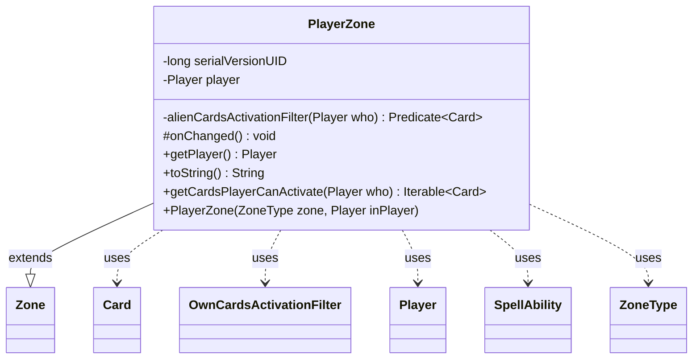

---
aliases:
  - PlayerZone
tags:
  - java/class
  - module/forge-game
  - pkg/forge/game/zone
fqn: forge.game.zone.PlayerZone
package: forge.game.zone
module: forge-game
kind: Class
---

# PlayerZone

**Package:** `forge.game.zone`   **Module:** `forge-game`   **Kind:** Class



## Relationships
**Extends:**
- [[forge.game.zone.Zone|Zone]]
**Uses:**
- [[forge.game.card.Card|Card]]
- [[forge.game.player.Player|Player]]
- [[forge.game.spellability.SpellAbility|SpellAbility]]
- [[forge.game.zone.PlayerZone.OwnCardsActivationFilter|OwnCardsActivationFilter]]
- [[forge.game.zone.ZoneType|ZoneType]]

## Design Description

PlayerZone specializes the abstract `Zone` to model a single player's region of cards (hand, battlefield, library, graveyard, exile, etc.), binding each zone instance to its owning `Player` and that player's `Game`. Beyond holding the player reference, it overrides `onChanged()` to keep the player's view synchronized and sort ordered hands, and renders a possessive label via `Lang`. Its central responsibility is `getCardsPlayerCanActivate(Player)`, which determines—through `Card` and `SpellAbility` queries—which cards a given player may legally play or activate from this zone.

The design distinguishes owner from non-owner access via two `Predicate<Card>` filters: the inner `OwnCardsActivationFilter` encodes zone-specific permissions (graveyard keywords like Flashback/Escape, exile's foretell/adventure, and SpellAbility zone restrictions), while `alienCardsActivationFilter` handles look/may-play rights for other players. Library access is deliberately limited to the top card, reflecting MTG rules.

## Source
`forge-game/src/main/java/forge/game/zone/PlayerZone.java`

```java
/*
 * Forge: Play Magic: the Gathering.
 * Copyright (C) 2011  Forge Team
 *
 * This program is free software: you can redistribute it and/or modify
 * it under the terms of the GNU General Public License as published by
 * the Free Software Foundation, either version 3 of the License, or
 * (at your option) any later version.
 * 
 * This program is distributed in the hope that it will be useful,
 * but WITHOUT ANY WARRANTY; without even the implied warranty of
 * MERCHANTABILITY or FITNESS FOR A PARTICULAR PURPOSE.  See the
 * GNU General Public License for more details.
 * 
 * You should have received a copy of the GNU General Public License
 * along with this program.  If not, see <http://www.gnu.org/licenses/>.
 */
package forge.game.zone;

import com.google.common.collect.Iterables;
import forge.game.card.Card;
import forge.game.card.CardLists;
import forge.game.keyword.Keyword;
import forge.game.player.Player;
import forge.game.spellability.SpellAbility;
import forge.util.Lang;

import java.util.function.Predicate;

/**
 * <p>
 * DefaultPlayerZone class.
 * </p>
 * 
 * @author Forge
 * @version $Id$
 */
public class PlayerZone extends Zone {
    private static final long serialVersionUID = -5687652485777639176L;

    // the this is not the owner of the card
    private static Predicate<Card> alienCardsActivationFilter(final Player who) {
        return c -> !c.mayPlay(who).isEmpty() || c.mayPlayerLook(who);
    }

    private final class OwnCardsActivationFilter implements Predicate<Card> {
        @Override
        public boolean test(final Card c) {
            if (c.mayPlayerLook(c.getController())) {
                return true;
            }

            if (!c.mayPlay(c.getController()).isEmpty()) {
                return true;
            }

            // Keywords like Flashback/Escape create alternative SAs at play time,
            // not stored on the card or in the mayPlay map. Check directly.
            if (PlayerZone.this.is(ZoneType.Graveyard) && (c.hasKeyword(Keyword.FLASHBACK)
                    || c.hasKeyword(Keyword.RETRACE) || c.hasKeyword(Keyword.JUMP_START)
                    || c.hasKeyword(Keyword.ESCAPE) || c.hasKeyword(Keyword.DISTURB))) {
                return true;
            }
            if (PlayerZone.this.is(ZoneType.Exile) && (c.isForetold() || c.isOnAdventure())) {
                return true;
            }

            for (final SpellAbility sa : c.getSpellAbilities()) {
                if (PlayerZone.this.is(sa.getRestrictions().getZone())) {
                    return true;
                }
            }
            return false;
        }
    }

    private final Player player;

    public PlayerZone(final ZoneType zone, final Player inPlayer) {
        super(zone, inPlayer.getGame());
        player = inPlayer;
    }

    @Override
    protected void onChanged() {
        if (getZoneType() == ZoneType.Hand && player.getController().isOrderedZone()) {
            sort();
        }
        player.updateZoneForView(this);
    }

    public final Player getPlayer() {
        return player;
    }

    @Override
    public final String toString() {
        return Lang.getInstance().getPossessedObject(player.toString(), zoneType.toString());
    }

    public Iterable<Card> getCardsPlayerCanActivate(Player who) {
        Iterable<Card> cl = getCards(false);
        boolean checkingForOwner = who == player;

        if (checkingForOwner && (is(ZoneType.Battlefield) || is(ZoneType.Hand))) {
            return cl;
        }

        // Only check the top card of the library
        if (is(ZoneType.Library)) {
            cl = Iterables.limit(cl, 1);
        }

        final Predicate<Card> filterPredicate = checkingForOwner ? new OwnCardsActivationFilter() : alienCardsActivationFilter(who);
        return CardLists.filter(cl, filterPredicate);
    }
}
```

## Python
`forge/game/zone/PlayerZone.py`

```python
from forge.game.card.Card import Card
from forge.game.card.CardLists import CardLists
from forge.game.keyword.Keyword import Keyword
from forge.game.player.Player import Player
from forge.game.spellability.SpellAbility import SpellAbility
from forge.util.Lang import Lang
from forge.game.zone.Zone import Zone
from forge.game.zone.ZoneType import ZoneType

import itertools
from typing import Callable, Iterable


class PlayerZone(Zone):
    serialVersionUID = -5687652485777639176

    # the this is not the owner of the card
    @staticmethod
    def alienCardsActivationFilter(who: Player) -> Callable[[Card], bool]:
        return lambda c: len(c.mayPlay(who)) != 0 or c.mayPlayerLook(who)

    class OwnCardsActivationFilter:
        def __init__(self, outer: "PlayerZone"):
            self.outer = outer

        def test(self, c: Card) -> bool:
            if c.mayPlayerLook(c.getController()):
                return True

            if len(c.mayPlay(c.getController())) != 0:
                return True

            # Keywords like Flashback/Escape create alternative SAs at play time,
            # not stored on the card or in the mayPlay map. Check directly.
            if self.outer.is_(ZoneType.Graveyard) and (c.hasKeyword(Keyword.FLASHBACK)
                    or c.hasKeyword(Keyword.RETRACE) or c.hasKeyword(Keyword.JUMP_START)
                    or c.hasKeyword(Keyword.ESCAPE) or c.hasKeyword(Keyword.DISTURB)):
                return True
            if self.outer.is_(ZoneType.Exile) and (c.isForetold() or c.isOnAdventure()):
                return True

            for sa in c.getSpellAbilities():
                if self.outer.is_(sa.getRestrictions().getZone()):
                    return True
            return False

        def __call__(self, c: Card) -> bool:
            return self.test(c)

    def __init__(self, zone: ZoneType, inPlayer: Player):
        super().__init__(zone, inPlayer.getGame())
        self.player = inPlayer

    def onChanged(self) -> None:
        if self.getZoneType() == ZoneType.Hand and self.player.getController().isOrderedZone():
            self.sort()
        self.player.updateZoneForView(self)

    def getPlayer(self) -> Player:
        return self.player

    def toString(self) -> str:
        return Lang.getInstance().getPossessedObject(self.player.toString(), self.zoneType.toString())

    def __str__(self) -> str:
        return self.toString()

    def getCardsPlayerCanActivate(self, who: Player) -> Iterable[Card]:
        cl = self.getCards(False)
        checkingForOwner = who == self.player

        if checkingForOwner and (self.is_(ZoneType.Battlefield) or self.is_(ZoneType.Hand)):
            return cl

        # Only check the top card of the library
        if self.is_(ZoneType.Library):
            cl = list(itertools.islice(cl, 1))

        filterPredicate = self.OwnCardsActivationFilter(self) if checkingForOwner else PlayerZone.alienCardsActivationFilter(who)
        return CardLists.filter(cl, filterPredicate)
```
