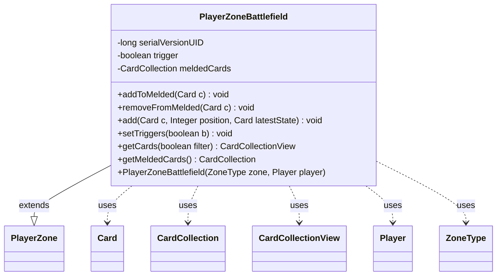

---
aliases:
  - PlayerZoneBattlefield
tags:
  - java/class
  - module/forge-game
  - pkg/forge/game/zone
fqn: forge.game.zone.PlayerZoneBattlefield
package: forge.game.zone
module: forge-game
kind: Class
---

# PlayerZoneBattlefield

**Package:** `forge.game.zone` &nbsp; **Module:** `forge-game` &nbsp; **Kind:** Class



## Relationships
**Extends:**
- [[forge.game.zone.PlayerZone|PlayerZone]]
**Uses:**
- [[forge.game.card.Card|Card]]
- [[forge.game.card.CardCollection|CardCollection]]
- [[forge.game.card.CardCollectionView|CardCollectionView]]
- [[forge.game.player.Player|Player]]
- [[forge.game.zone.ZoneType|ZoneType]]

## Source
`forge-game/src/main/java/forge/game/zone/PlayerZoneBattlefield.java`

```java
/*
 * Forge: Play Magic: the Gathering.
 * Copyright (C) 2011  Forge Team
 *
 * This program is free software: you can redistribute it and/or modify
 * it under the terms of the GNU General Public License as published by
 * the Free Software Foundation, either version 3 of the License, or
 * (at your option) any later version.
 * 
 * This program is distributed in the hope that it will be useful,
 * but WITHOUT ANY WARRANTY; without even the implied warranty of
 * MERCHANTABILITY or FITNESS FOR A PARTICULAR PURPOSE.  See the
 * GNU General Public License for more details.
 * 
 * You should have received a copy of the GNU General Public License
 * along with this program.  If not, see <http://www.gnu.org/licenses/>.
 */
package forge.game.zone;

import forge.game.card.Card;
import forge.game.card.CardCollection;
import forge.game.card.CardCollectionView;
import forge.game.player.Player;

/**
 * <p>
 * PlayerZoneComesIntoPlay class.
 * </p>
 * 
 * @author Forge

 * @version $Id$
 */
public class PlayerZoneBattlefield extends PlayerZone {
    /** Constant <code>serialVersionUID=5750837078903423978L</code>. */
    private static final long serialVersionUID = 5750837078903423978L;

    private boolean trigger = true;
    private CardCollection meldedCards = new CardCollection();

    public PlayerZoneBattlefield(final ZoneType zone, final Player player) {
        super(zone, player);
    }

    public final void addToMelded(final Card c) {
        c.getZone().remove(c);
        meldedCards.add(c);
    }

    public final void removeFromMelded(final Card c) {
        meldedCards.remove(c);
    }

    /** {@inheritDoc} */
    @Override
    public final void add(final Card c, final Integer position, final Card latestState) {
        if (c == null) {
            throw new RuntimeException("PlayerZoneComesInto Play : add() object is null");
        }

        super.add(c, position, latestState);

        if (trigger) {
            c.setSickness(true); // summoning sickness
        }
    }

    public final void setTriggers(final boolean b) {
        trigger = b;
    }

    @Override
    public final CardCollectionView getCards(final boolean filter) {
        // Battlefield filters out Phased Out cards by default. Needs to call
        // getCards(false) to get Phased Out cards

        CardCollectionView cards = super.getCards(false);
        if (!filter) {
            return cards;
        }

        boolean hasFilteredCard = false;
        for (Card c : cards) {
            if (c.isPhasedOut()) {
                hasFilteredCard = true;
                break;
            }
        }

        if (hasFilteredCard) {
            CardCollection filteredCollection = new CardCollection();
            for (Card c : cards) {
                if (!c.isPhasedOut()) {
                    filteredCollection.add(c);
                }
            }
            cards = filteredCollection;
        }
        return cards;
    }

    public final CardCollection getMeldedCards() {
        return meldedCards;
    }
}
```
