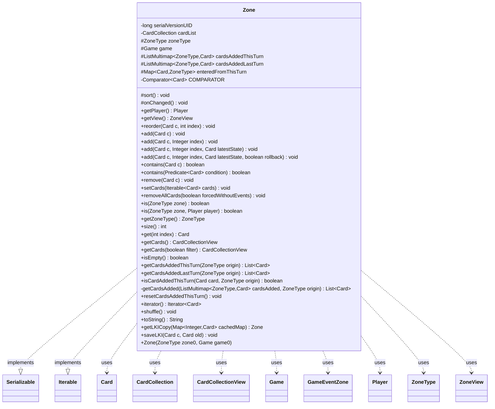

---
aliases:
  - Zone
tags:
  - java/class
  - module/forge-game
  - pkg/forge/game/zone
fqn: forge.game.zone.Zone
package: forge.game.zone
module: forge-game
kind: Class
---

# Zone

**Package:** `forge.game.zone`   **Module:** `forge-game`   **Kind:** Class



## Relationships
**Uses:**
- [[forge.game.Game|Game]]
- [[forge.game.card.Card|Card]]
- [[forge.game.card.CardCollection|CardCollection]]
- [[forge.game.card.CardCollectionView|CardCollectionView]]
- [[forge.game.event.GameEventZone|GameEventZone]]
- [[forge.game.player.Player|Player]]
- [[forge.game.zone.ZoneType|ZoneType]]
- [[forge.game.zone.ZoneView|ZoneView]]

## Design Description

Zone models a single Magic: the Gathering game region (library, graveyard, battlefield, stack, command, etc.), owning the ordered `CardCollection` of cards it holds and serving as the authoritative gatekeeper for cards moving in and out of that region. Implementing `Serializable` and `Iterable<Card>`, it exposes add/remove/contains/reorder/shuffle operations while firing `GameEventZone` notifications through its parent `Game` so views stay synchronized. It collaborates with `Card`, `ZoneType`, `Player`, and `ZoneView` to enforce zone-entry rules—resetting tap state, tracking commanders, descending on graveyard entry—and uses transient multimaps to record which cards entered from which origin this and last turn. The base class deliberately returns a null player and an unfiltered card view, leaving player ownership and battlefield filtering to subclasses, and provides last-known-information snapshots via `getLKICopy`/`saveLKI` for rollback and game-state queries.

## Source
`forge-game/src/main/java/forge/game/zone/Zone.java`

```java
/*
 * Forge: Play Magic: the Gathering.
 * Copyright (C) 2011  Forge Team
 *
 * This program is free software: you can redistribute it and/or modify
 * it under the terms of the GNU General Public License as published by
 * the Free Software Foundation, either version 3 of the License, or
 * (at your option) any later version.
 *
 * This program is distributed in the hope that it will be useful,
 * but WITHOUT ANY WARRANTY; without even the implied warranty of
 * MERCHANTABILITY or FITNESS FOR A PARTICULAR PURPOSE.  See the
 * GNU General Public License for more details.
 *
 * You should have received a copy of the GNU General Public License
 * along with this program.  If not, see <http://www.gnu.org/licenses/>.
 */
package forge.game.zone;

import java.util.*;
import java.util.function.Predicate;

import com.google.common.collect.ListMultimap;
import com.google.common.collect.Lists;
import com.google.common.collect.Maps;
import com.google.common.collect.MultimapBuilder;

import forge.card.CardStateName;
import forge.game.Game;
import forge.game.GameType;
import forge.game.card.*;
import forge.game.event.EventValueChangeType;
import forge.game.event.GameEventZone;
import forge.game.player.Player;
import forge.game.player.PlayerView;
import forge.util.MyRandom;

/**
 * <p>
 * DefaultPlayerZone class.
 * </p>
 *
 * @author Forge
 * @version $Id: PlayerZone.java 17582 2012-10-19 22:39:09Z Max mtg $
 */
public class Zone implements java.io.Serializable, Iterable<Card> {
    private static final long serialVersionUID = -5687652485777639176L;

    private final CardCollection cardList = new CardCollection();
    protected final ZoneType zoneType;
    protected final Game game;

    protected final transient ListMultimap<ZoneType, Card> cardsAddedThisTurn = MultimapBuilder.enumKeys(ZoneType.class).arrayListValues().build();
    protected final transient ListMultimap<ZoneType, Card> cardsAddedLastTurn = MultimapBuilder.enumKeys(ZoneType.class).arrayListValues().build();
    protected final transient Map<Card, ZoneType> enteredFromThisTurn = Maps.newHashMap();

    // might support different order via preference later
    private static final Comparator<Card> COMPARATOR = Comparator.comparingInt((Card c) -> c.getCMC())
            .thenComparing(c -> c.getColor().getOrderWeight())
            .thenComparing(Comparator.comparing(Card::getName))
            .thenComparing(Card::hasPerpetual);

    protected void sort() {
        cardList.sort(COMPARATOR);
    }

    public Zone(final ZoneType zone0, Game game0) {
        zoneType = zone0;
        game = game0;
    }

    protected void onChanged() {
    }

    public Player getPlayer() { // generic zones like stack have no player associated
        return null;
    }

    public ZoneView getView() {
        return new ZoneView(PlayerView.get(getPlayer()), zoneType);
    }

    public final void reorder(final Card c, final int index) {
        cardList.remove(c);
        cardList.add(index, c);
    }

    public final void add(final Card c) {
        add(c, null);
    }
    public final void add(final Card c, final Integer index) {
        add(c, index, null);
    }
    public void add(final Card c, Integer index, final Card latestState) {
        add(c, index, latestState, false);
    }
    public void add(final Card c, Integer index, final Card latestState, final boolean rollback) {
        if (index != null && cardList.isEmpty() && index > 0) {
            // something went wrong, most likely the method fired when the game was in an unexpected state
            // (e.g. conceding during the mana payment prompt)
            System.out.println("Warning: tried to add a card to zone with a specific non-zero index, but the zone was empty! Canceling Zone#add to avoid a crash.");
            return;
        }

        //ensure commander returns to being first card in command zone
        if (index == null && zoneType == ZoneType.Command && c.isCommander()) {
            index = 0;
            if (game.getRules().hasAppliedVariant(GameType.Oathbreaker) && c.getRules().canBeSignatureSpell()
                    && !cardList.isEmpty() && cardList.get(0).isCommander()) {
                index = 1; //signature spell should return to being second card in command zone if oathbreaker is there too
            }
        }

        if (!rollback) {
            // Immutable cards are usually emblems and effects
            if (!c.isImmutable()) {
                final Zone oldZone = game.getZoneOf(c);
                final ZoneType zt = oldZone == null ? ZoneType.Stack : oldZone.getZoneType();

                // don't go in there if its a control change
                if (zt != zoneType) {
                    c.setTurnInController(getPlayer());
                    c.setTurnInZone(game.getPhaseHandler().getTurn());
                    if (latestState != null) {
                        cardsAddedThisTurn.put(zt, latestState);
                        enteredFromThisTurn.put(latestState, zt);
                    }
                }
            }

            if (zoneType != ZoneType.Battlefield) {
                c.setTapped(false);
            }

            if (zoneType == ZoneType.Graveyard && c.isPermanent() && !c.isToken()) {
                c.getOwner().descend();
            }
        }

        c.setZone(this);

        if ((zoneType == ZoneType.Battlefield || !c.isToken() || c.getCurrentStateName() == CardStateName.PreparedSpell) || (zoneType == ZoneType.Stack && c.getCopiedPermanent() != null)) {
            if (index == null) {
                cardList.add(c);
            } else {
                cardList.add(index, c);
            }
        }
        onChanged();

        game.fireEvent(new GameEventZone(zoneType, getPlayer(), EventValueChangeType.Added, c));
   }

    public final boolean contains(final Card c) {
        return cardList.contains(c);
    }

    public final boolean contains(final Predicate<Card> condition) {
        return cardList.anyMatch(condition);
    }

    public void remove(final Card c) {
        if (cardList.remove(c)) {
            onChanged();
            game.fireEvent(new GameEventZone(zoneType, getPlayer(), EventValueChangeType.Removed, c));
        }
    }

    public final void setCards(final Iterable<Card> cards) {
        cardList.clear();
        for (Card c : cards) {
            c.setZone(this);
            cardList.add(c);
        }
        onChanged();
        game.fireEvent(new GameEventZone(zoneType, getPlayer(), EventValueChangeType.ComplexUpdate, null));
    }

    public final void removeAllCards(boolean forcedWithoutEvents) {
        if (forcedWithoutEvents) {
            cardList.clear();
        } else {
            for (Card c : cardList) {
                remove(c);
            }
        }
    }

    public final boolean is(final ZoneType zone) {
        return zone == zoneType;
    }

    public final boolean is(final ZoneType zone, final Player player) {
        return zoneType == zone && player == getPlayer();
    }

    public final ZoneType getZoneType() {
        return zoneType;
    }

    public final int size() {
        return cardList.size();
    }

    public final Card get(final int index) {
        return cardList.get(index);
    }

    public final CardCollectionView getCards() {
        return getCards(true);
    }

    public CardCollectionView getCards(final boolean filter) {
        return cardList; // Non-Battlefield PlayerZones don't care about the filter
    }

    public final boolean isEmpty() {
        return cardList.isEmpty();
    }

    public final List<Card> getCardsAddedThisTurn(final ZoneType origin) {
        return getCardsAdded(cardsAddedThisTurn, origin);
    }

    public final List<Card> getCardsAddedLastTurn(final ZoneType origin) {
        return getCardsAdded(cardsAddedLastTurn, origin);
    }

    public final boolean isCardAddedThisTurn(final Card card, final ZoneType origin) {
        if (cardsAddedThisTurn.containsEntry(origin, card)) {
            return origin.equals(enteredFromThisTurn.get(card));
        }
        return false;
    }

    private static List<Card> getCardsAdded(final ListMultimap<ZoneType, Card> cardsAdded, final ZoneType origin) {
        if (origin != null) {
            return Lists.newArrayList(cardsAdded.get(origin));
        }

        if (cardsAdded.isEmpty()) {
            return List.of();
        }

        // all cards if key == null
        return Lists.newArrayList(cardsAdded.values());
    }

    public final void resetCardsAddedThisTurn() {
        cardsAddedLastTurn.clear();
        cardsAddedLastTurn.putAll(cardsAddedThisTurn);
        cardsAddedThisTurn.clear();
        enteredFromThisTurn.clear();
    }

    @Override
    public Iterator<Card> iterator() {
        return cardList.iterator();
    }

    public void shuffle() {
        Collections.shuffle(cardList, MyRandom.getRandom());
        onChanged();
    }

    @Override
    public String toString() {
        return zoneType.toString();
    }

    public Zone getLKICopy(Map<Integer, Card> cachedMap) {
        Zone result = new Zone(zoneType, game);

        result.setCards(CardCopyService.getLKICopyList(getCards(), cachedMap));

        return result;
    }

    public void saveLKI(Card c, Card old) {
        final Zone oldZone = game.getZoneOf(old);
        final ZoneType zt = oldZone == null ? ZoneType.Stack : oldZone.getZoneType();
        if (zt == zoneType) {
            return;
        }
        Card lki = CardCopyService.getLKICopy(c);
        cardsAddedThisTurn.put(zt, lki);
        enteredFromThisTurn.put(lki, zt);
    }
}
```

## Python
`forge/game/zone/Zone.py`

```python
from forge.game.Game import Game
from forge.game.card.Card import Card
from forge.game.card.CardCollection import CardCollection
from forge.game.card.CardCollectionView import CardCollectionView
from forge.game.event.GameEventZone import GameEventZone
from forge.game.player.Player import Player
from forge.game.zone.ZoneType import ZoneType
from forge.game.zone.ZoneView import ZoneView

import functools
from typing import Iterator, List, Optional, Callable

from forge.card.CardStateName import CardStateName
from forge.game.GameType import GameType
from forge.game.card.CardCopyService import CardCopyService
from forge.game.event.EventValueChangeType import EventValueChangeType
from forge.game.player.PlayerView import PlayerView
from forge.util.MyRandom import MyRandom


def _card_comparator(a: Card, b: Card) -> int:
    # comparingInt(getCMC).thenComparing(color order weight)
    # .thenComparing(getName).thenComparing(hasPerpetual)
    ka = a.getCMC()
    kb = b.getCMC()
    if ka != kb:
        return -1 if ka < kb else 1

    ka = a.getColor().getOrderWeight()
    kb = b.getColor().getOrderWeight()
    if ka != kb:
        return -1 if ka < kb else 1

    ka = a.getName()
    kb = b.getName()
    if ka != kb:
        return -1 if ka < kb else 1

    ka = a.hasPerpetual()
    kb = b.hasPerpetual()
    if ka != kb:
        return -1 if ka < kb else 1

    return 0


class Zone:
    serialVersionUID = -5687652485777639176

    # might support different order via preference later
    COMPARATOR = staticmethod(functools.cmp_to_key(_card_comparator))

    def __init__(self, zone0: ZoneType, game0: Game):
        self.cardList = CardCollection()
        self.zoneType = zone0
        self.game = game0
        self.cardsAddedThisTurn = {}
        self.cardsAddedLastTurn = {}
        self.enteredFromThisTurn = {}

    def sort(self) -> None:
        self.cardList.sort(Zone.COMPARATOR)

    def onChanged(self) -> None:
        pass

    def getPlayer(self) -> Optional[Player]:  # generic zones like stack have no player associated
        return None

    def getView(self) -> ZoneView:
        return ZoneView(PlayerView.get(self.getPlayer()), self.zoneType)

    def reorder(self, c: Card, index: int) -> None:
        self.cardList.remove(c)
        self.cardList.add(index, c)

    def add(self, c: Card, index: Optional[int] = None, latestState: Optional[Card] = None, rollback: bool = False) -> None:
        if index is not None and self.cardList.isEmpty() and index > 0:
            # something went wrong, most likely the method fired when the game was in an unexpected state
            # (e.g. conceding during the mana payment prompt)
            print("Warning: tried to add a card to zone with a specific non-zero index, but the zone was empty! Canceling Zone#add to avoid a crash.")
            return

        # ensure commander returns to being first card in command zone
        if index is None and self.zoneType == ZoneType.Command and c.isCommander():
            index = 0
            if self.game.getRules().hasAppliedVariant(GameType.Oathbreaker) and c.getRules().canBeSignatureSpell() \
                    and not self.cardList.isEmpty() and self.cardList.get(0).isCommander():
                index = 1  # signature spell should return to being second card in command zone if oathbreaker is there too

        if not rollback:
            # Immutable cards are usually emblems and effects
            if not c.isImmutable():
                oldZone = self.game.getZoneOf(c)
                zt = ZoneType.Stack if oldZone is None else oldZone.getZoneType()

                # don't go in there if its a control change
                if zt != self.zoneType:
                    c.setTurnInController(self.getPlayer())
                    c.setTurnInZone(self.game.getPhaseHandler().getTurn())
                    if latestState is not None:
                        self.cardsAddedThisTurn.setdefault(zt, []).append(latestState)
                        self.enteredFromThisTurn[latestState] = zt

            if self.zoneType != ZoneType.Battlefield:
                c.setTapped(False)

            if self.zoneType == ZoneType.Graveyard and c.isPermanent() and not c.isToken():
                c.getOwner().descend()

        c.setZone(self)

        if (self.zoneType == ZoneType.Battlefield or not c.isToken() or c.getCurrentStateName() == CardStateName.PreparedSpell) or (self.zoneType == ZoneType.Stack and c.getCopiedPermanent() is not None):
            if index is None:
                self.cardList.add(c)
            else:
                self.cardList.add(index, c)
        self.onChanged()

        self.game.fireEvent(GameEventZone(self.zoneType, self.getPlayer(), EventValueChangeType.Added, c))

    def contains(self, c) -> bool:
        if callable(c) and not isinstance(c, Card):
            return self.cardList.anyMatch(c)
        return self.cardList.contains(c)

    def remove(self, c: Card) -> None:
        if self.cardList.remove(c):
            self.onChanged()
            self.game.fireEvent(GameEventZone(self.zoneType, self.getPlayer(), EventValueChangeType.Removed, c))

    def setCards(self, cards) -> None:
        self.cardList.clear()
        for c in cards:
            c.setZone(self)
            self.cardList.add(c)
        self.onChanged()
        self.game.fireEvent(GameEventZone(self.zoneType, self.getPlayer(), EventValueChangeType.ComplexUpdate, None))

    def removeAllCards(self, forcedWithoutEvents: bool) -> None:
        if forcedWithoutEvents:
            self.cardList.clear()
        else:
            for c in self.cardList:
                self.remove(c)

    def is_(self, zone: ZoneType, player: Optional[Player] = None) -> bool:
        if player is None:
            return zone == self.zoneType
        return self.zoneType == zone and player == self.getPlayer()

    def getZoneType(self) -> ZoneType:
        return self.zoneType

    def size(self) -> int:
        return self.cardList.size()

    def get(self, index: int) -> Card:
        return self.cardList.get(index)

    def getCards(self, filter: bool = True) -> CardCollectionView:
        return self.cardList  # Non-Battlefield PlayerZones don't care about the filter

    def isEmpty(self) -> bool:
        return self.cardList.isEmpty()

    def getCardsAddedThisTurn(self, origin: ZoneType) -> List[Card]:
        return self.getCardsAdded(self.cardsAddedThisTurn, origin)

    def getCardsAddedLastTurn(self, origin: ZoneType) -> List[Card]:
        return self.getCardsAdded(self.cardsAddedLastTurn, origin)

    def isCardAddedThisTurn(self, card: Card, origin: ZoneType) -> bool:
        if card in self.cardsAddedThisTurn.get(origin, []):
            return origin == self.enteredFromThisTurn.get(card)
        return False

    @staticmethod
    def getCardsAdded(cardsAdded: dict, origin: ZoneType) -> List[Card]:
        if origin is not None:
            return list(cardsAdded.get(origin, []))

        if not cardsAdded:
            return []

        # all cards if key == null
        result = []
        for values in cardsAdded.values():
            result.extend(values)
        return result

    def resetCardsAddedThisTurn(self) -> None:
        self.cardsAddedLastTurn.clear()
        for k, v in self.cardsAddedThisTurn.items():
            self.cardsAddedLastTurn.setdefault(k, []).extend(v)
        self.cardsAddedThisTurn.clear()
        self.enteredFromThisTurn.clear()

    def __iter__(self) -> Iterator[Card]:
        return iter(self.cardList)

    def iterator(self) -> Iterator[Card]:
        return self.cardList.iterator()

    def shuffle(self) -> None:
        MyRandom.getRandom().shuffle(self.cardList)
        self.onChanged()

    def __str__(self) -> str:
        return str(self.zoneType)

    def toString(self) -> str:
        return self.zoneType.toString()

    def getLKICopy(self, cachedMap: dict) -> "Zone":
        result = Zone(self.zoneType, self.game)

        result.setCards(CardCopyService.getLKICopyList(self.getCards(), cachedMap))

        return result

    def saveLKI(self, c: Card, old: Card) -> None:
        oldZone = self.game.getZoneOf(old)
        zt = ZoneType.Stack if oldZone is None else oldZone.getZoneType()
        if zt == self.zoneType:
            return
        lki = CardCopyService.getLKICopy(c)
        self.cardsAddedThisTurn.setdefault(zt, []).append(lki)
        self.enteredFromThisTurn[lki] = zt
```
