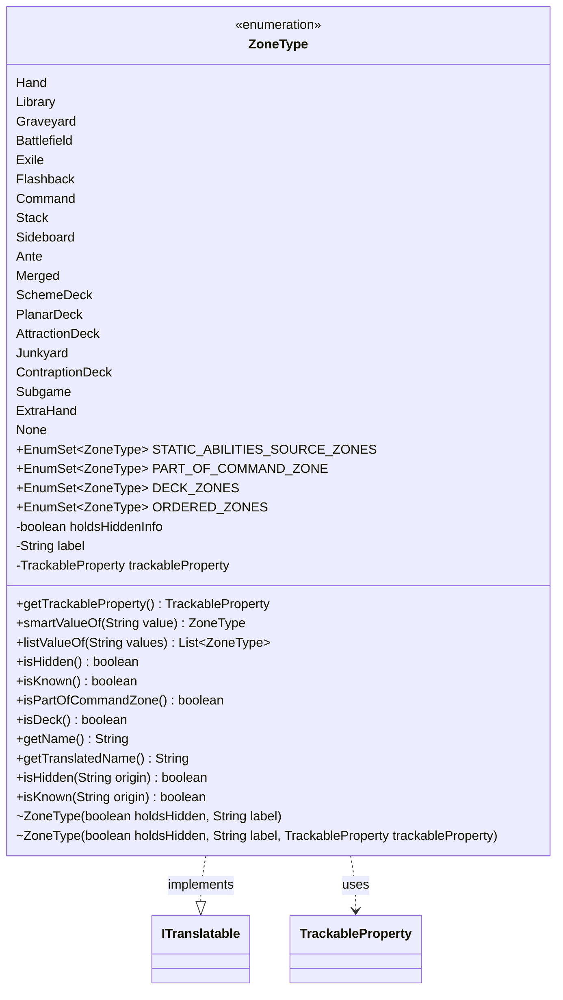

---
aliases:
  - ZoneType
tags:
  - java/enum
  - module/forge-game
  - pkg/forge/game/zone
fqn: forge.game.zone.ZoneType
package: forge.game.zone
module: forge-game
kind: Enum
---

# ZoneType

**Package:** `forge.game.zone` &nbsp; **Module:** `forge-game` &nbsp; **Kind:** Enum



## Relationships
**Implements:**
- [[forge.util.ITranslatable|ITranslatable]]
**Uses:**
- [[forge.trackable.TrackableProperty|TrackableProperty]]

## Design Description

Zone-related semantics in Magic: The Gathering, enumerating every game zone (Hand, Library, Graveyard, Battlefield, etc.) and centralizing the rules that distinguish them. Each constant carries a hidden-information flag, a localization label, and an optional TrackableProperty, so the enum encapsulates both visibility semantics and the binding to the network-trackable view layer. It implements ITranslatable to expose localized display names and uses TrackableProperty to map a zone to the field holding its cards on PlayerView.

The class concentrates zone-classification logic through static EnumSets (deck zones, command-zone members, ordered zones, static-ability sources) and convenience predicates like isHidden, isDeck, and isPartOfCommandZone. Lenient string-parsing helpers (smartValueOf, listValueOf) tolerate case differences and the special "All" token, reflecting its role as a parsing target for card-script origin definitions.

## Source
`forge-game/src/main/java/forge/game/zone/ZoneType.java`

```java
package forge.game.zone;

import forge.trackable.TrackableProperty;
import forge.util.ITranslatable;
import forge.util.Localizer;

import java.util.ArrayList;
import java.util.EnumSet;
import java.util.List;

/**
 * The Enum Zone.
 */
public enum ZoneType implements ITranslatable {
    Hand(true, "lblHandZone", TrackableProperty.Hand),
    Library(true, "lblLibraryZone", TrackableProperty.Library),
    Graveyard(false, "lblGraveyardZone", TrackableProperty.Graveyard),
    Battlefield(false, "lblBattlefieldZone", TrackableProperty.Battlefield),
    Exile(false, "lblExileZone", TrackableProperty.Exile),
    Flashback(false, "lblFlashbackZone", TrackableProperty.Flashback),
    Command(false, "lblCommandZone", TrackableProperty.Command),
    Stack(false, "lblStackZone"),
    Sideboard(true, "lblSideboardZone", TrackableProperty.Sideboard),
    Ante(false, "lblAnteZone", TrackableProperty.Ante),
    Merged(false, "lblBattlefieldZone"),
    SchemeDeck(true, "lblSchemeDeckZone", TrackableProperty.SchemeDeck),
    PlanarDeck(true, "lblPlanarDeckZone", TrackableProperty.PlanarDeck),
    AttractionDeck(true, "lblAttractionDeckZone", TrackableProperty.AttractionDeck),
    Junkyard(false, "lblJunkyardZone", TrackableProperty.Junkyard),
    ContraptionDeck(true, "lblContraptionDeckZone", TrackableProperty.ContraptionDeck),
    //Scrapyard is like the Junkyard but for contraptions; just going to recycle the Junkyard for this.
    Subgame(true, "lblSubgameZone"),
    // ExtraHand is used for Backup Plan for temporary extra hands
    ExtraHand(true, "lblHandZone"),
    None(true, "lblNoneZone");

    public static final EnumSet<ZoneType> STATIC_ABILITIES_SOURCE_ZONES = EnumSet.of(Battlefield, Graveyard, Exile, Command, Stack/*, Hand*/);
    public static final EnumSet<ZoneType> PART_OF_COMMAND_ZONE = EnumSet.of(Command, SchemeDeck, PlanarDeck, AttractionDeck, ContraptionDeck, Junkyard);
    public static final EnumSet<ZoneType> DECK_ZONES = EnumSet.of(Library, SchemeDeck, PlanarDeck, AttractionDeck, ContraptionDeck);
    public static final EnumSet<ZoneType> ORDERED_ZONES = EnumSet.of(Library, SchemeDeck, PlanarDeck, AttractionDeck, ContraptionDeck, Hand, Graveyard, Stack);

    private final boolean holdsHiddenInfo;
    private final String label;
    private final TrackableProperty trackableProperty;

    ZoneType(boolean holdsHidden, String label) {
        this(holdsHidden, label, null);
    }
    ZoneType(boolean holdsHidden, String label, TrackableProperty trackableProperty) {
        holdsHiddenInfo = holdsHidden;
        this.label = label;
        this.trackableProperty = trackableProperty;
    }

    /** Returns the TrackableProperty that holds this zone's cards on PlayerView, or null. */
    public TrackableProperty getTrackableProperty() {
        return trackableProperty;
    }

    public static ZoneType smartValueOf(final String value) {
        if (value == null) {
            return null;
        }
        if ("All".equals(value)) {
            return null;
        }
        final String valToCompate = value.trim();
        for (final ZoneType v : ZoneType.values()) {
            if (v.name().compareToIgnoreCase(valToCompate) == 0) {
                return v;
            }
        }
        throw new IllegalArgumentException("No element named " + value + " in enum Zone");
    }

    public static List<ZoneType> listValueOf(final String values) {
        if ("All".equals(values)) {
            return List.of(Battlefield, Hand, Graveyard, Exile, Stack, Library, Command);
        }
        final List<ZoneType> result = new ArrayList<>();
        for (final String s : values.split("[, ]+")) {
            ZoneType zt = ZoneType.smartValueOf(s);
            if (zt != null) {
                result.add(zt);
            }
        }
        return result;
    }

    public boolean isHidden() {
        return holdsHiddenInfo;
    }

    public boolean isKnown() {
        return !holdsHiddenInfo;
    }

    public boolean isPartOfCommandZone() {
        return PART_OF_COMMAND_ZONE.contains(this);
    }

    /**
     * Indicates that this zone behaves as a deck - an ordered pile of face down cards
     * such as the Library or Planar Deck.
     */
    public boolean isDeck() {
        return DECK_ZONES.contains(this);
    }

    @Override
    public String getName() {
        return name();
    }
    @Override
    public String getTranslatedName() {
        return Localizer.getInstance().getMessage(label);
    }

    public static boolean isHidden(final String origin) {
        List<ZoneType> zone = ZoneType.listValueOf(origin);

        if (zone.isEmpty()) {
            return true;
        }

        for (ZoneType z : zone) {
            if (z.isHidden()) {
                return true;
            }
        }
        return false;
    }

    public static boolean isKnown(final String origin) {
        return !isHidden(origin);
    }
}
```

## Python
`forge/game/zone/ZoneType.py`

```python
from forge.trackable.TrackableProperty import TrackableProperty
from forge.util.ITranslatable import ITranslatable
from forge.util.Localizer import Localizer

from enum import Enum
from typing import List, Optional


class ZoneType(ITranslatable, Enum):
    """The Enum Zone."""

    Hand = (True, "lblHandZone", TrackableProperty.Hand)
    Library = (True, "lblLibraryZone", TrackableProperty.Library)
    Graveyard = (False, "lblGraveyardZone", TrackableProperty.Graveyard)
    Battlefield = (False, "lblBattlefieldZone", TrackableProperty.Battlefield)
    Exile = (False, "lblExileZone", TrackableProperty.Exile)
    Flashback = (False, "lblFlashbackZone", TrackableProperty.Flashback)
    Command = (False, "lblCommandZone", TrackableProperty.Command)
    Stack = (False, "lblStackZone")
    Sideboard = (True, "lblSideboardZone", TrackableProperty.Sideboard)
    Ante = (False, "lblAnteZone", TrackableProperty.Ante)
    Merged = (False, "lblBattlefieldZone")
    SchemeDeck = (True, "lblSchemeDeckZone", TrackableProperty.SchemeDeck)
    PlanarDeck = (True, "lblPlanarDeckZone", TrackableProperty.PlanarDeck)
    AttractionDeck = (True, "lblAttractionDeckZone", TrackableProperty.AttractionDeck)
    Junkyard = (False, "lblJunkyardZone", TrackableProperty.Junkyard)
    ContraptionDeck = (True, "lblContraptionDeckZone", TrackableProperty.ContraptionDeck)
    # Scrapyard is like the Junkyard but for contraptions; just going to recycle the Junkyard for this.
    Subgame = (True, "lblSubgameZone")
    # ExtraHand is used for Backup Plan for temporary extra hands
    ExtraHand = (True, "lblHandZone")
    None_ = (True, "lblNoneZone")

    def __init__(self, holdsHidden: bool, label: str, trackableProperty: Optional[TrackableProperty] = None):
        self.holdsHiddenInfo = holdsHidden
        self.label = label
        self.trackableProperty = trackableProperty

    def getTrackableProperty(self) -> TrackableProperty:
        """Returns the TrackableProperty that holds this zone's cards on PlayerView, or null."""
        return self.trackableProperty

    @staticmethod
    def smartValueOf(value: str) -> "ZoneType":
        if value is None:
            return None
        if "All" == value:
            return None
        valToCompate = value.strip()
        for v in ZoneType.values():
            if v.name().lower() == valToCompate.lower():
                return v
        raise ValueError("No element named " + value + " in enum Zone")

    @staticmethod
    def listValueOf(values: str) -> List["ZoneType"]:
        if "All" == values:
            return [ZoneType.Battlefield, ZoneType.Hand, ZoneType.Graveyard, ZoneType.Exile,
                    ZoneType.Stack, ZoneType.Library, ZoneType.Command]
        import re
        result: List[ZoneType] = []
        for s in re.split("[, ]+", values):
            zt = ZoneType.smartValueOf(s)
            if zt is not None:
                result.append(zt)
        return result

    def isHidden(self) -> bool:
        return self.holdsHiddenInfo

    def isKnown(self) -> bool:
        return not self.holdsHiddenInfo

    def isPartOfCommandZone(self) -> bool:
        return self in ZoneType.PART_OF_COMMAND_ZONE

    def isDeck(self) -> bool:
        """
        Indicates that this zone behaves as a deck - an ordered pile of face down cards
        such as the Library or Planar Deck.
        """
        return self in ZoneType.DECK_ZONES

    def getName(self) -> str:
        return self.name()

    def getTranslatedName(self) -> str:
        return Localizer.getInstance().getMessage(self.label)

    @staticmethod
    def isHidden(origin: str) -> bool:
        zone = ZoneType.listValueOf(origin)

        if len(zone) == 0:
            return True

        for z in zone:
            if z.isHidden():
                return True
        return False

    @staticmethod
    def isKnown(origin: str) -> bool:
        return not ZoneType.isHidden(origin)


ZoneType.STATIC_ABILITIES_SOURCE_ZONES = frozenset({
    ZoneType.Battlefield, ZoneType.Graveyard, ZoneType.Exile, ZoneType.Command, ZoneType.Stack  # , Hand
})
ZoneType.PART_OF_COMMAND_ZONE = frozenset({
    ZoneType.Command, ZoneType.SchemeDeck, ZoneType.PlanarDeck, ZoneType.AttractionDeck,
    ZoneType.ContraptionDeck, ZoneType.Junkyard
})
ZoneType.DECK_ZONES = frozenset({
    ZoneType.Library, ZoneType.SchemeDeck, ZoneType.PlanarDeck, ZoneType.AttractionDeck,
    ZoneType.ContraptionDeck
})
ZoneType.ORDERED_ZONES = frozenset({
    ZoneType.Library, ZoneType.SchemeDeck, ZoneType.PlanarDeck, ZoneType.AttractionDeck,
    ZoneType.ContraptionDeck, ZoneType.Hand, ZoneType.Graveyard, ZoneType.Stack
})
```
