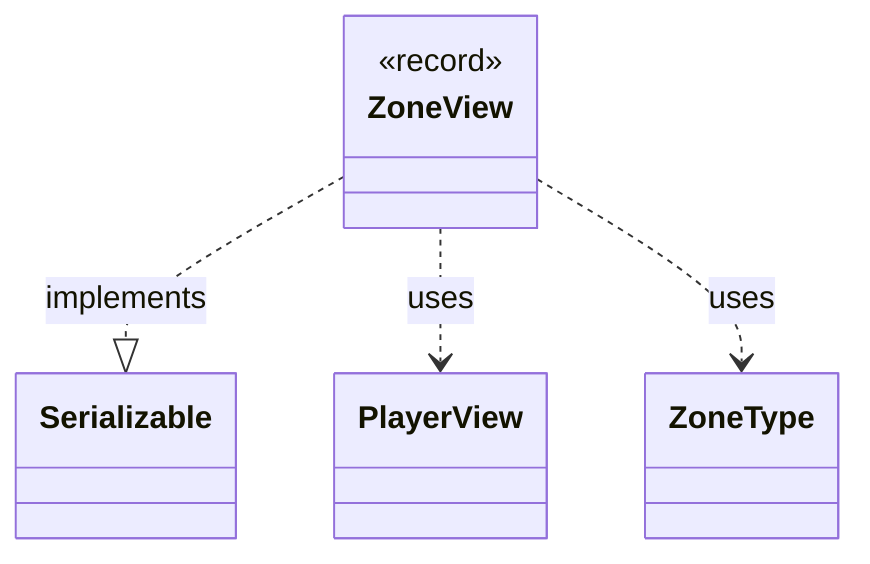

---
aliases:
  - ZoneView
tags:
  - java/record
  - module/forge-game
  - pkg/forge/game/zone
fqn: forge.game.zone.ZoneView
package: forge.game.zone
module: forge-game
kind: Record
---

# ZoneView

**Package:** `forge.game.zone`   **Module:** `forge-game`   **Kind:** Record



## Relationships
**Uses:**
- [[forge.game.player.PlayerView|PlayerView]]
- [[forge.game.zone.ZoneType|ZoneType]]

## Design Description

Snapshots an MTG zone's identity—its owning `PlayerView` and its `ZoneType`—as an immutable record rather than a live engine reference. By implementing `Serializable` and holding only view-layer collaborators, it lets game events communicate zone transitions across the engine/UI boundary without exposing or coupling to mutable internal `Zone` objects. The record form makes the snapshot inherently final and value-based, reinforcing its role as a lightweight, transmissible descriptor used purely to track which player owns the zone and what kind of zone it is.

## Source
`forge-game/src/main/java/forge/game/zone/ZoneView.java`

```java
package forge.game.zone;

import forge.game.player.PlayerView;

import java.io.Serializable;

/**
 * A serializable snapshot of a zone's owner and type, used by game events
 * to track zone transitions without referencing engine objects.
 */
public record ZoneView(PlayerView player, ZoneType zoneType) implements Serializable {}
```

## Python
`forge/game/zone/ZoneView.py`

```python
from forge.game.player.PlayerView import PlayerView
from forge.game.zone.ZoneType import ZoneType

import typing


class ZoneView(typing.NamedTuple):
    """
    A serializable snapshot of a zone's owner and type, used by game events
    to track zone transitions without referencing engine objects.
    """
    player: PlayerView
    zoneType: ZoneType
```
