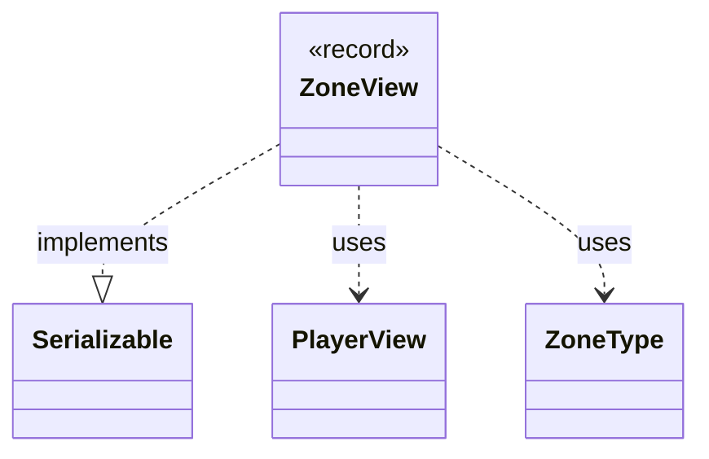

---
aliases:
  - ZoneView
tags:
  - java/record
  - module/forge-game
  - pkg/forge/game/zone
fqn: forge.game.zone.ZoneView
package: forge.game.zone
module: forge-game
kind: Record
---

# ZoneView

**Package:** `forge.game.zone` &nbsp; **Module:** `forge-game` &nbsp; **Kind:** Record



## Relationships
**Uses:**
- [[forge.game.player.PlayerView|PlayerView]]
- [[forge.game.zone.ZoneType|ZoneType]]

## Source
`forge-game/src/main/java/forge/game/zone/ZoneView.java`

```java
package forge.game.zone;

import forge.game.player.PlayerView;

import java.io.Serializable;

/**
 * A serializable snapshot of a zone's owner and type, used by game events
 * to track zone transitions without referencing engine objects.
 */
public record ZoneView(PlayerView player, ZoneType zoneType) implements Serializable {}
```
