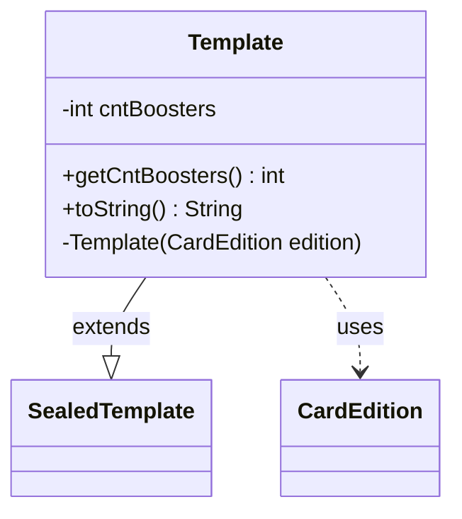

---
aliases:
  - Template
tags:
  - java/class
  - module/forge-core
  - pkg/forge/item
fqn: forge.item.BoosterBox.Template
package: forge.item
module: forge-core
kind: Class
---

# Template

**Package:** `forge.item`   **Module:** `forge-core`   **Kind:** Class



## Relationships
**Extends:**
- [[forge.item.SealedTemplate|SealedTemplate]]
**Uses:**
- [[forge.card.CardEdition|CardEdition]]

## Design Description

The `Template` class is a private nested specialization of `SealedTemplate` that models the contents of a Magic: The Gathering booster box for a specific card set. Its sole responsibility is to capture how many booster packs a box contains, derived at construction time from a `CardEdition` via `getBoosterBoxCount()`. By extending `SealedTemplate`, it reuses the inherited slot-based representation of sealed product contents (the `slots` collection) while adding the booster-count dimension.

The design favors immutability and encapsulation: `cntBoosters` is `final`, the constructor is `private` (restricting instantiation to the enclosing `BoosterBox`), and `CardEdition` is used only transiently as a configuration source rather than retained. The overridden `toString()` produces a human-readable summary, concatenating any fixed card slots with the booster-pack count and gracefully reporting "no cards" when the box is empty.

## Source
`forge-core/src/main/java/forge/item/BoosterBox.java` — declaration excerpt

```java
    public static class Template extends SealedTemplate {
        private final int cntBoosters;

        public int getCntBoosters() { return cntBoosters; }

        private Template(CardEdition edition) {
            super(edition.getCode(), new ArrayList<>());
            cntBoosters = edition.getBoosterBoxCount();
        }

        @Override
        public String toString() {
            if (0 >= cntBoosters) {
                return "no cards";
            }

            StringBuilder s = new StringBuilder();
            for(Pair<String, Integer> p : slots) {
                s.append(p.getRight()).append(" ").append(p.getLeft()).append(", ");
            }
            // trim the last comma and space
            if( s.length() > 0 )
                s.replace(s.length() - 2, s.length(), "");

            if (0 < cntBoosters) {
                if( s.length() > 0 )
                    s.append(" and ");
                    
                s.append(cntBoosters).append(" booster packs ");
            }
            return s.toString();
        }
    }
```

## Python
`forge/item/BoosterBox/Template.py`

```python
from forge.item.SealedTemplate import SealedTemplate
from forge.card.CardEdition import CardEdition


class Template(SealedTemplate):
    def __init__(self, edition: CardEdition):
        super().__init__(edition.getCode(), [])
        self.cntBoosters = edition.getBoosterBoxCount()

    def getCntBoosters(self) -> int:
        return self.cntBoosters

    def toString(self) -> str:
        if 0 >= self.cntBoosters:
            return "no cards"

        s = ""
        for p in self.slots:
            s += str(p.getRight()) + " " + p.getLeft() + ", "
        # trim the last comma and space
        if len(s) > 0:
            s = s[:len(s) - 2]

        if 0 < self.cntBoosters:
            if len(s) > 0:
                s += " and "

            s += str(self.cntBoosters) + " booster packs "
        return s
```
