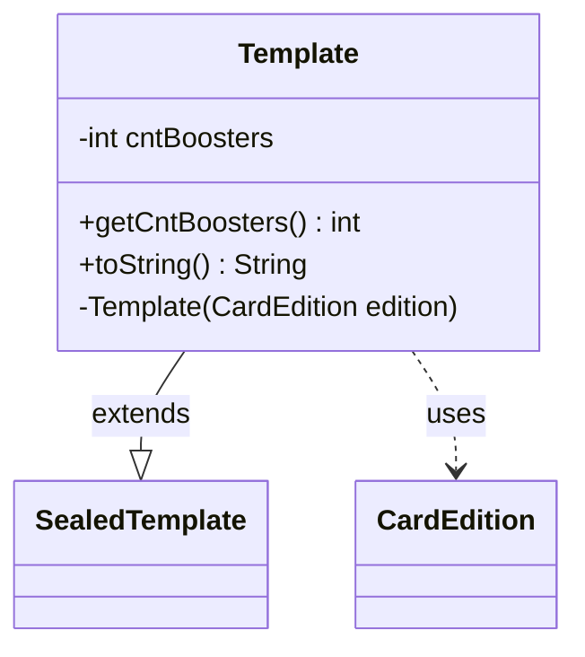

---
aliases:
  - Template
tags:
  - java/class
  - module/forge-core
  - pkg/forge/item
fqn: forge.item.BoosterBox.Template
package: forge.item
module: forge-core
kind: Class
---

# Template

**Package:** `forge.item` &nbsp; **Module:** `forge-core` &nbsp; **Kind:** Class



## Relationships
**Extends:**
- [[forge.item.SealedTemplate|SealedTemplate]]
**Uses:**
- [[forge.card.CardEdition|CardEdition]]

## Source
`forge-core/src/main/java/forge/item/BoosterBox.java` — declaration excerpt

```java
    public static class Template extends SealedTemplate {
        private final int cntBoosters;

        public int getCntBoosters() { return cntBoosters; }

        private Template(CardEdition edition) {
            super(edition.getCode(), new ArrayList<>());
            cntBoosters = edition.getBoosterBoxCount();
        }

        @Override
        public String toString() {
            if (0 >= cntBoosters) {
                return "no cards";
            }

            StringBuilder s = new StringBuilder();
            for(Pair<String, Integer> p : slots) {
                s.append(p.getRight()).append(" ").append(p.getLeft()).append(", ");
            }
            // trim the last comma and space
            if( s.length() > 0 )
                s.replace(s.length() - 2, s.length(), "");

            if (0 < cntBoosters) {
                if( s.length() > 0 )
                    s.append(" and ");
                    
                s.append(cntBoosters).append(" booster packs ");
            }
            return s.toString();
        }
    }
```
