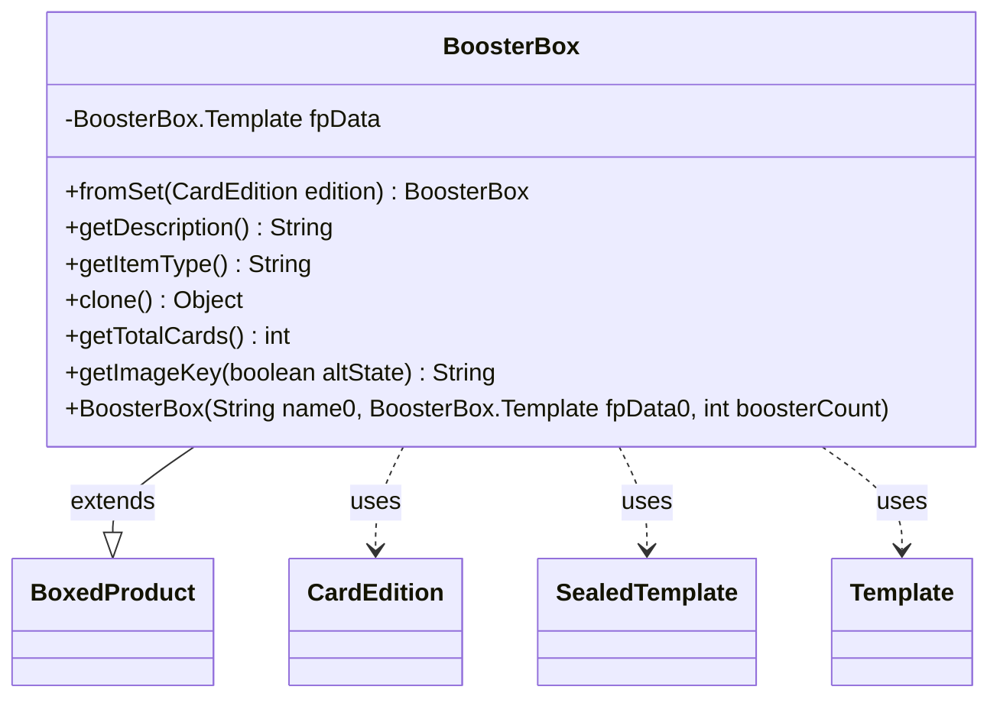

---
aliases:
  - BoosterBox
tags:
  - java/class
  - module/forge-core
  - pkg/forge/item
fqn: forge.item.BoosterBox
package: forge.item
module: forge-core
kind: Class
---

# BoosterBox

**Package:** `forge.item`   **Module:** `forge-core`   **Kind:** Class



## Relationships
**Extends:**
- [[forge.item.BoxedProduct|BoxedProduct]]
**Uses:**
- [[forge.card.CardEdition|CardEdition]]
- [[forge.item.BoosterBox.Template|Template]]
- [[forge.item.SealedTemplate|SealedTemplate]]

## Design Description

BoosterBox represents a sealed Magic product — a full box of booster packs for a given card edition — within Forge's item model. It extends BoxedProduct, specializing that base to compute its contents from the edition's configured booster-box count, and overrides the standard item hooks (`getDescription`, `getItemType`, `getTotalCards`, `getImageKey`, and `clone`) to report box-specific values. The static `fromSet` factory builds an instance directly from a CardEdition, returning null when the edition defines no box, keeping construction guarded and edition-driven.

Design intent centers on the nested `Template` (a SealedTemplate subclass) that holds the booster count and produces a human-readable contents string, decoupling product metadata from the box itself. Card totals combine the inherited per-booster count with expected extras, and image keys are derived from the edition code, integrating the box cleanly into Forge's image and sealed-product infrastructure.

## Source
`forge-core/src/main/java/forge/item/BoosterBox.java`

```java
/*
 * Forge: Play Magic: the Gathering.
 * Copyright (C) 2011  Forge Team
 *
 * This program is free software: you can redistribute it and/or modify
 * it under the terms of the GNU General Public License as published by
 * the Free Software Foundation, either version 3 of the License, or
 * (at your option) any later version.
 * 
 * This program is distributed in the hope that it will be useful,
 * but WITHOUT ANY WARRANTY; without even the implied warranty of
 * MERCHANTABILITY or FITNESS FOR A PARTICULAR PURPOSE.  See the
 * GNU General Public License for more details.
 * 
 * You should have received a copy of the GNU General Public License
 * along with this program.  If not, see <http://www.gnu.org/licenses/>.
 */

package forge.item;

import forge.ImageKeys;
import forge.StaticData;
import forge.card.CardEdition;
import org.apache.commons.lang3.tuple.Pair;

import java.util.ArrayList;

public class BoosterBox extends BoxedProduct {

    public static BoosterBox fromSet(CardEdition edition) {
        if (edition.getBoosterBoxCount() <= 0) {
            return null;
        }
        BoosterBox.Template d = new Template(edition);
        return new BoosterBox(edition.getName(), d, d.cntBoosters);
    }

    private final BoosterBox.Template fpData;

    public BoosterBox(final String name0, final BoosterBox.Template fpData0, final int boosterCount) {
        super(name0, StaticData.instance().getBoosters().get(fpData0.getEdition()), boosterCount);
        fpData = fpData0;
    }

    @Override
    public String getDescription() {
        return fpData.toString() + contents.toString();
    }

    @Override
    public final String getItemType() {
        return "Booster Box";
    }

    @Override
    public final Object clone() {
        return new BoosterBox(name, fpData, fpData.cntBoosters);
    }

    @Override
    public int getTotalCards() {
        return super.getTotalCards() * fpData.getCntBoosters() + fpData.getNumberOfCardsExpected();
    }
    
    public static class Template extends SealedTemplate {
        private final int cntBoosters;

        public int getCntBoosters() { return cntBoosters; }

        private Template(CardEdition edition) {
            super(edition.getCode(), new ArrayList<>());
            cntBoosters = edition.getBoosterBoxCount();
        }

        @Override
        public String toString() {
            if (0 >= cntBoosters) {
                return "no cards";
            }

            StringBuilder s = new StringBuilder();
            for(Pair<String, Integer> p : slots) {
                s.append(p.getRight()).append(" ").append(p.getLeft()).append(", ");
            }
            // trim the last comma and space
            if( s.length() > 0 )
                s.replace(s.length() - 2, s.length(), "");

            if (0 < cntBoosters) {
                if( s.length() > 0 )
                    s.append(" and ");
                    
                s.append(cntBoosters).append(" booster packs ");
            }
            return s.toString();
        }
    }

    @Override
    public String getImageKey(boolean altState) {
        return ImageKeys.BOOSTERBOX_PREFIX + getEdition();
    }
}
```

## Python
`forge/item/BoosterBox.py`

```python
from forge.ImageKeys import ImageKeys
from forge.StaticData import StaticData
from forge.card.CardEdition import CardEdition
from forge.item.BoxedProduct import BoxedProduct
from forge.item.SealedTemplate import SealedTemplate


class BoosterBox(BoxedProduct):

    @staticmethod
    def fromSet(edition):
        if edition.getBoosterBoxCount() <= 0:
            return None
        d = BoosterBox.Template(edition)
        return BoosterBox(edition.getName(), d, d.cntBoosters)

    def __init__(self, name0, fpData0, boosterCount):
        super().__init__(name0, StaticData.instance().getBoosters().get(fpData0.getEdition()), boosterCount)
        self.fpData = fpData0

    def getDescription(self):
        return str(self.fpData) + str(self.contents)

    def getItemType(self):
        return "Booster Box"

    def clone(self):
        return BoosterBox(self.name, self.fpData, self.fpData.cntBoosters)

    def getTotalCards(self):
        return super().getTotalCards() * self.fpData.getCntBoosters() + self.fpData.getNumberOfCardsExpected()

    class Template(SealedTemplate):
        def getCntBoosters(self):
            return self.cntBoosters

        def __init__(self, edition):
            super().__init__(edition.getCode(), [])
            self.cntBoosters = edition.getBoosterBoxCount()

        def __str__(self):
            if 0 >= self.cntBoosters:
                return "no cards"

            s = []
            for p in self.slots:
                s.append(str(p.getRight()) + " " + p.getLeft() + ", ")
            result = "".join(s)
            # trim the last comma and space
            if len(result) > 0:
                result = result[:len(result) - 2]

            if 0 < self.cntBoosters:
                if len(result) > 0:
                    result += " and "

                result += str(self.cntBoosters) + " booster packs "
            return result

    def getImageKey(self, altState):
        return ImageKeys.BOOSTERBOX_PREFIX + self.getEdition()
```
