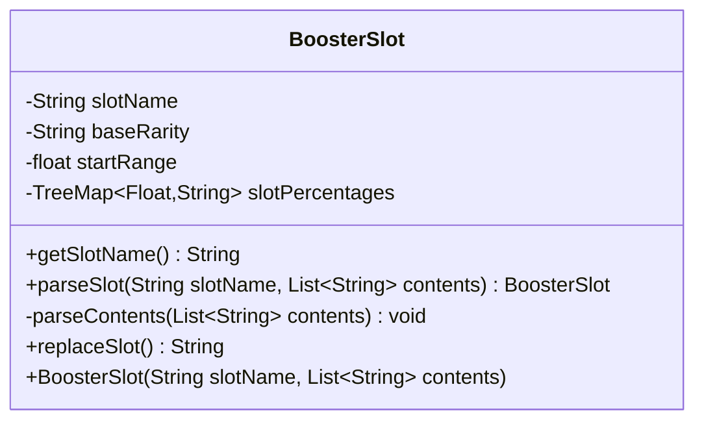

---
aliases:
  - BoosterSlot
tags:
  - java/class
  - module/forge-core
  - pkg/forge/item
fqn: forge.item.BoosterSlot
package: forge.item
module: forge-core
kind: Class
---

# BoosterSlot

**Package:** `forge.item`   **Module:** `forge-core`   **Kind:** Class



## Design Description

Booster packs in Magic: The Gathering contain card slots whose rarities can sometimes be upgraded; `BoosterSlot` models one such slot and the probability table that governs whether its base rarity is replaced. As a plain data-and-behavior class in `forge.item`, it parses a list of configuration lines—a `Base` rarity and any number of weighted `Replace` entries—accumulating the weights into a `TreeMap<Float,String>` keyed by cumulative probability thresholds.

The static `parseSlot` factory mirrors the constructor, offering a named entry point for building instances from raw config contents. At pack-generation time, `replaceSlot` draws a random float and walks the sorted threshold map to pick a replacement rarity, falling back to the base rarity when no threshold is met. The `final` slot name and immutable map reflect intent that a slot's identity and probability distribution stay fixed after construction, while the cumulative-range design keeps the random lookup simple and ordered.

## Source
`forge-core/src/main/java/forge/item/BoosterSlot.java`

```java
package forge.item;

import java.util.List;
import java.util.TreeMap;

public class BoosterSlot {
    private final String slotName;
    private String baseRarity;
    private float startRange = 0.0f;
    private final TreeMap<Float, String> slotPercentages = new TreeMap<>();

    public BoosterSlot(final String slotName, final List<String> contents) {
        this.slotName = slotName;
        this.baseRarity = null;
        parseContents(contents);
    }

    public final String getSlotName() {
        return slotName;
    }

    public static BoosterSlot parseSlot(final String slotName, final List<String> contents) {
        return new BoosterSlot(slotName, contents);
    }

    private void parseContents(List<String> contents) {
        for (String content : contents) {
            if (content.startsWith("#")) {
                continue;
            }
            String[] parts = content.split("=", 2);
            String key = parts[0];
            String value = parts[1];

            if (key.equalsIgnoreCase("Base")) {
                baseRarity = value;
            } else if (key.equalsIgnoreCase("Replace")) {
                // Are there other things?
                String[] replaceParts = value.split(" ", 2);
                float pct = Float.parseFloat(replaceParts[0]);
                startRange += pct;
                slotPercentages.put(startRange, replaceParts[1]);
            }
        }
    }

    public String replaceSlot() {
        float rand = (float) Math.random();
        for (Float key : slotPercentages.keySet()) {
            if (rand < key) {
                System.out.println("Replaced a base slot! " + slotName + " -> " + slotPercentages.get(key));

                return slotPercentages.get(key);
            }
        }

        // If we didn't find a key, return the base rarity from that edition
        return baseRarity;
    }
}
```

## Python
`forge/item/BoosterSlot.py`

```python
from forge.item.BoosterSlot import BoosterSlot
import random


class BoosterSlot:
    def __init__(self, slotName: str, contents: list[str]):
        self.slotName = slotName
        self.baseRarity = None
        self.startRange = 0.0
        self.slotPercentages: dict[float, str] = {}
        self.parseContents(contents)

    def getSlotName(self) -> str:
        return self.slotName

    @staticmethod
    def parseSlot(slotName: str, contents: list[str]) -> "BoosterSlot":
        return BoosterSlot(slotName, contents)

    def parseContents(self, contents: list[str]) -> None:
        for content in contents:
            if content.startswith("#"):
                continue
            parts = content.split("=", 1)
            key = parts[0]
            value = parts[1]

            if key.lower() == "base":
                self.baseRarity = value
            elif key.lower() == "replace":
                # Are there other things?
                replaceParts = value.split(" ", 1)
                pct = float(replaceParts[0])
                self.startRange += pct
                self.slotPercentages[self.startRange] = replaceParts[1]

    def replaceSlot(self) -> str:
        rand = random.random()
        for key in sorted(self.slotPercentages.keys()):
            if rand < key:
                print("Replaced a base slot! " + self.slotName + " -> " + self.slotPercentages[key])

                return self.slotPercentages[key]

        # If we didn't find a key, return the base rarity from that edition
        return self.baseRarity
```
