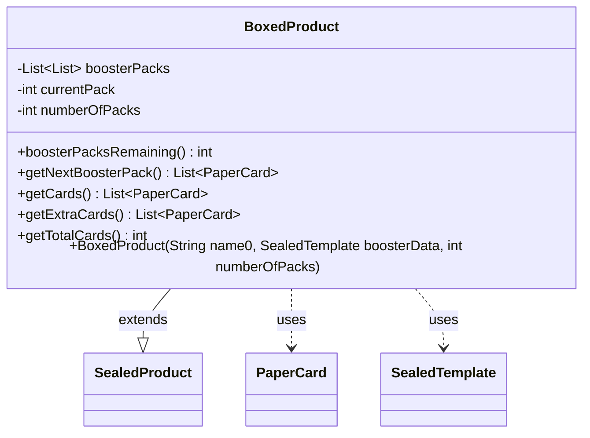

---
aliases:
  - BoxedProduct
tags:
  - java/class
  - module/forge-core
  - pkg/forge/item
fqn: forge.item.BoxedProduct
package: forge.item
module: forge-core
kind: Class
---

# BoxedProduct

**Package:** `forge.item` &nbsp; **Module:** `forge-core` &nbsp; **Kind:** Class



## Relationships
**Extends:**
- [[forge.item.SealedProduct|SealedProduct]]
**Uses:**
- [[forge.item.PaperCard|PaperCard]]
- [[forge.item.SealedTemplate|SealedTemplate]]

## Design Description

BoxedProduct is an abstract base for multi-pack sealed products (such as booster boxes), extending SealedProduct to model an item that bundles a fixed number of generated booster packs built from a shared SealedTemplate. It lazily generates all packs on first access, caching them in an internal list, and lets callers draw packs sequentially via getNextBoosterPack() while tracking how many remain. getCards() aggregates every pack plus any extra contents into the inherited card list, and getTotalCards() reports the expected count as cards-per-pack times the number of packs.

The design centralizes pack generation and counting here while deferring product-specific behavior to subclasses: getExtraCards() is an empty hook for added contents, and getNextBoosterPack() is final to protect the lazy-generation and cursor logic. It collaborates with PaperCard as the card type it dispenses and relies on SealedProduct's generate() and contents for the underlying booster construction.

## Source
`forge-core/src/main/java/forge/item/BoxedProduct.java`

```java
package forge.item;

import java.util.ArrayList;
import java.util.List;

public abstract class BoxedProduct extends SealedProduct {

	private List<List<PaperCard>> boosterPacks = new ArrayList<>();
	private int currentPack;
	
	private int numberOfPacks;
	
	public BoxedProduct(String name0, SealedTemplate boosterData, int numberOfPacks) {
		super(name0, boosterData);
		this.numberOfPacks = numberOfPacks;
	}
	
	public int boosterPacksRemaining() {
		return numberOfPacks - currentPack;
	}
	
    public final List<PaperCard> getNextBoosterPack() {
    	if (boosterPacks.size() == 0) {
    		cards = new ArrayList<>();
    		for (int i = 0; i < numberOfPacks; i++) {
    			boosterPacks.add(generate());
    			cards.addAll(boosterPacks.get(i));
    		}
    	}
        return boosterPacks.get(currentPack++);
    }
    
    @Override
    public List<PaperCard> getCards() {
    	if (boosterPacks.size() == 0) {
    		cards = new ArrayList<>();
    		for (int i = 0; i < numberOfPacks; i++) {
    			boosterPacks.add(generate());
    			cards.addAll(boosterPacks.get(i));
    		}
    	}
    	cards.addAll(getExtraCards());
        return cards;
    }
    
    public List<PaperCard> getExtraCards() {
    	return new ArrayList<>();
    }
    
    @Override
    public int getTotalCards() {
        return contents.getNumberOfCardsExpected() * numberOfPacks;
    }
	
}
```

## Python
`forge/item/BoxedProduct.py`

```python
from forge.item.SealedProduct import SealedProduct
from forge.item.PaperCard import PaperCard
from forge.item.SealedTemplate import SealedTemplate


class BoxedProduct(SealedProduct):

    def __init__(self, name0: str, boosterData: SealedTemplate, numberOfPacks: int):
        super().__init__(name0, boosterData)
        self.boosterPacks: list[list[PaperCard]] = []
        self.currentPack: int = 0
        self.numberOfPacks: int = numberOfPacks

    def boosterPacksRemaining(self) -> int:
        return self.numberOfPacks - self.currentPack

    def getNextBoosterPack(self) -> list[PaperCard]:
        if len(self.boosterPacks) == 0:
            self.cards = []
            for i in range(self.numberOfPacks):
                self.boosterPacks.append(self.generate())
                self.cards.extend(self.boosterPacks[i])
        pack = self.boosterPacks[self.currentPack]
        self.currentPack += 1
        return pack

    def getCards(self) -> list[PaperCard]:
        if len(self.boosterPacks) == 0:
            self.cards = []
            for i in range(self.numberOfPacks):
                self.boosterPacks.append(self.generate())
                self.cards.extend(self.boosterPacks[i])
        self.cards.extend(self.getExtraCards())
        return self.cards

    def getExtraCards(self) -> list[PaperCard]:
        return []

    def getTotalCards(self) -> int:
        return self.contents.getNumberOfCardsExpected() * self.numberOfPacks
```
