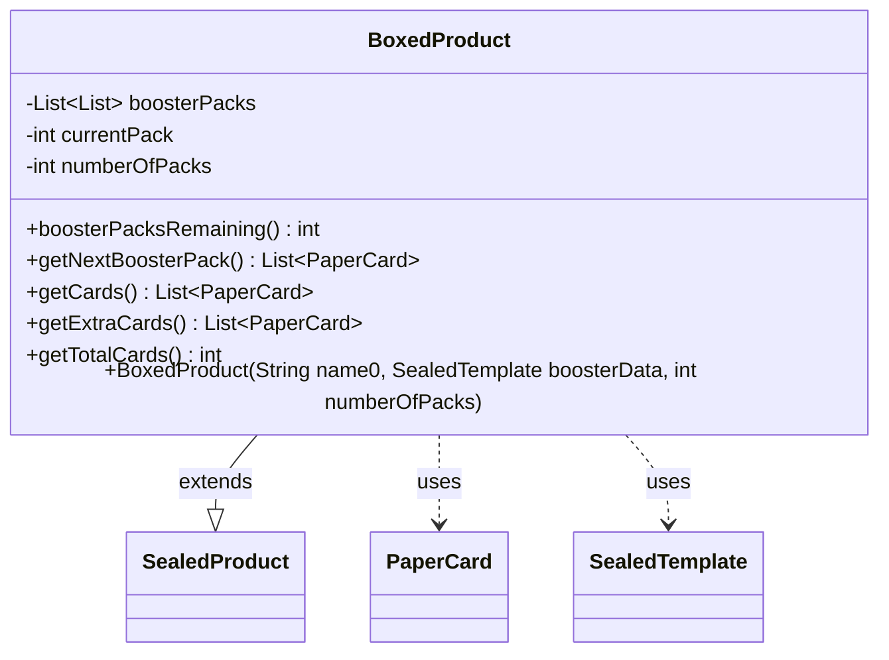

---
aliases:
  - BoxedProduct
tags:
  - java/class
  - module/forge-core
  - pkg/forge/item
fqn: forge.item.BoxedProduct
package: forge.item
module: forge-core
kind: Class
---

# BoxedProduct

**Package:** `forge.item` &nbsp; **Module:** `forge-core` &nbsp; **Kind:** Class



## Relationships
**Extends:**
- [[forge.item.SealedProduct|SealedProduct]]
**Uses:**
- [[forge.item.PaperCard|PaperCard]]
- [[forge.item.SealedTemplate|SealedTemplate]]

## Source
`forge-core/src/main/java/forge/item/BoxedProduct.java`

```java
package forge.item;

import java.util.ArrayList;
import java.util.List;

public abstract class BoxedProduct extends SealedProduct {

	private List<List<PaperCard>> boosterPacks = new ArrayList<>();
	private int currentPack;
	
	private int numberOfPacks;
	
	public BoxedProduct(String name0, SealedTemplate boosterData, int numberOfPacks) {
		super(name0, boosterData);
		this.numberOfPacks = numberOfPacks;
	}
	
	public int boosterPacksRemaining() {
		return numberOfPacks - currentPack;
	}
	
    public final List<PaperCard> getNextBoosterPack() {
    	if (boosterPacks.size() == 0) {
    		cards = new ArrayList<>();
    		for (int i = 0; i < numberOfPacks; i++) {
    			boosterPacks.add(generate());
    			cards.addAll(boosterPacks.get(i));
    		}
    	}
        return boosterPacks.get(currentPack++);
    }
    
    @Override
    public List<PaperCard> getCards() {
    	if (boosterPacks.size() == 0) {
    		cards = new ArrayList<>();
    		for (int i = 0; i < numberOfPacks; i++) {
    			boosterPacks.add(generate());
    			cards.addAll(boosterPacks.get(i));
    		}
    	}
    	cards.addAll(getExtraCards());
        return cards;
    }
    
    public List<PaperCard> getExtraCards() {
    	return new ArrayList<>();
    }
    
    @Override
    public int getTotalCards() {
        return contents.getNumberOfCardsExpected() * numberOfPacks;
    }
	
}
```
