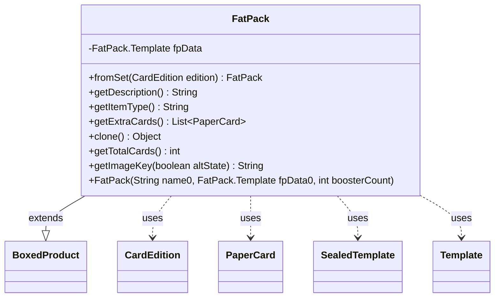

---
aliases:
  - FatPack
tags:
  - java/class
  - module/forge-core
  - pkg/forge/item
fqn: forge.item.FatPack
package: forge.item
module: forge-core
kind: Class
---

# FatPack

**Package:** `forge.item`   **Module:** `forge-core`   **Kind:** Class



## Relationships
**Extends:**
- [[forge.item.BoxedProduct|BoxedProduct]]
**Uses:**
- [[forge.card.CardEdition|CardEdition]]
- [[forge.item.FatPack.Template|Template]]
- [[forge.item.PaperCard|PaperCard]]
- [[forge.item.SealedTemplate|SealedTemplate]]

## Design Description

FatPack models a sealed product — a Magic set's Fat Pack or Bundle — composed of a fixed number of booster packs plus extra fixed cards. It extends BoxedProduct, inheriting the booster contents and count, and adds the extra-slot behavior through its nested Template, a SealedTemplate subclass that records the booster count and renders the human-readable slot description. The static fromSet factory builds an instance from a CardEdition, returning null when the edition defines no fat pack or lacks registered boosters. Design intent is visible in getItemType, which inspects the edition's release date against KLD to label products released from Kaladesh onward as "Bundle" rather than "Fat Pack," and in getExtraCards, which delegates to BoosterGenerator for the supplementary cards. It collaborates with CardEdition, PaperCard, SealedTemplate, and StaticData, and overrides clone, getTotalCards, and getImageKey to integrate with Forge's item framework.

## Source
`forge-core/src/main/java/forge/item/FatPack.java`

```java
/*
 * Forge: Play Magic: the Gathering.
 * Copyright (C) 2011  Forge Team
 *
 * This program is free software: you can redistribute it and/or modify
 * it under the terms of the GNU General Public License as published by
 * the Free Software Foundation, either version 3 of the License, or
 * (at your option) any later version.
 * 
 * This program is distributed in the hope that it will be useful,
 * but WITHOUT ANY WARRANTY; without even the implied warranty of
 * MERCHANTABILITY or FITNESS FOR A PARTICULAR PURPOSE.  See the
 * GNU General Public License for more details.
 * 
 * You should have received a copy of the GNU General Public License
 * along with this program.  If not, see <http://www.gnu.org/licenses/>.
 */

package forge.item;

import forge.ImageKeys;
import forge.StaticData;
import forge.card.CardEdition;
import forge.item.generation.BoosterGenerator;
import org.apache.commons.lang3.tuple.Pair;

import java.util.List;

public class FatPack extends BoxedProduct {
    public static FatPack fromSet(final CardEdition edition) {
        int boosters = edition.getFatPackCount();
        if (boosters <= 0) { return null; }

        FatPack.Template d = new Template(edition);
        if (null == StaticData.instance().getBoosters().get(d.getEdition())) { return null; }
        return new FatPack(edition.getName(), d, d.cntBoosters);
    }

    private final FatPack.Template fpData;

    public FatPack(final String name0, final FatPack.Template fpData0, final int boosterCount) {
        super(name0, StaticData.instance().getBoosters().get(fpData0.getEdition()), boosterCount);
        fpData = fpData0;
    }

    @Override
    public String getDescription() {
        return fpData.toString() + contents.toString();
    }

    @Override
    public final String getItemType() {
        boolean isBundle = StaticData.instance().getEditions().get(fpData.getEdition()).getDate().getTime() >=
                StaticData.instance().getEditions().get("KLD").getDate().getTime();

        return isBundle ? "Bundle" : "Fat Pack";
    }
    
    @Override
    public List<PaperCard> getExtraCards() {
        return BoosterGenerator.getBoosterPack(fpData);
    }

    @Override
    public final Object clone() {
        return new FatPack(name, fpData, fpData.cntBoosters);
    }

    @Override
    public int getTotalCards() {
        return super.getTotalCards() * fpData.getCntBoosters() + fpData.getNumberOfCardsExpected();
    }
    
    public static class Template extends SealedTemplate {
        private final int cntBoosters;

        public int getCntBoosters() { return cntBoosters; }

        private Template(CardEdition edition) {
            super(edition.getCode(), edition.getFatPackExtraSlots());

            cntBoosters = edition.getFatPackCount();
        }
        
        @Override
        public String toString() {
            if (0 >= cntBoosters) {
                return "no cards";
            }

            StringBuilder s = new StringBuilder();
            for(Pair<String, Integer> p : slots) {
                s.append(p.getRight()).append(" ").append(p.getLeft()).append(", ");
            }
            // trim the last comma and space
            if( s.length() > 0 )
                s.replace(s.length() - 2, s.length(), "");

            if (0 < cntBoosters) {
                if( s.length() > 0 )
                    s.append(" and ");
                    
                s.append(cntBoosters).append(" booster packs ");
            }
            return s.toString();
        }
    }

    @Override
    public String getImageKey(boolean altState) {
        return ImageKeys.FATPACK_PREFIX + getEdition();
    }    
}
```

## Python
`forge/item/FatPack.py`

```python
from forge.ImageKeys import ImageKeys
from forge.StaticData import StaticData
from forge.card.CardEdition import CardEdition
from forge.item.generation.BoosterGenerator import BoosterGenerator
from forge.item.BoxedProduct import BoxedProduct
from forge.item.PaperCard import PaperCard
from forge.item.SealedTemplate import SealedTemplate

from typing import List


class FatPack(BoxedProduct):
    @staticmethod
    def fromSet(edition: CardEdition) -> "FatPack":
        boosters = edition.getFatPackCount()
        if boosters <= 0:
            return None

        d = FatPack.Template(edition)
        if StaticData.instance().getBoosters().get(d.getEdition()) is None:
            return None
        return FatPack(edition.getName(), d, d.cntBoosters)

    def __init__(self, name0: str, fpData0: "FatPack.Template", boosterCount: int):
        super().__init__(name0, StaticData.instance().getBoosters().get(fpData0.getEdition()), boosterCount)
        self.fpData = fpData0

    def getDescription(self) -> str:
        return self.fpData.toString() + self.contents.toString()

    def getItemType(self) -> str:
        isBundle = StaticData.instance().getEditions().get(self.fpData.getEdition()).getDate().getTime() >= \
            StaticData.instance().getEditions().get("KLD").getDate().getTime()

        return "Bundle" if isBundle else "Fat Pack"

    def getExtraCards(self) -> List[PaperCard]:
        return BoosterGenerator.getBoosterPack(self.fpData)

    def clone(self) -> object:
        return FatPack(self.name, self.fpData, self.fpData.cntBoosters)

    def getTotalCards(self) -> int:
        return super().getTotalCards() * self.fpData.getCntBoosters() + self.fpData.getNumberOfCardsExpected()

    class Template(SealedTemplate):
        def __init__(self, edition: CardEdition):
            super().__init__(edition.getCode(), edition.getFatPackExtraSlots())

            self.cntBoosters = edition.getFatPackCount()

        def getCntBoosters(self) -> int:
            return self.cntBoosters

        def toString(self) -> str:
            if 0 >= self.cntBoosters:
                return "no cards"

            s = ""
            for p in self.slots:
                s += str(p.getRight()) + " " + p.getLeft() + ", "
            # trim the last comma and space
            if len(s) > 0:
                s = s[:len(s) - 2]

            if 0 < self.cntBoosters:
                if len(s) > 0:
                    s += " and "

                s += str(self.cntBoosters) + " booster packs "
            return s

    def getImageKey(self, altState: bool) -> str:
        return ImageKeys.FATPACK_PREFIX + self.getEdition()
```
