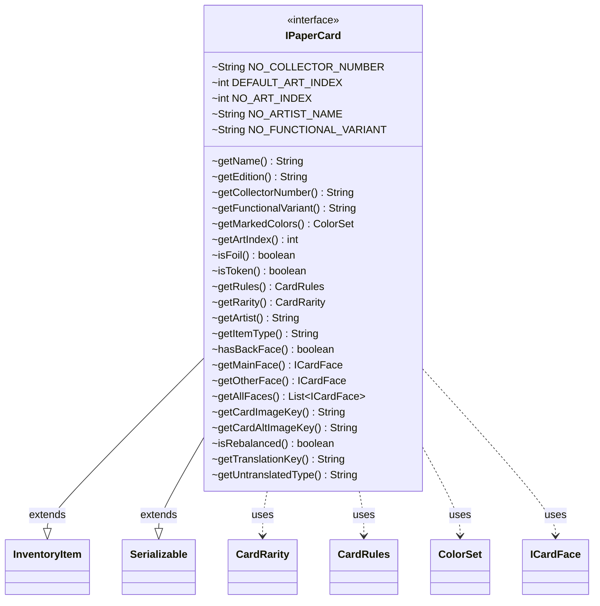

---
aliases:
  - IPaperCard
tags:
  - java/interface
  - module/forge-core
  - pkg/forge/item
fqn: forge.item.IPaperCard
package: forge.item
module: forge-core
kind: Interface
---

# IPaperCard

**Package:** `forge.item` &nbsp; **Module:** `forge-core` &nbsp; **Kind:** Interface



## Relationships
**Extends:**
- [[forge.item.InventoryItem|InventoryItem]]
**Uses:**
- [[forge.card.CardRarity|CardRarity]]
- [[forge.card.CardRules|CardRules]]
- [[forge.card.ColorSet|ColorSet]]
- [[forge.card.ICardFace|ICardFace]]

## Source
`forge-core/src/main/java/forge/item/IPaperCard.java`

```java
package forge.item;

import forge.card.CardRarity;
import forge.card.CardRules;
import forge.card.ColorSet;
import forge.card.ICardFace;

import java.io.Serializable;
import java.util.List;

public interface IPaperCard extends InventoryItem, Serializable {

    String NO_COLLECTOR_NUMBER = "N.A.";  // Placeholder for No-Collection number available
    int DEFAULT_ART_INDEX = 1;
    int NO_ART_INDEX = -1;  // Placeholder when NO ArtIndex is Specified
    String NO_ARTIST_NAME = "";
    String NO_FUNCTIONAL_VARIANT = "";


    String getName();
    String getEdition();
    String getCollectorNumber();
    String getFunctionalVariant();
    ColorSet getMarkedColors();
    int getArtIndex();
    boolean isFoil();
    boolean isToken();
    CardRules getRules();
    CardRarity getRarity();
    String getArtist();
    String getItemType();
    boolean hasBackFace();
    ICardFace getMainFace();
    ICardFace getOtherFace();
    List<ICardFace> getAllFaces();
    String getCardImageKey();
    String getCardAltImageKey();

    boolean isRebalanced();

    @Override
    default String getTranslationKey() {
        //Cards with flavor names will use that flavor name as their translation key. Other variants are just appended as a suffix.
        if(!NO_FUNCTIONAL_VARIANT.equals(getFunctionalVariant()) && getAllFaces().stream().noneMatch(pc -> pc.getFlavorName() != null))
            return getName() + " $" + getFunctionalVariant();
        return getDisplayName();
    }

    @Override
    default String getUntranslatedType() {
        return getRules().getType().toString();
    }
}
```
