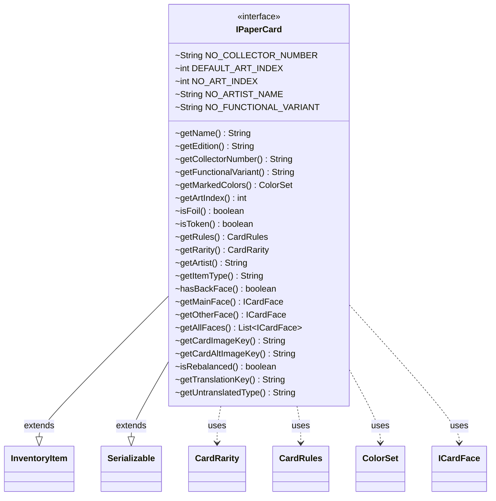

---
aliases:
  - IPaperCard
tags:
  - java/interface
  - module/forge-core
  - pkg/forge/item
fqn: forge.item.IPaperCard
package: forge.item
module: forge-core
kind: Interface
---

# IPaperCard

**Package:** `forge.item` &nbsp; **Module:** `forge-core` &nbsp; **Kind:** Interface



## Relationships
**Extends:**
- [[forge.item.InventoryItem|InventoryItem]]
**Uses:**
- [[forge.card.CardRarity|CardRarity]]
- [[forge.card.CardRules|CardRules]]
- [[forge.card.ColorSet|ColorSet]]
- [[forge.card.ICardFace|ICardFace]]

## Design Description

IPaperCard defines the contract for a physical ("paper") Magic card within Forge's inventory model, exposing read-only accessors that describe a printed card's identity (name, edition, collector number, art index, artist) and gameplay characteristics (rules, rarity, marked colors, foil and token status). By extending InventoryItem and Serializable, it integrates printed cards into Forge's broader collectible-item framework while ensuring they can be persisted. It collaborates with CardRules and CardRarity for gameplay metadata, ColorSet for color identity, and ICardFace to model single- or multi-faced layouts via getMainFace, getOtherFace, and getAllFaces.

The interface centralizes constants for absent metadata (collector number, art index, artist, functional variant) and supplies default methods for translation. Notably, getTranslationKey encodes the design intent that functional variants append a suffix only when no flavor name is present, keeping localization keys stable and unambiguous across card variants.

## Source
`forge-core/src/main/java/forge/item/IPaperCard.java`

```java
package forge.item;

import forge.card.CardRarity;
import forge.card.CardRules;
import forge.card.ColorSet;
import forge.card.ICardFace;

import java.io.Serializable;
import java.util.List;

public interface IPaperCard extends InventoryItem, Serializable {

    String NO_COLLECTOR_NUMBER = "N.A.";  // Placeholder for No-Collection number available
    int DEFAULT_ART_INDEX = 1;
    int NO_ART_INDEX = -1;  // Placeholder when NO ArtIndex is Specified
    String NO_ARTIST_NAME = "";
    String NO_FUNCTIONAL_VARIANT = "";


    String getName();
    String getEdition();
    String getCollectorNumber();
    String getFunctionalVariant();
    ColorSet getMarkedColors();
    int getArtIndex();
    boolean isFoil();
    boolean isToken();
    CardRules getRules();
    CardRarity getRarity();
    String getArtist();
    String getItemType();
    boolean hasBackFace();
    ICardFace getMainFace();
    ICardFace getOtherFace();
    List<ICardFace> getAllFaces();
    String getCardImageKey();
    String getCardAltImageKey();

    boolean isRebalanced();

    @Override
    default String getTranslationKey() {
        //Cards with flavor names will use that flavor name as their translation key. Other variants are just appended as a suffix.
        if(!NO_FUNCTIONAL_VARIANT.equals(getFunctionalVariant()) && getAllFaces().stream().noneMatch(pc -> pc.getFlavorName() != null))
            return getName() + " $" + getFunctionalVariant();
        return getDisplayName();
    }

    @Override
    default String getUntranslatedType() {
        return getRules().getType().toString();
    }
}
```

## Python
`forge/item/IPaperCard.py`

```python
from forge.item.InventoryItem import InventoryItem
from forge.card.CardRarity import CardRarity
from forge.card.CardRules import CardRules
from forge.card.ColorSet import ColorSet
from forge.card.ICardFace import ICardFace

from abc import abstractmethod
from typing import List


class IPaperCard(InventoryItem):

    NO_COLLECTOR_NUMBER: str = "N.A."  # Placeholder for No-Collection number available
    DEFAULT_ART_INDEX: int = 1
    NO_ART_INDEX: int = -1  # Placeholder when NO ArtIndex is Specified
    NO_ARTIST_NAME: str = ""
    NO_FUNCTIONAL_VARIANT: str = ""

    @abstractmethod
    def getName(self) -> str:
        ...

    @abstractmethod
    def getEdition(self) -> str:
        ...

    @abstractmethod
    def getCollectorNumber(self) -> str:
        ...

    @abstractmethod
    def getFunctionalVariant(self) -> str:
        ...

    @abstractmethod
    def getMarkedColors(self) -> ColorSet:
        ...

    @abstractmethod
    def getArtIndex(self) -> int:
        ...

    @abstractmethod
    def isFoil(self) -> bool:
        ...

    @abstractmethod
    def isToken(self) -> bool:
        ...

    @abstractmethod
    def getRules(self) -> CardRules:
        ...

    @abstractmethod
    def getRarity(self) -> CardRarity:
        ...

    @abstractmethod
    def getArtist(self) -> str:
        ...

    @abstractmethod
    def getItemType(self) -> str:
        ...

    @abstractmethod
    def hasBackFace(self) -> bool:
        ...

    @abstractmethod
    def getMainFace(self) -> ICardFace:
        ...

    @abstractmethod
    def getOtherFace(self) -> ICardFace:
        ...

    @abstractmethod
    def getAllFaces(self) -> List[ICardFace]:
        ...

    @abstractmethod
    def getCardImageKey(self) -> str:
        ...

    @abstractmethod
    def getCardAltImageKey(self) -> str:
        ...

    @abstractmethod
    def isRebalanced(self) -> bool:
        ...

    def getTranslationKey(self) -> str:
        # Cards with flavor names will use that flavor name as their translation key. Other variants are just appended as a suffix.
        if self.NO_FUNCTIONAL_VARIANT != self.getFunctionalVariant() and not any(pc.getFlavorName() is not None for pc in self.getAllFaces()):
            return self.getName() + " $" + self.getFunctionalVariant()
        return self.getDisplayName()

    def getUntranslatedType(self) -> str:
        return self.getRules().getType().toString()
```
