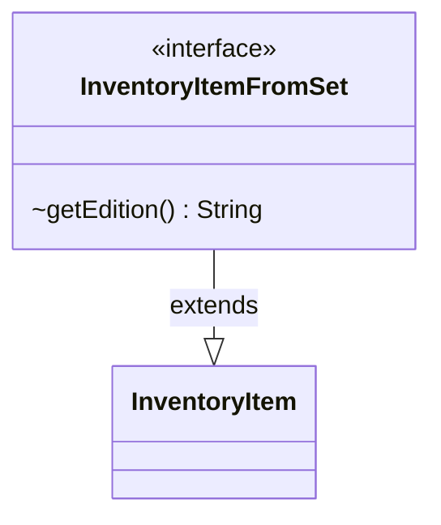

---
aliases:
  - InventoryItemFromSet
tags:
  - java/interface
  - module/forge-core
  - pkg/forge/item
fqn: forge.item.InventoryItemFromSet
package: forge.item
module: forge-core
kind: Interface
---

# InventoryItemFromSet

**Package:** `forge.item`   **Module:** `forge-core`   **Kind:** Interface



## Relationships
**Extends:**
- [[forge.item.InventoryItem|InventoryItem]]

## Design Description

Inventory management for player-owned items that originate from a specific Magic: the Gathering set or edition. As a specialization of `InventoryItem`, it adds a single contract, `getEdition()`, requiring any conforming item to report the set it belongs to. Concrete inventory types tied to a release—such as printed cards, boosters, and similar collectibles—implement this interface so callers can uniformly query an item's edition without knowing its concrete type. The design intent is minimal and composable: rather than folding set-awareness into the base `InventoryItem` abstraction, it isolates that responsibility in a narrow extension interface, keeping set-agnostic items free of an irrelevant method while letting set-bound items participate in the broader inventory hierarchy.

## Source
`forge-core/src/main/java/forge/item/InventoryItemFromSet.java`

```java
/*
 * Forge: Play Magic: the Gathering.
 * Copyright (C) 2011  Forge Team
 *
 * This program is free software: you can redistribute it and/or modify
 * it under the terms of the GNU General Public License as published by
 * the Free Software Foundation, either version 3 of the License, or
 * (at your option) any later version.
 * 
 * This program is distributed in the hope that it will be useful,
 * but WITHOUT ANY WARRANTY; without even the implied warranty of
 * MERCHANTABILITY or FITNESS FOR A PARTICULAR PURPOSE.  See the
 * GNU General Public License for more details.
 * 
 * You should have received a copy of the GNU General Public License
 * along with this program.  If not, see <http://www.gnu.org/licenses/>.
 */
package forge.item;

/**
 * Interface to define a player's inventory may hold. Should include
 * CardPrinted, Booster, Pets, Plants... etc
 */
public interface InventoryItemFromSet extends InventoryItem {
    /**
     * An item belonging to a set should return its set as well.
     * 
     * @return the sets the
     */
    String getEdition();
}
```

## Python
`forge/item/InventoryItemFromSet.py`

```python
from abc import abstractmethod

from forge.item.InventoryItem import InventoryItem


class InventoryItemFromSet(InventoryItem):
    """
    Interface to define a player's inventory may hold. Should include
    CardPrinted, Booster, Pets, Plants... etc
    """

    @abstractmethod
    def getEdition(self) -> str:
        """
        An item belonging to a set should return its set as well.

        :return: the sets the
        """
        ...
```
