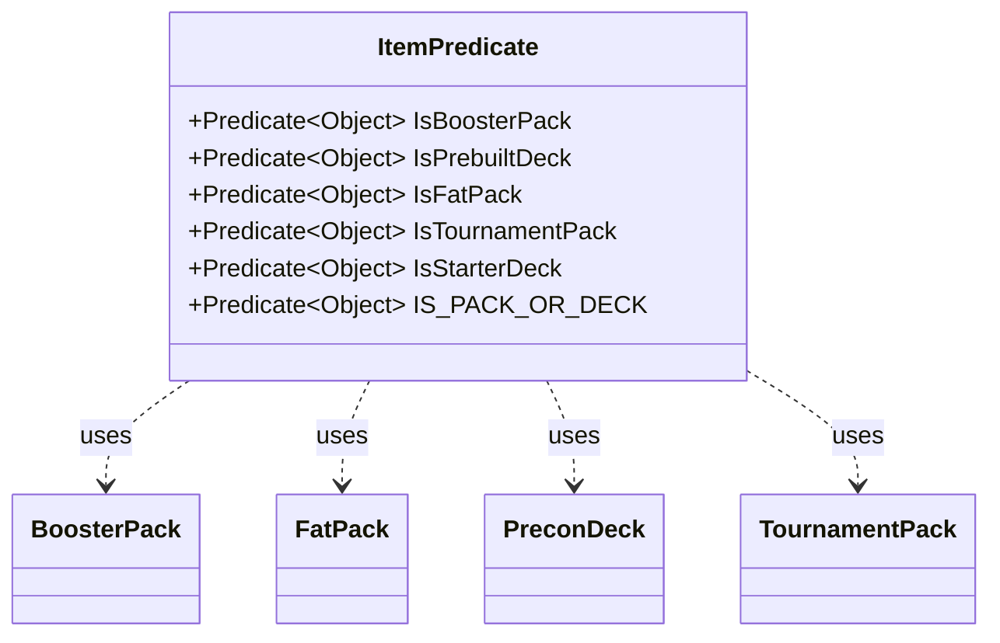

---
aliases:
  - ItemPredicate
tags:
  - java/class
  - module/forge-core
  - pkg/forge/item
fqn: forge.item.ItemPredicate
package: forge.item
module: forge-core
kind: Class
---

# ItemPredicate

**Package:** `forge.item`   **Module:** `forge-core`   **Kind:** Class



## Relationships
**Uses:**
- [[forge.item.BoosterPack|BoosterPack]]
- [[forge.item.FatPack|FatPack]]
- [[forge.item.PreconDeck|PreconDeck]]
- [[forge.item.TournamentPack|TournamentPack]]

## Design Description

ItemPredicate is an abstract utility class in the `forge.item` package that centralizes the filtering conditions used to identify special, non-card inventory items. Rather than being instantiated, it exposes a set of public static `Predicate<Object>` constants—`IsBoosterPack`, `IsPrebuiltDeck`, `IsFatPack`, `IsTournamentPack`, and `IsStarterDeck`—each performing a type-based test against a concrete item class it collaborates with (BoosterPack, PreconDeck, FatPack, and TournamentPack).

The design intent is to provide reusable, composable selection criteria. It leans on `isInstance` references and lambdas, and notably distinguishes tournament packs from starter decks by inspecting `TournamentPack.isStarterDeck()` since both share a type. These primitives are combined via `Predicate.or` into the aggregate `IS_PACK_OR_DECK`, giving callers a single predicate for matching any pack-or-deck inventory item.

## Source
`forge-core/src/main/java/forge/item/ItemPredicate.java`

```java
package forge.item;

import java.util.function.Predicate;

/**
 * Filtering conditions for miscellaneous InventoryItems.
 */
public abstract class ItemPredicate {

    // Static builder methods - they choose concrete implementation by themselves

    public static final Predicate<Object> IsBoosterPack = BoosterPack.class::isInstance;
    /**
     * Checks that the inventory item is a Prebuilt Deck.
     */
    public static final Predicate<Object> IsPrebuiltDeck = PreconDeck.class::isInstance;
    public static final Predicate<Object> IsFatPack = FatPack.class::isInstance;

    /**
     * Checks that the inventory item is a Tournament Pack.
     */
    public static final Predicate<Object> IsTournamentPack = card -> card instanceof TournamentPack && !((TournamentPack) card).isStarterDeck();

    /**
     * Checks that the inventory item is a Starter Deck.
     */
    public static final Predicate<Object> IsStarterDeck = card -> card instanceof TournamentPack && ((TournamentPack) card).isStarterDeck();

    public static final Predicate<Object> IS_PACK_OR_DECK = IsBoosterPack.or(IsFatPack).or(IsTournamentPack).or(IsStarterDeck).or(IsPrebuiltDeck);
}
```

## Python
`forge/item/ItemPredicate.py`

```python
from forge.item.BoosterPack import BoosterPack
from forge.item.FatPack import FatPack
from forge.item.PreconDeck import PreconDeck
from forge.item.TournamentPack import TournamentPack


class ItemPredicate:
    """
    Filtering conditions for miscellaneous InventoryItems.
    """

    # Static builder methods - they choose concrete implementation by themselves

    IsBoosterPack = lambda card: isinstance(card, BoosterPack)
    # Checks that the inventory item is a Prebuilt Deck.
    IsPrebuiltDeck = lambda card: isinstance(card, PreconDeck)
    IsFatPack = lambda card: isinstance(card, FatPack)

    # Checks that the inventory item is a Tournament Pack.
    IsTournamentPack = lambda card: isinstance(card, TournamentPack) and not card.isStarterDeck()

    # Checks that the inventory item is a Starter Deck.
    IsStarterDeck = lambda card: isinstance(card, TournamentPack) and card.isStarterDeck()

    IS_PACK_OR_DECK = lambda card: (
        ItemPredicate.IsBoosterPack(card)
        or ItemPredicate.IsFatPack(card)
        or ItemPredicate.IsTournamentPack(card)
        or ItemPredicate.IsStarterDeck(card)
        or ItemPredicate.IsPrebuiltDeck(card)
    )
```
