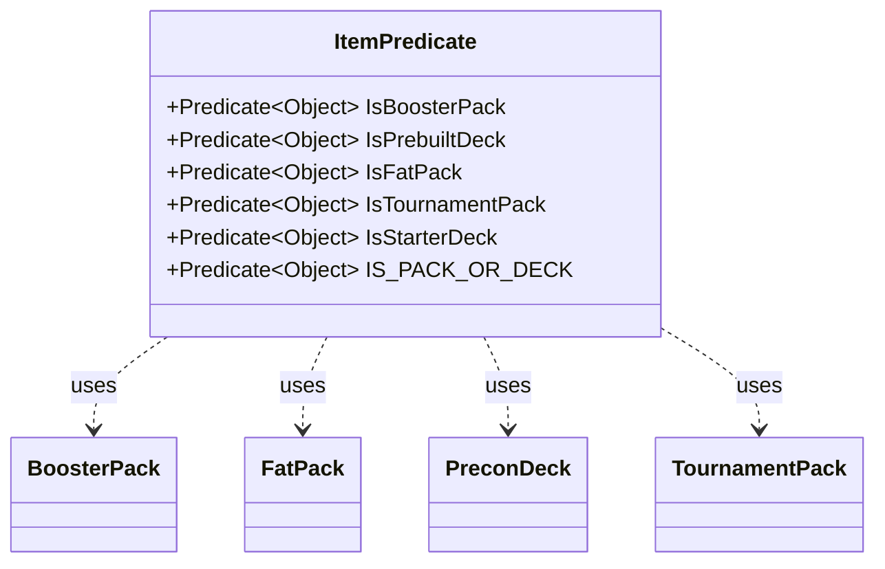

---
aliases:
  - ItemPredicate
tags:
  - java/class
  - module/forge-core
  - pkg/forge/item
fqn: forge.item.ItemPredicate
package: forge.item
module: forge-core
kind: Class
---

# ItemPredicate

**Package:** `forge.item` &nbsp; **Module:** `forge-core` &nbsp; **Kind:** Class



## Relationships
**Uses:**
- [[forge.item.BoosterPack|BoosterPack]]
- [[forge.item.FatPack|FatPack]]
- [[forge.item.PreconDeck|PreconDeck]]
- [[forge.item.TournamentPack|TournamentPack]]

## Source
`forge-core/src/main/java/forge/item/ItemPredicate.java`

```java
package forge.item;

import java.util.function.Predicate;

/**
 * Filtering conditions for miscellaneous InventoryItems.
 */
public abstract class ItemPredicate {

    // Static builder methods - they choose concrete implementation by themselves

    public static final Predicate<Object> IsBoosterPack = BoosterPack.class::isInstance;
    /**
     * Checks that the inventory item is a Prebuilt Deck.
     */
    public static final Predicate<Object> IsPrebuiltDeck = PreconDeck.class::isInstance;
    public static final Predicate<Object> IsFatPack = FatPack.class::isInstance;

    /**
     * Checks that the inventory item is a Tournament Pack.
     */
    public static final Predicate<Object> IsTournamentPack = card -> card instanceof TournamentPack && !((TournamentPack) card).isStarterDeck();

    /**
     * Checks that the inventory item is a Starter Deck.
     */
    public static final Predicate<Object> IsStarterDeck = card -> card instanceof TournamentPack && ((TournamentPack) card).isStarterDeck();

    public static final Predicate<Object> IS_PACK_OR_DECK = IsBoosterPack.or(IsFatPack).or(IsTournamentPack).or(IsStarterDeck).or(IsPrebuiltDeck);
}
```
