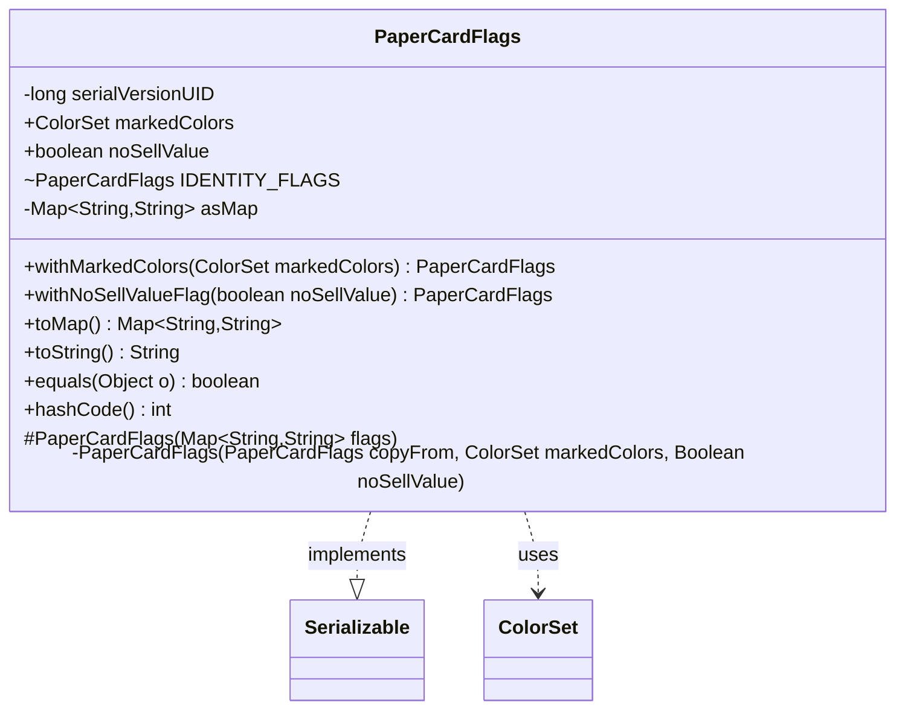

---
aliases:
  - PaperCardFlags
tags:
  - java/class
  - module/forge-core
  - pkg/forge/item
fqn: forge.item.PaperCard.PaperCardFlags
package: forge.item
module: forge-core
kind: Class
---

# PaperCardFlags

**Package:** `forge.item`   **Module:** `forge-core`   **Kind:** Class



## Relationships
**Uses:**
- [[forge.card.ColorSet|ColorSet]]

## Design Description

PaperCardFlags is an immutable nested value class that captures the distinguishing properties of a physical card variant — permanently marked colors (as for Cryptic Spires) and the Adventure-mode no-sell-value flag — that set one copy apart from another sharing the same name, edition, and collector number. By implementing `Serializable`, it can be persisted alongside the cards it qualifies. It collaborates with `ColorSet` to represent chosen colors, parsing them from and serializing them to a string/`Map` form for storage. Immutability is the central design intent: all fields are `final`, and modifications go through fluent `withMarkedColors`/`withNoSellValueFlag` methods that build new instances via a private copy constructor, guaranteeing a flags object can never be mutated while in use. It also offers a shared `IDENTITY_FLAGS` constant for the empty case, a lazily cached `toMap` view, and value-based `equals`/`hashCode`.

## Source
`forge-core/src/main/java/forge/item/PaperCard.java` — declaration excerpt

```java
    /**
     * Contains properties of a card which distinguish it from an otherwise identical copy of the card with the same
     * name, edition, and collector number. Examples include permanent markings on the card, and flags for Adventure
     * mode.
     */
    public static class PaperCardFlags implements Serializable {
        @Serial
        private static final long serialVersionUID = -3924720485840169336L;

        /**
         * Chosen colors, for cards like Cryptic Spires.
         */
        public final ColorSet markedColors;
        /**
         * Removes the sell value of the card in Adventure mode.
         */
        public final boolean noSellValue;

        //TODO: Could probably move foil here.

        static final PaperCardFlags IDENTITY_FLAGS = new PaperCardFlags(Map.of());

        protected PaperCardFlags(Map<String, String> flags) {
            if(flags.containsKey("markedColors"))
                markedColors = ColorSet.fromNames(flags.get("markedColors").split(""));
            else
                markedColors = null;
            noSellValue = flags.containsKey("noSellValue");
        }

        //Copy constructor. There are some better ways to do this, and they should be explored once we have more than 4
        //or 5 fields here. Just need to ensure it's impossible to accidentally change a field while the PaperCardFlags
        //object is in use.
        private PaperCardFlags(PaperCardFlags copyFrom, ColorSet markedColors, Boolean noSellValue) {
            if(markedColors == null)
                markedColors = copyFrom.markedColors;
            else if(markedColors.isColorless())
                markedColors = null;
            this.markedColors = markedColors;
            this.noSellValue = noSellValue != null ? noSellValue : copyFrom.noSellValue;
        }

        public PaperCardFlags withMarkedColors(ColorSet markedColors) {
            if(markedColors == null)
                markedColors = ColorSet.C;
            return new PaperCardFlags(this, markedColors, null);
        }

        public PaperCardFlags withNoSellValueFlag(boolean noSellValue) {
            return new PaperCardFlags(this, null, noSellValue);
        }

        private Map<String, String> asMap;
        public Map<String, String> toMap() {
            if(asMap != null)
                return asMap;
            Map<String, String> out = new HashMap<>();
            if(markedColors != null && !markedColors.isColorless())
                out.put("markedColors", markedColors.toString());
            if(noSellValue)
                out.put("noSellValue", "true");
            asMap = out;
            return out;
        }

        @Override
        public String toString() {
            return this.toMap().entrySet().stream()
                    .map((e) -> e.getKey() + "=" + e.getValue())
                    .collect(Collectors.joining("\t"));
        }

        @Override
        public boolean equals(Object o) {
            if (!(o instanceof PaperCardFlags that)) return false;
            return noSellValue == that.noSellValue && Objects.equals(markedColors, that.markedColors);
        }

        @Override
        public int hashCode() {
            return Objects.hash(markedColors, noSellValue);
        }
    }
```

## Python
`forge/item/PaperCard/PaperCardFlags.py`

```python
from forge.card.ColorSet import ColorSet


class PaperCardFlags:
    """
    Contains properties of a card which distinguish it from an otherwise identical copy of the card with the same
    name, edition, and collector number. Examples include permanent markings on the card, and flags for Adventure
    mode.
    """

    serialVersionUID = -3924720485840169336

    def __init__(self, flags=None, copyFrom=None, markedColors=None, noSellValue=None):
        if copyFrom is None:
            # protected PaperCardFlags(Map<String, String> flags)
            if flags is None:
                flags = {}
            if "markedColors" in flags:
                self.markedColors = ColorSet.fromNames(list(flags["markedColors"]))
            else:
                self.markedColors = None
            self.noSellValue = "noSellValue" in flags
        else:
            # Copy constructor. There are some better ways to do this, and they should be explored once we have more
            # than 4 or 5 fields here. Just need to ensure it's impossible to accidentally change a field while the
            # PaperCardFlags object is in use.
            if markedColors is None:
                markedColors = copyFrom.markedColors
            elif markedColors.isColorless():
                markedColors = None
            self.markedColors = markedColors
            self.noSellValue = noSellValue if noSellValue is not None else copyFrom.noSellValue
        self.asMap = None

    def withMarkedColors(self, markedColors):
        if markedColors is None:
            markedColors = ColorSet.C
        return PaperCardFlags(copyFrom=self, markedColors=markedColors, noSellValue=None)

    def withNoSellValueFlag(self, noSellValue):
        return PaperCardFlags(copyFrom=self, markedColors=None, noSellValue=noSellValue)

    def toMap(self):
        if self.asMap is not None:
            return self.asMap
        out = {}
        if self.markedColors is not None and not self.markedColors.isColorless():
            out["markedColors"] = str(self.markedColors)
        if self.noSellValue:
            out["noSellValue"] = "true"
        self.asMap = out
        return out

    def __str__(self):
        return "\t".join(k + "=" + v for k, v in self.toMap().items())

    def __eq__(self, o):
        if not isinstance(o, PaperCardFlags):
            return False
        return self.noSellValue == o.noSellValue and self.markedColors == o.markedColors

    def __hash__(self):
        return hash((self.markedColors, self.noSellValue))


PaperCardFlags.IDENTITY_FLAGS = PaperCardFlags({})
```
