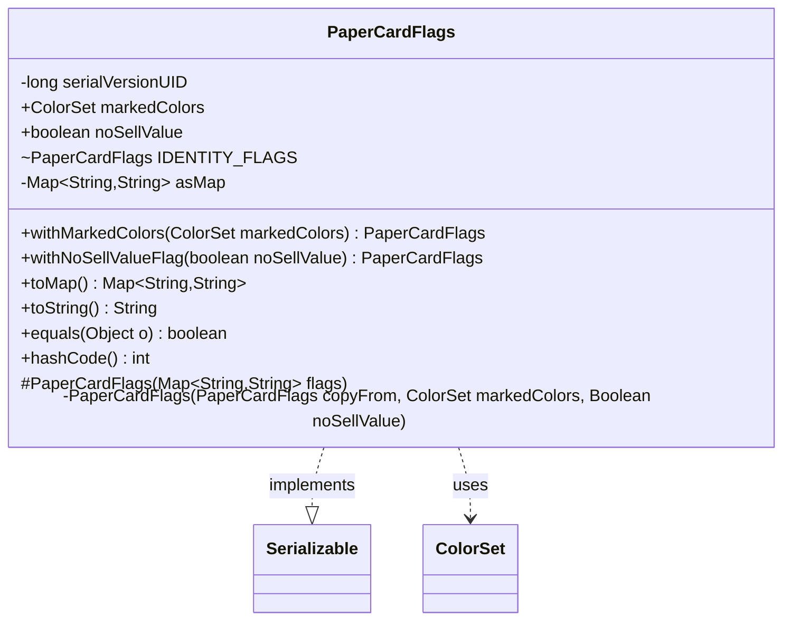

---
aliases:
  - PaperCardFlags
tags:
  - java/class
  - module/forge-core
  - pkg/forge/item
fqn: forge.item.PaperCard.PaperCardFlags
package: forge.item
module: forge-core
kind: Class
---

# PaperCardFlags

**Package:** `forge.item` &nbsp; **Module:** `forge-core` &nbsp; **Kind:** Class



## Relationships
**Uses:**
- [[forge.card.ColorSet|ColorSet]]

## Source
`forge-core/src/main/java/forge/item/PaperCard.java` — declaration excerpt

```java
    /**
     * Contains properties of a card which distinguish it from an otherwise identical copy of the card with the same
     * name, edition, and collector number. Examples include permanent markings on the card, and flags for Adventure
     * mode.
     */
    public static class PaperCardFlags implements Serializable {
        @Serial
        private static final long serialVersionUID = -3924720485840169336L;

        /**
         * Chosen colors, for cards like Cryptic Spires.
         */
        public final ColorSet markedColors;
        /**
         * Removes the sell value of the card in Adventure mode.
         */
        public final boolean noSellValue;

        //TODO: Could probably move foil here.

        static final PaperCardFlags IDENTITY_FLAGS = new PaperCardFlags(Map.of());

        protected PaperCardFlags(Map<String, String> flags) {
            if(flags.containsKey("markedColors"))
                markedColors = ColorSet.fromNames(flags.get("markedColors").split(""));
            else
                markedColors = null;
            noSellValue = flags.containsKey("noSellValue");
        }

        //Copy constructor. There are some better ways to do this, and they should be explored once we have more than 4
        //or 5 fields here. Just need to ensure it's impossible to accidentally change a field while the PaperCardFlags
        //object is in use.
        private PaperCardFlags(PaperCardFlags copyFrom, ColorSet markedColors, Boolean noSellValue) {
            if(markedColors == null)
                markedColors = copyFrom.markedColors;
            else if(markedColors.isColorless())
                markedColors = null;
            this.markedColors = markedColors;
            this.noSellValue = noSellValue != null ? noSellValue : copyFrom.noSellValue;
        }

        public PaperCardFlags withMarkedColors(ColorSet markedColors) {
            if(markedColors == null)
                markedColors = ColorSet.C;
            return new PaperCardFlags(this, markedColors, null);
        }

        public PaperCardFlags withNoSellValueFlag(boolean noSellValue) {
            return new PaperCardFlags(this, null, noSellValue);
        }

        private Map<String, String> asMap;
        public Map<String, String> toMap() {
            if(asMap != null)
                return asMap;
            Map<String, String> out = new HashMap<>();
            if(markedColors != null && !markedColors.isColorless())
                out.put("markedColors", markedColors.toString());
            if(noSellValue)
                out.put("noSellValue", "true");
            asMap = out;
            return out;
        }

        @Override
        public String toString() {
            return this.toMap().entrySet().stream()
                    .map((e) -> e.getKey() + "=" + e.getValue())
                    .collect(Collectors.joining("\t"));
        }

        @Override
        public boolean equals(Object o) {
            if (!(o instanceof PaperCardFlags that)) return false;
            return noSellValue == that.noSellValue && Objects.equals(markedColors, that.markedColors);
        }

        @Override
        public int hashCode() {
            return Objects.hash(markedColors, noSellValue);
        }
    }
```
