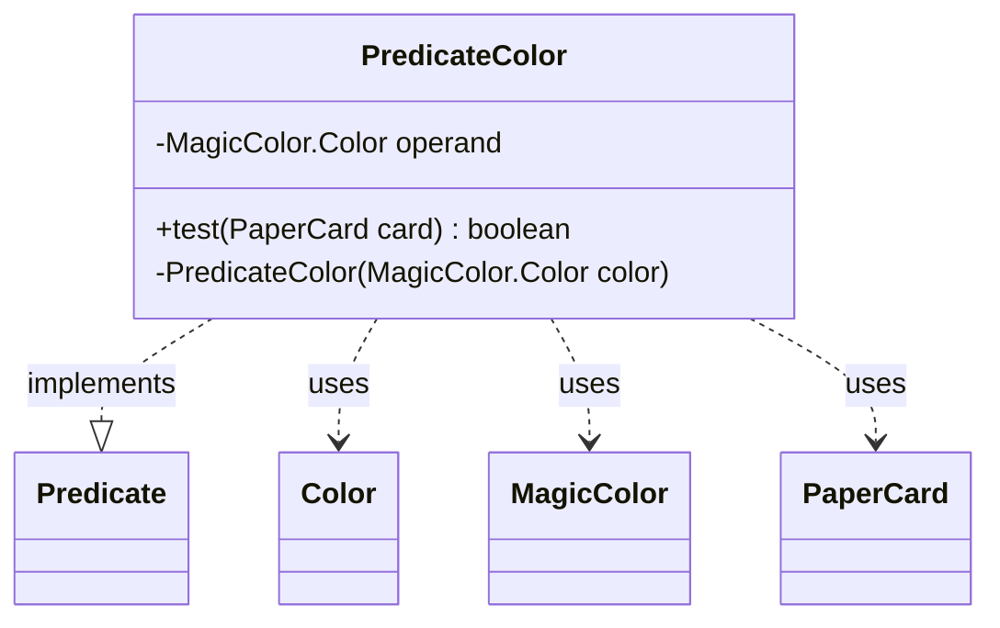

---
aliases:
  - PredicateColor
tags:
  - java/class
  - module/forge-core
  - pkg/forge/item
fqn: forge.item.PaperCardPredicates.PredicateColor
package: forge.item
module: forge-core
kind: Class
---

# PredicateColor

**Package:** `forge.item` &nbsp; **Module:** `forge-core` &nbsp; **Kind:** Class



## Relationships
**Uses:**
- [[forge.card.MagicColor|MagicColor]]
- [[forge.card.MagicColor.Color|Color]]
- [[forge.item.PaperCard|PaperCard]]

## Source
`forge-core/src/main/java/forge/item/PaperCardPredicates.java` — declaration excerpt

```java
    private static final class PredicateColor implements Predicate<PaperCard> {
        private final MagicColor.Color operand;

        private PredicateColor(final MagicColor.Color color) {
            this.operand = color;
        }

        @Override
        public boolean test(final PaperCard card) {
            if (card.getRules().getColor().hasAnyColor(operand)) {
                return true;
            }
            if (card.getRules().getType().hasType(CardType.CoreType.Land) && card.getRules().getColorIdentity().hasAnyColor(operand)) {
                return true;
            }
            return false;
        }
    }
```
