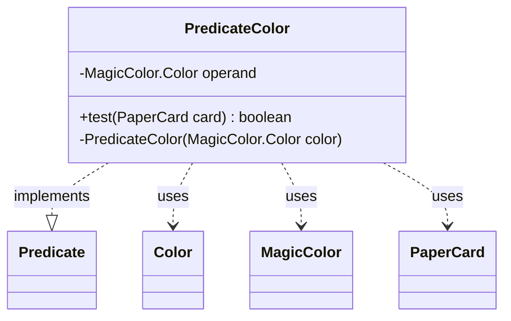

---
aliases:
  - PredicateColor
tags:
  - java/class
  - module/forge-core
  - pkg/forge/item
fqn: forge.item.PaperCardPredicates.PredicateColor
package: forge.item
module: forge-core
kind: Class
---

# PredicateColor

**Package:** `forge.item`   **Module:** `forge-core`   **Kind:** Class



## Relationships
**Uses:**
- [[forge.card.MagicColor|MagicColor]]
- [[forge.card.MagicColor.Color|Color]]
- [[forge.item.PaperCard|PaperCard]]

## Design Description

The PredicateColor class is a private, immutable nested helper within PaperCardPredicates that implements `Predicate<PaperCard>` to filter cards by a single color. It holds one `MagicColor.Color` operand, set through its private constructor, restricting instantiation to the enclosing factory class.

Its `test` method evaluates a card's membership in the target color: it returns true when the card's rules declare the operand directly, or—for lands specifically—when the operand appears in the card's color identity. This dual check reflects the design intent that lands are matched by color identity rather than printed color, accommodating Magic's distinction between a card's mana cost colors and the colors of mana it can produce. The class collaborates with PaperCard (and its CardRules), MagicColor, and CardType to resolve these color semantics.

## Source
`forge-core/src/main/java/forge/item/PaperCardPredicates.java` — declaration excerpt

```java
    private static final class PredicateColor implements Predicate<PaperCard> {
        private final MagicColor.Color operand;

        private PredicateColor(final MagicColor.Color color) {
            this.operand = color;
        }

        @Override
        public boolean test(final PaperCard card) {
            if (card.getRules().getColor().hasAnyColor(operand)) {
                return true;
            }
            if (card.getRules().getType().hasType(CardType.CoreType.Land) && card.getRules().getColorIdentity().hasAnyColor(operand)) {
                return true;
            }
            return false;
        }
    }
```

## Python
`forge/item/PaperCardPredicates/PredicateColor.py`

```python
from forge.card.MagicColor import MagicColor
from forge.card.MagicColor.Color import Color
from forge.card.CardType import CardType
from forge.item.PaperCard import PaperCard


class PredicateColor:
    def __init__(self, color: Color):
        self.operand = color

    def test(self, card: PaperCard) -> bool:
        if card.getRules().getColor().hasAnyColor(self.operand):
            return True
        if card.getRules().getType().hasType(CardType.CoreType.Land) and card.getRules().getColorIdentity().hasAnyColor(self.operand):
            return True
        return False
```
