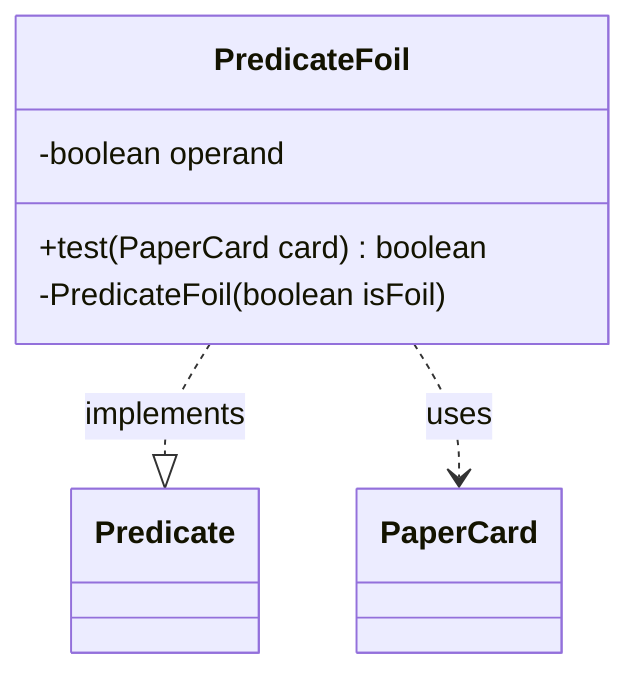

---
aliases:
  - PredicateFoil
tags:
  - java/class
  - module/forge-core
  - pkg/forge/item
fqn: forge.item.PaperCardPredicates.PredicateFoil
package: forge.item
module: forge-core
kind: Class
---

# PredicateFoil

**Package:** `forge.item` &nbsp; **Module:** `forge-core` &nbsp; **Kind:** Class



## Relationships
**Uses:**
- [[forge.item.PaperCard|PaperCard]]

## Source
`forge-core/src/main/java/forge/item/PaperCardPredicates.java` — declaration excerpt

```java
    private static final class PredicateFoil implements Predicate<PaperCard> {
        private final boolean operand;

        @Override
        public boolean test(final PaperCard card) { return card.isFoil() == operand; }

        private PredicateFoil(final boolean isFoil) {
            this.operand = isFoil;
        }
    }
```
