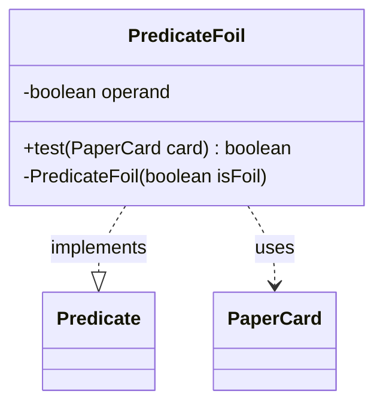

---
aliases:
  - PredicateFoil
tags:
  - java/class
  - module/forge-core
  - pkg/forge/item
fqn: forge.item.PaperCardPredicates.PredicateFoil
package: forge.item
module: forge-core
kind: Class
---

# PredicateFoil

**Package:** `forge.item`   **Module:** `forge-core`   **Kind:** Class



## Relationships
**Uses:**
- [[forge.item.PaperCard|PaperCard]]

## Design Description

The PredicateFoil class is a small, immutable predicate that tests whether a PaperCard matches a desired foil state. As a private static nested helper within PaperCardPredicates, it implements `Predicate<PaperCard>`, allowing instances to be composed into standard Java functional pipelines for filtering card collections. Its single `operand` field, set through a private constructor, captures the target foil value, and the `test` method returns true when a card's `isFoil()` equals that operand. The private constructor and final field reflect a deliberate factory-and-encapsulation design: instances are created only by the enclosing PaperCardPredicates class, keeping this filtering logic centralized and hidden behind a stable Predicate interface while collaborating solely with PaperCard.

## Source
`forge-core/src/main/java/forge/item/PaperCardPredicates.java` — declaration excerpt

```java
    private static final class PredicateFoil implements Predicate<PaperCard> {
        private final boolean operand;

        @Override
        public boolean test(final PaperCard card) { return card.isFoil() == operand; }

        private PredicateFoil(final boolean isFoil) {
            this.operand = isFoil;
        }
    }
```

## Python
`forge/item/PaperCardPredicates/PredicateFoil.py`

```python
from forge.item.PaperCard import PaperCard


class PredicateFoil:
    def __init__(self, isFoil: bool):
        self.operand: bool = isFoil

    def test(self, card: PaperCard) -> bool:
        return card.isFoil() == self.operand
```
