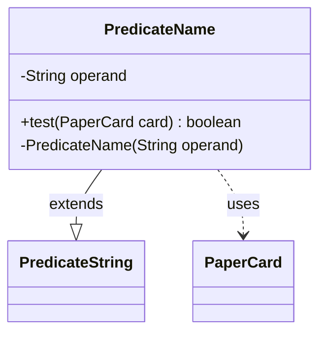

---
aliases:
  - PredicateName
tags:
  - java/class
  - module/forge-core
  - pkg/forge/item
fqn: forge.item.PaperCardPredicates.PredicateName
package: forge.item
module: forge-core
kind: Class
---

# PredicateName

**Package:** `forge.item` &nbsp; **Module:** `forge-core` &nbsp; **Kind:** Class



## Relationships
**Extends:**
- [[forge.util.PredicateString|PredicateString]]
**Uses:**
- [[forge.item.PaperCard|PaperCard]]

## Source
`forge-core/src/main/java/forge/item/PaperCardPredicates.java` — declaration excerpt

```java
    private static final class PredicateName extends PredicateString<PaperCard> {
        private final String operand;

        @Override
        public boolean test(final PaperCard card) {
            return this.op(card.getName(), this.operand);
        }

        private PredicateName(final String operand) {
            super(StringOp.EQUALS_IC);
            this.operand = operand;
        }
    }
```
