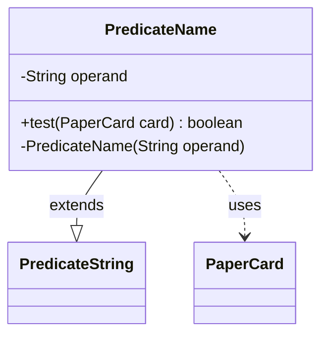

---
aliases:
  - PredicateName
tags:
  - java/class
  - module/forge-core
  - pkg/forge/item
fqn: forge.item.PaperCardPredicates.PredicateName
package: forge.item
module: forge-core
kind: Class
---

# PredicateName

**Package:** `forge.item`   **Module:** `forge-core`   **Kind:** Class



## Relationships
**Extends:**
- [[forge.util.PredicateString|PredicateString]]
**Uses:**
- [[forge.item.PaperCard|PaperCard]]

## Design Description

PredicateName is a private, immutable inner predicate that encapsulates a single matching rule: whether a `PaperCard`'s name equals a given operand. By extending `PredicateString<PaperCard>`, it inherits string-comparison machinery and configures it for case-insensitive equality (`StringOp.EQUALS_IC`) at construction, reducing its own logic to extracting the card's name and delegating to the inherited `op` method. It collaborates with `PaperCard` purely as the test subject, reading its name via `getName()`.

The design intent is clear separation of concerns: the reusable string-operation logic lives in the `PredicateString` supertype, while this class supplies only the card-specific field accessor and the fixed comparison mode. Its `private` visibility and private constructor mark it as an internal building block of the enclosing `PaperCardPredicates` factory, exposed only through that class's predicate-producing methods rather than instantiated directly by clients.

## Source
`forge-core/src/main/java/forge/item/PaperCardPredicates.java` — declaration excerpt

```java
    private static final class PredicateName extends PredicateString<PaperCard> {
        private final String operand;

        @Override
        public boolean test(final PaperCard card) {
            return this.op(card.getName(), this.operand);
        }

        private PredicateName(final String operand) {
            super(StringOp.EQUALS_IC);
            this.operand = operand;
        }
    }
```

## Python
`forge/item/PaperCardPredicates/PredicateName.py`

```python
from forge.util.PredicateString import PredicateString
from forge.item.PaperCard import PaperCard


class PredicateName(PredicateString[PaperCard]):
    def test(self, card: PaperCard) -> bool:
        return self.op(card.getName(), self.operand)

    def __init__(self, operand: str):
        super().__init__(StringOp.EQUALS_IC)
        self.operand = operand
```
