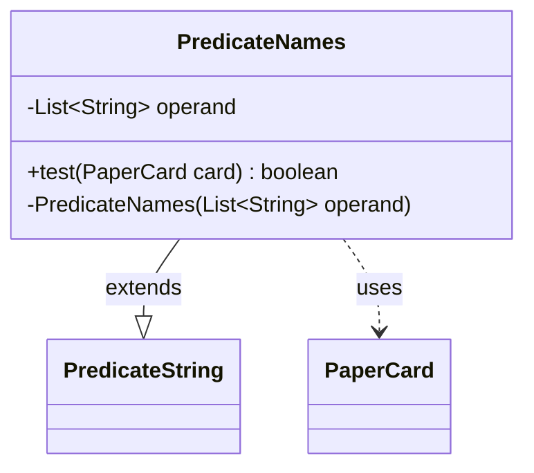

---
aliases:
  - PredicateNames
tags:
  - java/class
  - module/forge-core
  - pkg/forge/item
fqn: forge.item.PaperCardPredicates.PredicateNames
package: forge.item
module: forge-core
kind: Class
---

# PredicateNames

**Package:** `forge.item`   **Module:** `forge-core`   **Kind:** Class



## Relationships
**Extends:**
- [[forge.util.PredicateString|PredicateString]]
**Uses:**
- [[forge.item.PaperCard|PaperCard]]

## Design Description

The PredicateNames class is a private static, inner predicate used by `PaperCardPredicates` to match a `PaperCard` against a set of candidate card names. It extends `PredicateString<PaperCard>`, inheriting string-comparison machinery (notably the `op` helper) and is fixed to the `StringOp.EQUALS` operation via its constructor, so it tests for exact name matches. Its `test` method retrieves the card's name and returns true if that name equals any entry in its immutable `operand` list, giving OR-style semantics across multiple names. The private constructor and final fields signal that instances are immutable and meant to be created only through the enclosing factory class, while delegating comparison logic to the supertype keeps the predicate focused solely on extracting and matching the card name.

## Source
`forge-core/src/main/java/forge/item/PaperCardPredicates.java` — declaration excerpt

```java
    private static final class PredicateNames extends PredicateString<PaperCard> {
        private final List<String> operand;

        @Override
        public boolean test(final PaperCard card) {
            final String cardName = card.getName();
            for (final String element : this.operand) {
                if (this.op(cardName, element)) {
                    return true;
                }
            }
            return false;
        }

        private PredicateNames(final List<String> operand) {
            super(StringOp.EQUALS);
            this.operand = operand;
        }
    }
```

## Python
`forge/item/PaperCardPredicates/PredicateNames.py`

```python
from forge.util.PredicateString import PredicateString
from forge.item.PaperCard import PaperCard


class PredicateNames(PredicateString):
    def __init__(self, operand: list[str]):
        super().__init__(StringOp.EQUALS)
        self.operand = operand

    def test(self, card: PaperCard) -> bool:
        cardName = card.getName()
        for element in self.operand:
            if self.op(cardName, element):
                return True
        return False
```
