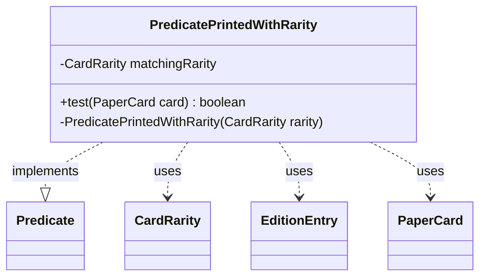

---
aliases:
  - PredicatePrintedWithRarity
tags:
  - java/class
  - module/forge-core
  - pkg/forge/item
fqn: forge.item.PaperCardPredicates.PredicatePrintedWithRarity
package: forge.item
module: forge-core
kind: Class
---

# PredicatePrintedWithRarity

**Package:** `forge.item` &nbsp; **Module:** `forge-core` &nbsp; **Kind:** Class



## Relationships
**Uses:**
- [[forge.card.CardEdition.EditionEntry|EditionEntry]]
- [[forge.card.CardRarity|CardRarity]]
- [[forge.item.PaperCard|PaperCard]]

## Source
`forge-core/src/main/java/forge/item/PaperCardPredicates.java` — declaration excerpt

```java
    private static final class PredicatePrintedWithRarity implements Predicate<PaperCard> {
        private final CardRarity matchingRarity;

        @Override
        public boolean test(final PaperCard card) {
            return StaticData.instance().getEditions().stream()
                .anyMatch(ce -> {
                    List<EditionEntry> entries = ce.getCardInSet(card.getName());
                    return entries != null && entries.stream()
                        .anyMatch(ee -> ee.rarity() == matchingRarity);
                });
        }

        private PredicatePrintedWithRarity(final CardRarity rarity) {
            this.matchingRarity = rarity;
        }
    }
```
