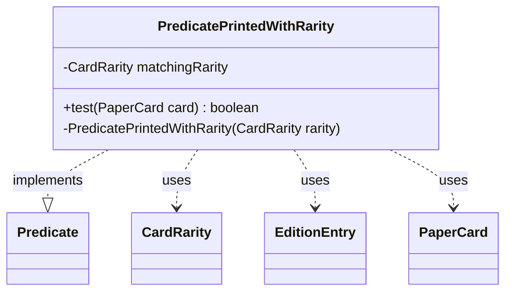

---
aliases:
  - PredicatePrintedWithRarity
tags:
  - java/class
  - module/forge-core
  - pkg/forge/item
fqn: forge.item.PaperCardPredicates.PredicatePrintedWithRarity
package: forge.item
module: forge-core
kind: Class
---

# PredicatePrintedWithRarity

**Package:** `forge.item`   **Module:** `forge-core`   **Kind:** Class



## Relationships
**Uses:**
- [[forge.card.CardEdition.EditionEntry|EditionEntry]]
- [[forge.card.CardRarity|CardRarity]]
- [[forge.item.PaperCard|PaperCard]]

## Design Description

`PredicatePrintedWithRarity` is a private, immutable nested predicate within `PaperCardPredicates` that implements `Predicate<PaperCard>`, encapsulating the test of whether a given card was ever printed at a specific `CardRarity`. Its `test` method scans every edition in the global `StaticData` card database, inspecting each set's `EditionEntry` records for the card and returning true when any printing matches the rarity held in its final `matchingRarity` field. The private constructor confines instantiation to the enclosing factory class, reinforcing its use as a stateless, reusable filter. By delegating edition and rarity lookups to `CardEdition` and `EditionEntry` rather than the card itself, it cleanly separates per-printing rarity concerns from the `PaperCard` identity, fitting Forge's predicate-based collection-filtering pattern.

## Source
`forge-core/src/main/java/forge/item/PaperCardPredicates.java` — declaration excerpt

```java
    private static final class PredicatePrintedWithRarity implements Predicate<PaperCard> {
        private final CardRarity matchingRarity;

        @Override
        public boolean test(final PaperCard card) {
            return StaticData.instance().getEditions().stream()
                .anyMatch(ce -> {
                    List<EditionEntry> entries = ce.getCardInSet(card.getName());
                    return entries != null && entries.stream()
                        .anyMatch(ee -> ee.rarity() == matchingRarity);
                });
        }

        private PredicatePrintedWithRarity(final CardRarity rarity) {
            this.matchingRarity = rarity;
        }
    }
```

## Python
`forge/item/PaperCardPredicates/PredicatePrintedWithRarity.py`

```python
from forge.StaticData import StaticData
from forge.card.CardEdition.EditionEntry import EditionEntry
from forge.card.CardRarity import CardRarity
from forge.item.PaperCard import PaperCard


class PredicatePrintedWithRarity:
    def __init__(self, rarity: CardRarity):
        self.matchingRarity = rarity

    def test(self, card: PaperCard) -> bool:
        def matches(ce) -> bool:
            entries: list[EditionEntry] = ce.getCardInSet(card.getName())
            return entries is not None and any(
                ee.rarity() == self.matchingRarity for ee in entries
            )

        return any(matches(ce) for ce in StaticData.instance().getEditions())
```
