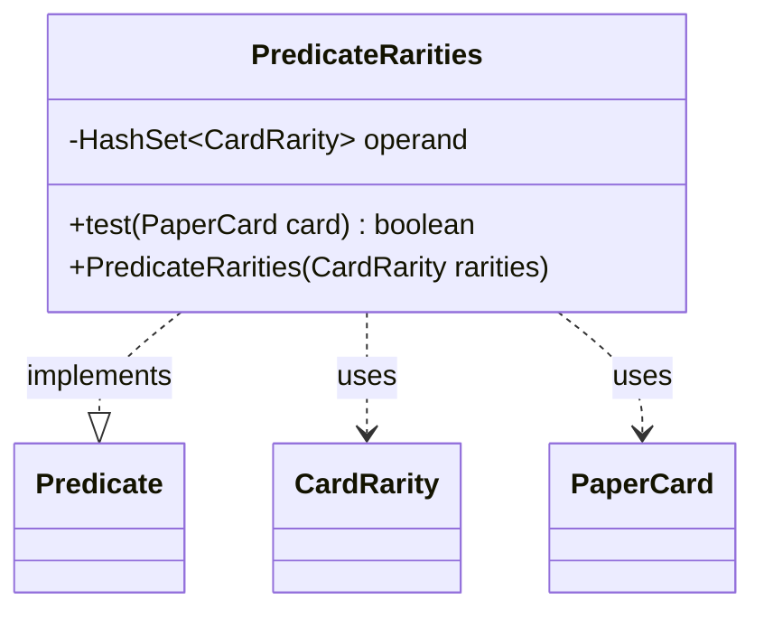

---
aliases:
  - PredicateRarities
tags:
  - java/class
  - module/forge-core
  - pkg/forge/item
fqn: forge.item.PaperCardPredicates.PredicateRarities
package: forge.item
module: forge-core
kind: Class
---

# PredicateRarities

**Package:** `forge.item`   **Module:** `forge-core`   **Kind:** Class



## Relationships
**Uses:**
- [[forge.card.CardRarity|CardRarity]]
- [[forge.item.PaperCard|PaperCard]]

## Design Description

Forge's `PredicateRarities` is an immutable predicate that matches a `PaperCard` whose rarity belongs to a fixed set of `CardRarity` values. As a `static final` class implementing `Predicate<PaperCard>`, it serves as a self-contained filter—one of several nested predicate types within `PaperCardPredicates`—usable wherever card collections are screened by rarity. Its varargs constructor eagerly collects the supplied rarities into a `HashSet`, trading a small allocation for constant-time membership checks in `test`, which simply delegates to `card.getRarity()`. The `final` field and absence of mutators reflect a deliberate stateless, thread-safe design: once constructed, the predicate is a reusable, side-effect-free criterion that composes cleanly with Java's functional `Predicate` combinators.

## Source
`forge-core/src/main/java/forge/item/PaperCardPredicates.java` — declaration excerpt

```java
    public static final class PredicateRarities implements Predicate<PaperCard> {
        private final HashSet<CardRarity> operand;

        @Override
        public boolean test(final PaperCard card) {
            return this.operand.contains(card.getRarity());
        }

        public PredicateRarities(CardRarity... rarities) {
            this.operand = new HashSet<>(Arrays.asList(rarities));
        }
    }
```

## Python
`forge/item/PaperCardPredicates/PredicateRarities.py`

```python
from forge.card.CardRarity import CardRarity
from forge.item.PaperCard import PaperCard


class PredicateRarities(Predicate[PaperCard]):
    def __init__(self, *rarities: CardRarity):
        self.operand: set[CardRarity] = set(rarities)

    def test(self, card: PaperCard) -> bool:
        return card.getRarity() in self.operand
```
