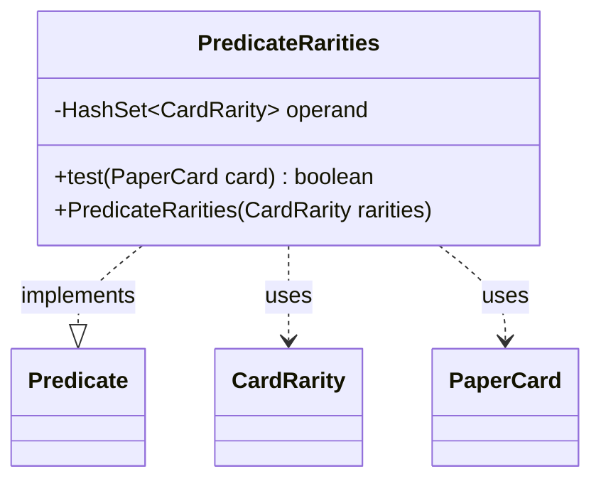

---
aliases:
  - PredicateRarities
tags:
  - java/class
  - module/forge-core
  - pkg/forge/item
fqn: forge.item.PaperCardPredicates.PredicateRarities
package: forge.item
module: forge-core
kind: Class
---

# PredicateRarities

**Package:** `forge.item` &nbsp; **Module:** `forge-core` &nbsp; **Kind:** Class



## Relationships
**Uses:**
- [[forge.card.CardRarity|CardRarity]]
- [[forge.item.PaperCard|PaperCard]]

## Source
`forge-core/src/main/java/forge/item/PaperCardPredicates.java` — declaration excerpt

```java
    public static final class PredicateRarities implements Predicate<PaperCard> {
        private final HashSet<CardRarity> operand;

        @Override
        public boolean test(final PaperCard card) {
            return this.operand.contains(card.getRarity());
        }

        public PredicateRarities(CardRarity... rarities) {
            this.operand = new HashSet<>(Arrays.asList(rarities));
        }
    }
```
