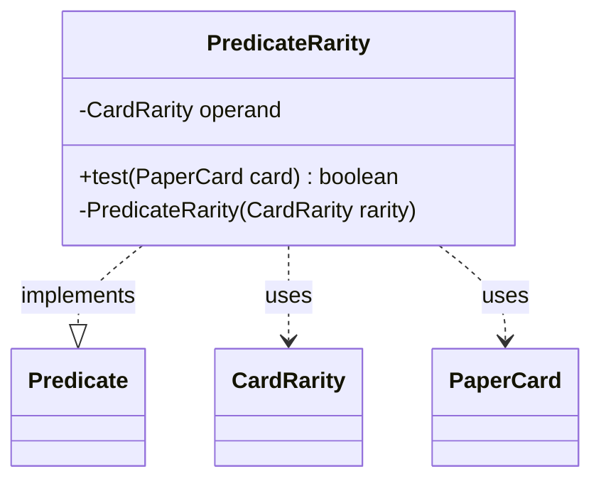

---
aliases:
  - PredicateRarity
tags:
  - java/class
  - module/forge-core
  - pkg/forge/item
fqn: forge.item.PaperCardPredicates.PredicateRarity
package: forge.item
module: forge-core
kind: Class
---

# PredicateRarity

**Package:** `forge.item`   **Module:** `forge-core`   **Kind:** Class



## Relationships
**Uses:**
- [[forge.card.CardRarity|CardRarity]]
- [[forge.item.PaperCard|PaperCard]]

## Design Description

PredicateRarity is a private static, immutable predicate that tests whether a PaperCard matches a specific card rarity. Nested within the PaperCardPredicates factory class, it encapsulates a single CardRarity operand supplied through its private constructor, keeping instantiation under the enclosing class's control rather than exposing it to clients.

By implementing `Predicate<PaperCard>`, it plugs into Java's standard functional and stream-filtering APIs, letting callers compose rarity filters with other predicates uniformly. Its `test` method performs a direct reference comparison against the stored rarity, reflecting a deliberately lightweight, stateless design: each instance is a reusable, thread-safe filter built once and applied across card collections. Collaborating only with CardRarity and PaperCard, it embodies a focused single-responsibility component within Forge's card-querying infrastructure.

## Source
`forge-core/src/main/java/forge/item/PaperCardPredicates.java` — declaration excerpt

```java
    private static final class PredicateRarity implements Predicate<PaperCard> {
        private final CardRarity operand;

        @Override
        public boolean test(final PaperCard card) {
            return card.getRarity() == this.operand;
        }

        private PredicateRarity(final CardRarity rarity) {
            this.operand = rarity;
        }
    }
```

## Python
`forge/item/PaperCardPredicates/PredicateRarity.py`

```python
from forge.card.CardRarity import CardRarity
from forge.item.PaperCard import PaperCard
from forge.util.Predicate import Predicate


class PredicateRarity(Predicate):
    def __init__(self, rarity: CardRarity):
        self.operand: CardRarity = rarity

    def test(self, card: PaperCard) -> bool:
        return card.getRarity() == self.operand
```
