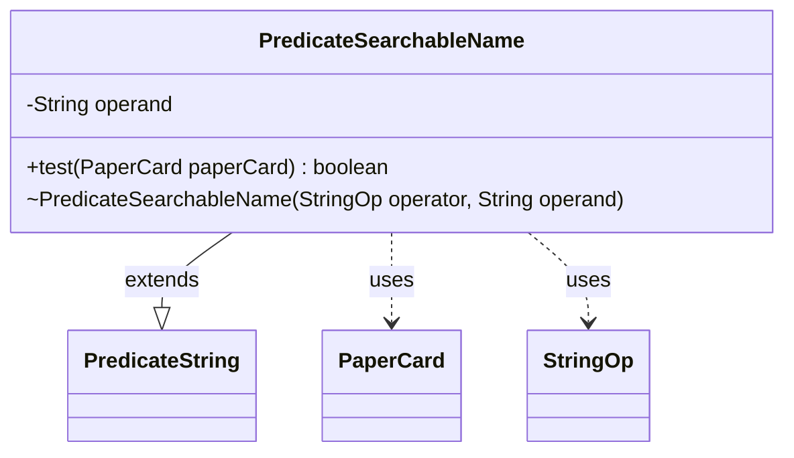

---
aliases:
  - PredicateSearchableName
tags:
  - java/class
  - module/forge-core
  - pkg/forge/item
fqn: forge.item.PaperCardPredicates.PredicateSearchableName
package: forge.item
module: forge-core
kind: Class
---

# PredicateSearchableName

**Package:** `forge.item`   **Module:** `forge-core`   **Kind:** Class



## Relationships
**Extends:**
- [[forge.util.PredicateString|PredicateString]]
**Uses:**
- [[forge.item.PaperCard|PaperCard]]
- [[forge.util.PredicateString.StringOp|StringOp]]

## Design Description

PredicateSearchableName is a private, immutable predicate that tests whether a PaperCard matches a given name string under a configurable string-comparison operator. As a nested helper within PaperCardPredicates, it encapsulates one specific matching rule—searchable-name lookup—behind the standard predicate interface so callers can filter card collections without knowing the comparison details.

By extending PredicateString<PaperCard>, it inherits the StringOp operator (passed to the superclass constructor) and the inherited op helper that performs the actual comparison, leaving this class responsible only for supplying the operand and choosing what to compare against. Its test method streams over the card's full set of searchable names and reports a match if any satisfies the operator, deliberately supporting cards with multiple names (such as split or double-faced cards). The package-private constructor and final operand field reflect intent: instances are constructed only by the enclosing factory class and remain stateless and reusable after creation.

## Source
`forge-core/src/main/java/forge/item/PaperCardPredicates.java` — declaration excerpt

```java
    private static final class PredicateSearchableName extends PredicateString<PaperCard> {
        private final String operand;

        PredicateSearchableName(final StringOp operator, final String operand) {
            super(operator);
            this.operand = operand;
        }

        @Override
        public boolean test(PaperCard paperCard) {
            return paperCard.getAllSearchableNames().stream().anyMatch(name -> this.op(name, this.operand));
        }
    }
```

## Python
`forge/item/PaperCardPredicates/PredicateSearchableName.py`

```python
from forge.util.PredicateString import PredicateString
from forge.item.PaperCard import PaperCard
from forge.util.PredicateString import StringOp


class PredicateSearchableName(PredicateString):
    def __init__(self, operator: StringOp, operand: str):
        super().__init__(operator)
        self.operand = operand

    def test(self, paperCard: PaperCard) -> bool:
        return any(self.op(name, self.operand) for name in paperCard.getAllSearchableNames())
```
