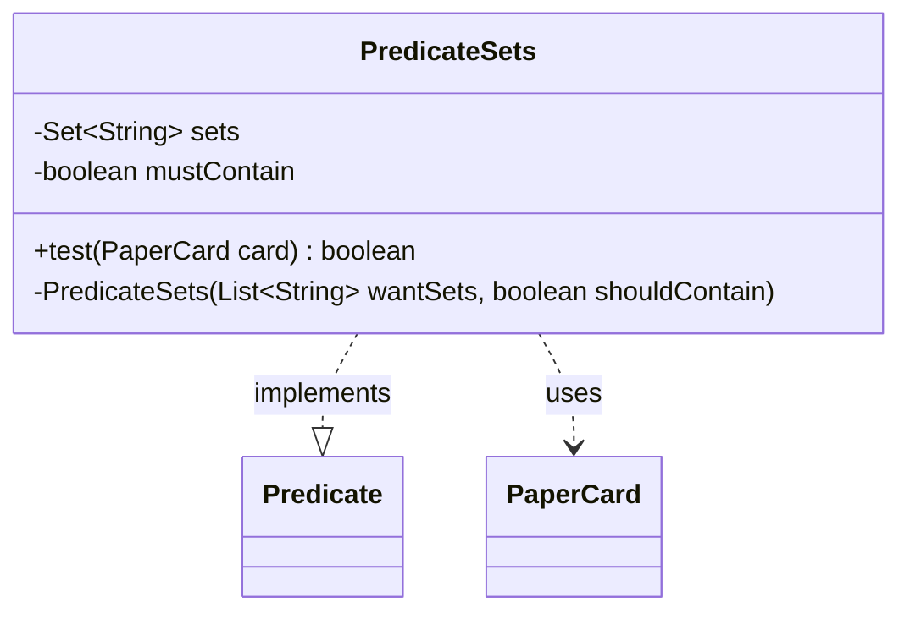

---
aliases:
  - PredicateSets
tags:
  - java/class
  - module/forge-core
  - pkg/forge/item
fqn: forge.item.PaperCardPredicates.PredicateSets
package: forge.item
module: forge-core
kind: Class
---

# PredicateSets

**Package:** `forge.item`   **Module:** `forge-core`   **Kind:** Class



## Relationships
**Uses:**
- [[forge.item.PaperCard|PaperCard]]

## Design Description

The PredicateSets class is a private, immutable nested helper inside PaperCardPredicates that implements `Predicate<PaperCard>`, allowing card collections to be filtered by their set/edition membership. It encapsulates a case-insensitive `TreeSet` of edition codes together with a `mustContain` flag, so a single implementation serves both inclusion and exclusion queries: `test` passes a card only when its edition's presence in the set matches the flag.

Collaborating with PaperCard for edition and name lookups and with StaticData for edition metadata, it additionally restricts matches to cards that are actually obtainable in their edition. The private constructor and `final` class signal that instances are meant to be created only through the enclosing factory class, and the case-insensitive comparator reflects deliberate intent to tolerate inconsistent set-code casing.

## Source
`forge-core/src/main/java/forge/item/PaperCardPredicates.java` — declaration excerpt

```java
    private static final class PredicateSets implements Predicate<PaperCard> {
        private final Set<String> sets;
        private final boolean mustContain;

        @Override
        public boolean test(final PaperCard card) {
            return this.sets.contains(card.getEdition()) == this.mustContain &&
                StaticData.instance().getCardEdition(card.getEdition()).isCardObtainable(card.getName());
        }

        private PredicateSets(final List<String> wantSets, final boolean shouldContain) {
            this.sets = new TreeSet<>(String.CASE_INSENSITIVE_ORDER);
            this.sets.addAll(wantSets);
            this.mustContain = shouldContain;
        }
    }
```

## Python
`forge/item/PaperCardPredicates/PredicateSets.py`

```python
from forge.item.PaperCard import PaperCard
from forge.item.StaticData import StaticData
from forge.util.Predicate import Predicate


class PredicateSets(Predicate):
    def test(self, card: PaperCard) -> bool:
        return self.sets.__contains__(card.getEdition()) == self.mustContain and \
            StaticData.instance().getCardEdition(card.getEdition()).isCardObtainable(card.getName())

    def __init__(self, wantSets: list[str], shouldContain: bool):
        self.sets: set[str] = set()
        for s in wantSets:
            self.sets.add(s.upper())
        self.mustContain: bool = shouldContain
```
