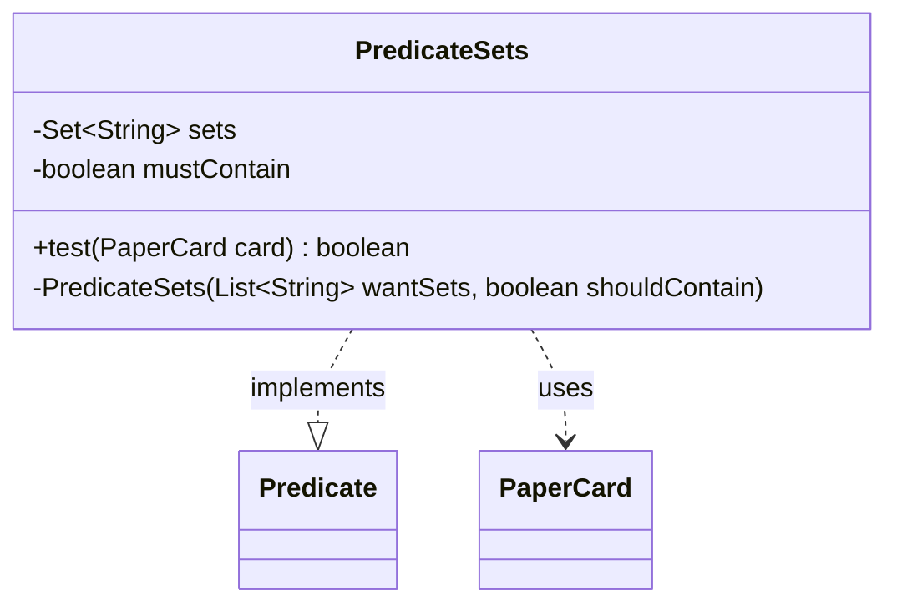

---
aliases:
  - PredicateSets
tags:
  - java/class
  - module/forge-core
  - pkg/forge/item
fqn: forge.item.PaperCardPredicates.PredicateSets
package: forge.item
module: forge-core
kind: Class
---

# PredicateSets

**Package:** `forge.item` &nbsp; **Module:** `forge-core` &nbsp; **Kind:** Class



## Relationships
**Uses:**
- [[forge.item.PaperCard|PaperCard]]

## Source
`forge-core/src/main/java/forge/item/PaperCardPredicates.java` — declaration excerpt

```java
    private static final class PredicateSets implements Predicate<PaperCard> {
        private final Set<String> sets;
        private final boolean mustContain;

        @Override
        public boolean test(final PaperCard card) {
            return this.sets.contains(card.getEdition()) == this.mustContain &&
                StaticData.instance().getCardEdition(card.getEdition()).isCardObtainable(card.getName());
        }

        private PredicateSets(final List<String> wantSets, final boolean shouldContain) {
            this.sets = new TreeSet<>(String.CASE_INSENSITIVE_ORDER);
            this.sets.addAll(wantSets);
            this.mustContain = shouldContain;
        }
    }
```
