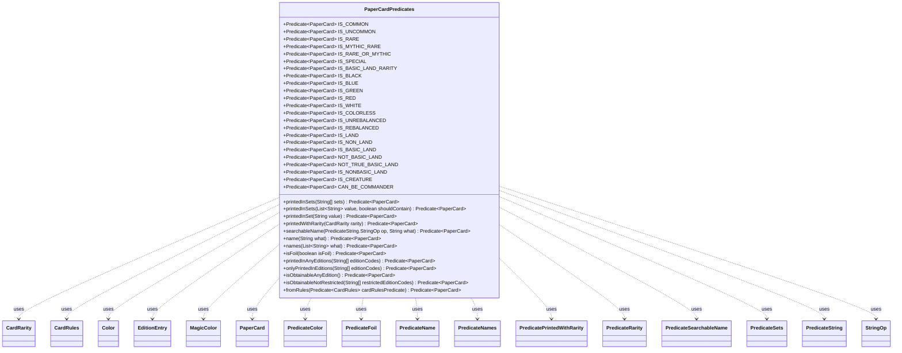

---
aliases:
  - PaperCardPredicates
tags:
  - java/class
  - module/forge-core
  - pkg/forge/item
fqn: forge.item.PaperCardPredicates
package: forge.item
module: forge-core
kind: Class
---

# PaperCardPredicates

**Package:** `forge.item` &nbsp; **Module:** `forge-core` &nbsp; **Kind:** Class



## Relationships
**Uses:**
- [[forge.card.CardEdition.EditionEntry|EditionEntry]]
- [[forge.card.CardRarity|CardRarity]]
- [[forge.card.CardRules|CardRules]]
- [[forge.card.MagicColor|MagicColor]]
- [[forge.card.MagicColor.Color|Color]]
- [[forge.item.PaperCard|PaperCard]]
- [[forge.item.PaperCardPredicates.PredicateColor|PredicateColor]]
- [[forge.item.PaperCardPredicates.PredicateFoil|PredicateFoil]]
- [[forge.item.PaperCardPredicates.PredicateName|PredicateName]]
- [[forge.item.PaperCardPredicates.PredicateNames|PredicateNames]]
- [[forge.item.PaperCardPredicates.PredicatePrintedWithRarity|PredicatePrintedWithRarity]]
- [[forge.item.PaperCardPredicates.PredicateRarity|PredicateRarity]]
- [[forge.item.PaperCardPredicates.PredicateSearchableName|PredicateSearchableName]]
- [[forge.item.PaperCardPredicates.PredicateSets|PredicateSets]]
- [[forge.util.PredicateString|PredicateString]]
- [[forge.util.PredicateString.StringOp|StringOp]]

## Source
`forge-core/src/main/java/forge/item/PaperCardPredicates.java`

```java
package forge.item;

import com.google.common.collect.Lists;

import forge.StaticData;
import forge.card.*;
import forge.card.CardEdition.EditionEntry;
import forge.util.PredicateString;
import org.apache.commons.lang3.StringUtils;

import java.util.Arrays;
import java.util.HashSet;
import java.util.List;
import java.util.Set;
import java.util.TreeSet;
import java.util.function.Predicate;

/**
 * Filters based on PaperCard values.
 */
public abstract class PaperCardPredicates {

    public static Predicate<PaperCard> printedInSets(final String[] sets) {
        return printedInSets(Lists.newArrayList(sets), true);
    }

    public static Predicate<PaperCard> printedInSets(final List<String> value, final boolean shouldContain) {
        if ((value == null) || value.isEmpty()) {
            return x -> true;
        }
        return new PredicateSets(value, shouldContain);
    }

    public static Predicate<PaperCard> printedInSet(final String value) {
        if (StringUtils.isEmpty(value)) {
            return x -> true;
        }
        return new PredicateSets(Lists.newArrayList(value), true);
    }

    public static Predicate<PaperCard> printedWithRarity(final CardRarity rarity) {
        return new PredicatePrintedWithRarity(rarity);
    }

    public static Predicate<PaperCard> searchableName(final PredicateString.StringOp op, final String what) {
        return new PredicateSearchableName(op, what);
    }

    public static Predicate<PaperCard> name(final String what) {
        return new PredicateName(what);
    }

    public static Predicate<PaperCard> names(final List<String> what) {
        return new PredicateNames(what);
    }

    /**
     * Filters on a card foil status
     */
    public static Predicate<PaperCard> isFoil(final boolean isFoil) {
        return new PredicateFoil(isFoil);
    }

    /**
     * Filters cards that were printed in any of the specified editions.
     */
    public static Predicate<PaperCard> printedInAnyEditions(final String[] editionCodes) {
        Set<String> editions = new HashSet<>(Arrays.asList(editionCodes));

        return card -> StaticData.instance().getCommonCards().getAllCards(card).stream()
            .map(PaperCard::getEdition).anyMatch(editionCode ->
                editions.contains(editionCode) &&
                    StaticData.instance().getCardEdition(editionCode).isCardObtainable(card.getName())
        );
    }

    /**
     * Filters cards that were only printed in any of the specified editions.
     */
    public static Predicate<PaperCard> onlyPrintedInEditions(final String[] editionCodes) {
        Set<String> editions = new HashSet<>(Arrays.asList(editionCodes));

        return card -> StaticData.instance().getCommonCards().getAllCards(card).stream()
            .map(PaperCard::getEdition).allMatch(editionCode ->
                editions.contains(editionCode) &&
                    StaticData.instance().getCardEdition(editionCode).isCardObtainable(card.getName())
        );
    }

    /**
     * Filters cards that are obtainable in any edition.
     */
    public static Predicate<PaperCard> isObtainableAnyEdition() {
        return card -> StaticData.instance().getCommonCards().getAllCards(card).stream()
            .map(PaperCard::getEdition).anyMatch(editionCode ->
                StaticData.instance().getCardEdition(editionCode).isCardObtainable(card.getName())
            );
    }

    /**
     * Returns a predicate that checks whether a card has at least one printing
     * in a non-restricted edition and that printing is obtainable.
     * @param restrictedEditionCodes Array of edition codes that are restricted.
     * @return Predicate
     */
    public static Predicate<PaperCard> isObtainableNotRestricted(final String[] restrictedEditionCodes) {
        Set<String> restrictedEditions = new HashSet<>(Arrays.asList(restrictedEditionCodes));

        return card -> StaticData.instance().getCommonCards()
            .getAllCards(card).stream()
            .map(PaperCard::getEdition)
            .anyMatch(editionCode ->
                !restrictedEditions.contains(editionCode) &&
                    StaticData.instance().getCardEdition(editionCode).isCardObtainable(card.getName())
        );
    }

    private static final class PredicatePrintedWithRarity implements Predicate<PaperCard> {
        private final CardRarity matchingRarity;

        @Override
        public boolean test(final PaperCard card) {
            return StaticData.instance().getEditions().stream()
                .anyMatch(ce -> {
                    List<EditionEntry> entries = ce.getCardInSet(card.getName());
                    return entries != null && entries.stream()
                        .anyMatch(ee -> ee.rarity() == matchingRarity);
                });
        }

        private PredicatePrintedWithRarity(final CardRarity rarity) {
            this.matchingRarity = rarity;
        }
    }

    private static final class PredicateColor implements Predicate<PaperCard> {
        private final MagicColor.Color operand;

        private PredicateColor(final MagicColor.Color color) {
            this.operand = color;
        }

        @Override
        public boolean test(final PaperCard card) {
            if (card.getRules().getColor().hasAnyColor(operand)) {
                return true;
            }
            if (card.getRules().getType().hasType(CardType.CoreType.Land) && card.getRules().getColorIdentity().hasAnyColor(operand)) {
                return true;
            }
            return false;
        }
    }

    private static final class PredicateFoil implements Predicate<PaperCard> {
        private final boolean operand;

        @Override
        public boolean test(final PaperCard card) { return card.isFoil() == operand; }

        private PredicateFoil(final boolean isFoil) {
            this.operand = isFoil;
        }
    }

    private static final class PredicateRarity implements Predicate<PaperCard> {
        private final CardRarity operand;

        @Override
        public boolean test(final PaperCard card) {
            return card.getRarity() == this.operand;
        }

        private PredicateRarity(final CardRarity rarity) {
            this.operand = rarity;
        }
    }

    public static final class PredicateRarities implements Predicate<PaperCard> {
        private final HashSet<CardRarity> operand;

        @Override
        public boolean test(final PaperCard card) {
            return this.operand.contains(card.getRarity());
        }

        public PredicateRarities(CardRarity... rarities) {
            this.operand = new HashSet<>(Arrays.asList(rarities));
        }
    }

    private static final class PredicateSets implements Predicate<PaperCard> {
        private final Set<String> sets;
        private final boolean mustContain;

        @Override
        public boolean test(final PaperCard card) {
            return this.sets.contains(card.getEdition()) == this.mustContain &&
                StaticData.instance().getCardEdition(card.getEdition()).isCardObtainable(card.getName());
        }

        private PredicateSets(final List<String> wantSets, final boolean shouldContain) {
            this.sets = new TreeSet<>(String.CASE_INSENSITIVE_ORDER);
            this.sets.addAll(wantSets);
            this.mustContain = shouldContain;
        }
    }

    private static final class PredicateSearchableName extends PredicateString<PaperCard> {
        private final String operand;

        PredicateSearchableName(final StringOp operator, final String operand) {
            super(operator);
            this.operand = operand;
        }

        @Override
        public boolean test(PaperCard paperCard) {
            return paperCard.getAllSearchableNames().stream().anyMatch(name -> this.op(name, this.operand));
        }
    }

    private static final class PredicateName extends PredicateString<PaperCard> {
        private final String operand;

        @Override
        public boolean test(final PaperCard card) {
            return this.op(card.getName(), this.operand);
        }

        private PredicateName(final String operand) {
            super(StringOp.EQUALS_IC);
            this.operand = operand;
        }
    }

    private static final class PredicateNames extends PredicateString<PaperCard> {
        private final List<String> operand;

        @Override
        public boolean test(final PaperCard card) {
            final String cardName = card.getName();
            for (final String element : this.operand) {
                if (this.op(cardName, element)) {
                    return true;
                }
            }
            return false;
        }

        private PredicateNames(final List<String> operand) {
            super(StringOp.EQUALS);
            this.operand = operand;
        }
    }

    public static Predicate<PaperCard> fromRules(Predicate<CardRules> cardRulesPredicate) {
        return paperCard -> cardRulesPredicate.test(paperCard.getRules());
    }

    public static final Predicate<PaperCard> IS_COMMON = new PredicateRarity(CardRarity.Common);
    public static final Predicate<PaperCard> IS_UNCOMMON = new PredicateRarity(CardRarity.Uncommon);
    public static final Predicate<PaperCard> IS_RARE = new PredicateRarity(CardRarity.Rare);
    public static final Predicate<PaperCard> IS_MYTHIC_RARE = new PredicateRarity(CardRarity.MythicRare);
    public static final Predicate<PaperCard> IS_RARE_OR_MYTHIC = PaperCardPredicates.IS_RARE.or(PaperCardPredicates.IS_MYTHIC_RARE);
    public static final Predicate<PaperCard> IS_SPECIAL = new PredicateRarity(CardRarity.Special);
    public static final Predicate<PaperCard> IS_BASIC_LAND_RARITY = new PredicateRarity(CardRarity.BasicLand);
    public static final Predicate<PaperCard> IS_BLACK = new PredicateColor(MagicColor.Color.BLACK);
    public static final Predicate<PaperCard> IS_BLUE = new PredicateColor(MagicColor.Color.BLUE);
    public static final Predicate<PaperCard> IS_GREEN = new PredicateColor(MagicColor.Color.GREEN);
    public static final Predicate<PaperCard> IS_RED = new PredicateColor(MagicColor.Color.RED);
    public static final Predicate<PaperCard> IS_WHITE = new PredicateColor(MagicColor.Color.WHITE);
    public static final Predicate<PaperCard> IS_COLORLESS = paperCard -> paperCard.getRules().getColor().isColorless();
    public static final Predicate<PaperCard> IS_UNREBALANCED = PaperCard::isUnRebalanced;
    public static final Predicate<PaperCard> IS_REBALANCED = PaperCard::isRebalanced;

    //Common rules-based predicates.
    public static final Predicate<PaperCard> IS_LAND = fromRules(CardRulesPredicates.IS_LAND);
    public static final Predicate<PaperCard> IS_NON_LAND = fromRules(CardRulesPredicates.IS_NON_LAND);
    public static final Predicate<PaperCard> IS_BASIC_LAND = fromRules(CardRulesPredicates.IS_BASIC_LAND);
    /** Matches any card except Plains, Island, Swamp, Mountain, Forest, or Wastes. */
    public static final Predicate<PaperCard> NOT_BASIC_LAND = fromRules(CardRulesPredicates.NOT_BASIC_LAND);
    /** Matches any card except Plains, Island, Swamp, Mountain, or Forest. */
    public static final Predicate<PaperCard> NOT_TRUE_BASIC_LAND = fromRules(CardRulesPredicates.NOT_TRUE_BASIC_LAND);
    public static final Predicate<PaperCard> IS_NONBASIC_LAND = fromRules(CardRulesPredicates.IS_NONBASIC_LAND);
    public static final Predicate<PaperCard> IS_CREATURE = fromRules(CardRulesPredicates.IS_CREATURE);
    public static final Predicate<PaperCard> CAN_BE_COMMANDER = fromRules(CardRulesPredicates.CAN_BE_COMMANDER);
}
```
