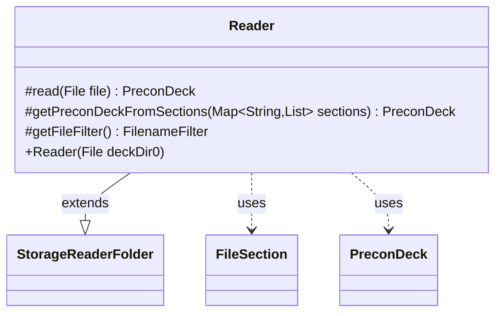

---
aliases:
  - Reader
tags:
  - java/class
  - module/forge-core
  - pkg/forge/item
fqn: forge.item.PreconDeck.Reader
package: forge.item
module: forge-core
kind: Class
---

# Reader

**Package:** `forge.item` &nbsp; **Module:** `forge-core` &nbsp; **Kind:** Class



## Relationships
**Extends:**
- [[forge.util.storage.StorageReaderFolder|StorageReaderFolder]]
**Uses:**
- [[forge.item.PreconDeck|PreconDeck]]
- [[forge.util.FileSection|FileSection]]

## Source
`forge-core/src/main/java/forge/item/PreconDeck.java` — declaration excerpt

```java
    public static class Reader extends StorageReaderFolder<PreconDeck> {
        public Reader(final File deckDir0) {
            super(deckDir0, PreconDeck::getName);
        }

        @Override
        protected PreconDeck read(final File file) {
            return getPreconDeckFromSections(FileSection.parseSections(FileUtil.readFile(file)));
        }

        // To be able to read "shops" section in overloads
        protected PreconDeck getPreconDeckFromSections(final Map<String, List<String>> sections) {
            FileSection kv = FileSection.parse(sections.get("metadata"), FileSection.EQUALS_KV_SEPARATOR);
            String imageFilename = kv.get("Image");
            String description = kv.get("Description");
            String deckEdition = kv.get("set");
            String set = deckEdition == null || StaticData.instance().getEditions().get(deckEdition.toUpperCase()) == null ? "n/a" : deckEdition;
            PreconDeck result = new PreconDeck(DeckSerializer.fromSections(sections), set, description);
            result.imageFilename = imageFilename;
            return result;
        }

        @Override
        protected FilenameFilter getFileFilter() {
            return DeckStorage.DCK_FILE_FILTER;
        }
    }
```
