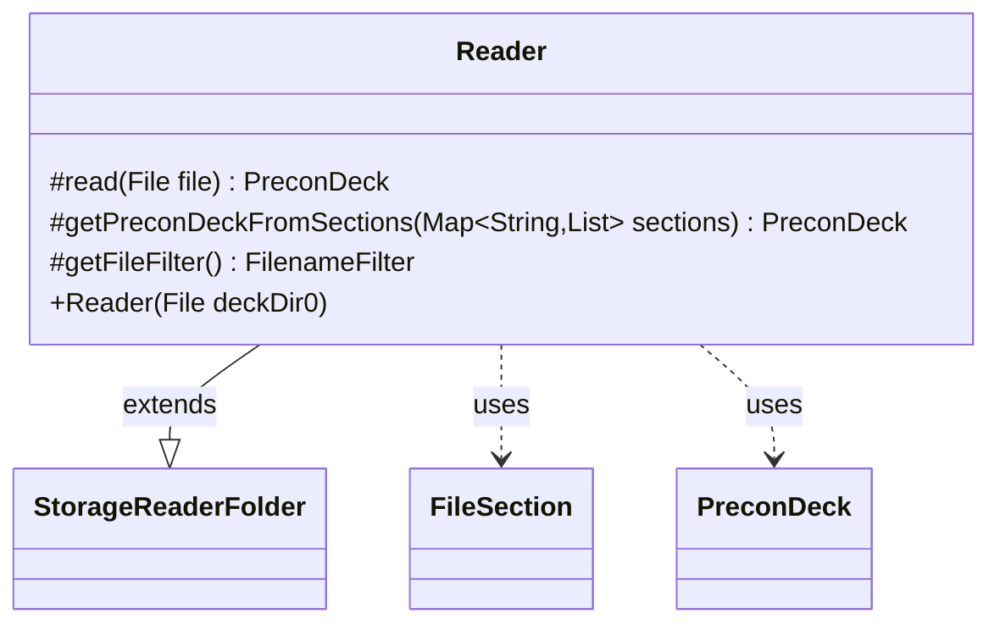

---
aliases:
  - Reader
tags:
  - java/class
  - module/forge-core
  - pkg/forge/item
fqn: forge.item.PreconDeck.Reader
package: forge.item
module: forge-core
kind: Class
---

# Reader

**Package:** `forge.item`   **Module:** `forge-core`   **Kind:** Class



## Relationships
**Extends:**
- [[forge.util.storage.StorageReaderFolder|StorageReaderFolder]]
**Uses:**
- [[forge.item.PreconDeck|PreconDeck]]
- [[forge.util.FileSection|FileSection]]

## Design Description

Reader is a static nested helper inside `PreconDeck` that loads preconstructed deck definitions from a directory of files. By extending `StorageReaderFolder<PreconDeck>`, it plugs into Forge's generic folder-backed storage framework, supplying the type-specific logic for turning each file into a `PreconDeck` while delegating naming (via the `PreconDeck::getName` key extractor) and directory iteration to the superclass.

It overrides `read` to parse a file into named sections with `FileSection`, then builds a deck from its "metadata" section—resolving image, description, and edition, and validating the set against `StaticData`'s known editions (falling back to "n/a"). The `getPreconDeckFromSections` step is deliberately factored out as a `protected` method so subclasses can extend parsing (e.g. to read a "shops" section), and `getFileFilter` restricts loading to `.dck` files.

## Source
`forge-core/src/main/java/forge/item/PreconDeck.java` — declaration excerpt

```java
    public static class Reader extends StorageReaderFolder<PreconDeck> {
        public Reader(final File deckDir0) {
            super(deckDir0, PreconDeck::getName);
        }

        @Override
        protected PreconDeck read(final File file) {
            return getPreconDeckFromSections(FileSection.parseSections(FileUtil.readFile(file)));
        }

        // To be able to read "shops" section in overloads
        protected PreconDeck getPreconDeckFromSections(final Map<String, List<String>> sections) {
            FileSection kv = FileSection.parse(sections.get("metadata"), FileSection.EQUALS_KV_SEPARATOR);
            String imageFilename = kv.get("Image");
            String description = kv.get("Description");
            String deckEdition = kv.get("set");
            String set = deckEdition == null || StaticData.instance().getEditions().get(deckEdition.toUpperCase()) == null ? "n/a" : deckEdition;
            PreconDeck result = new PreconDeck(DeckSerializer.fromSections(sections), set, description);
            result.imageFilename = imageFilename;
            return result;
        }

        @Override
        protected FilenameFilter getFileFilter() {
            return DeckStorage.DCK_FILE_FILTER;
        }
    }
```

## Python
`forge/item/PreconDeck/Reader.py`

```python
from forge.util.storage.StorageReaderFolder import StorageReaderFolder
from forge.item.PreconDeck import PreconDeck
from forge.util.FileSection import FileSection
from forge.util.FileUtil import FileUtil
from forge.StaticData import StaticData
from forge.deck.DeckSerializer import DeckSerializer
from forge.deck.DeckStorage import DeckStorage


class Reader(StorageReaderFolder):
    def __init__(self, deckDir0):
        super().__init__(deckDir0, PreconDeck.getName)

    def read(self, file):
        return self.getPreconDeckFromSections(FileSection.parseSections(FileUtil.readFile(file)))

    # To be able to read "shops" section in overloads
    def getPreconDeckFromSections(self, sections: dict[str, list[str]]):
        kv = FileSection.parse(sections.get("metadata"), FileSection.EQUALS_KV_SEPARATOR)
        imageFilename = kv.get("Image")
        description = kv.get("Description")
        deckEdition = kv.get("set")
        set = "n/a" if deckEdition is None or StaticData.instance().getEditions().get(deckEdition.upper()) is None else deckEdition
        result = PreconDeck(DeckSerializer.fromSections(sections), set, description)
        result.imageFilename = imageFilename
        return result

    def getFileFilter(self):
        return DeckStorage.DCK_FILE_FILTER
```
