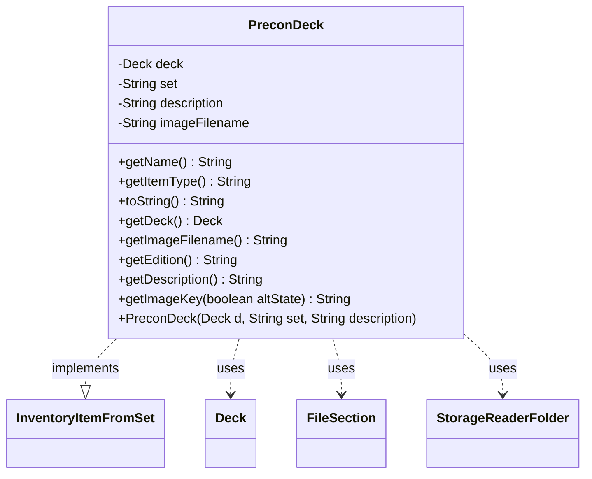

---
aliases:
  - PreconDeck
tags:
  - java/class
  - module/forge-core
  - pkg/forge/item
fqn: forge.item.PreconDeck
package: forge.item
module: forge-core
kind: Class
---

# PreconDeck

**Package:** `forge.item` &nbsp; **Module:** `forge-core` &nbsp; **Kind:** Class



## Relationships
**Implements:**
- [[forge.item.InventoryItemFromSet|InventoryItemFromSet]]
**Uses:**
- [[forge.deck.Deck|Deck]]
- [[forge.util.FileSection|FileSection]]
- [[forge.util.storage.StorageReaderFolder|StorageReaderFolder]]

## Design Description

PreconDeck represents a prebuilt ("precon") deck as an inventory item within Forge's item model. It implements InventoryItemFromSet, exposing a deck's name, edition/set code, item type label ("Prebuilt Deck"), description, and image key, while wrapping an immutable Deck instance it delegates name and string representation to. Most state is final, reflecting an intentionally read-only catalog item; only the image filename is mutable, set during loading.

Its nested Reader, a StorageReaderFolder<PreconDeck>, handles persistence: it parses deck files via FileSection into metadata sections, validates the set against StaticData's known editions (defaulting to "n/a"), and reconstructs decks through DeckSerializer. This keeps file-format and edition-validation concerns separate from the item's value-object role, collaborating with the deck and storage subsystems to populate the inventory.

## Source
`forge-core/src/main/java/forge/item/PreconDeck.java`

```java
/*
 * Forge: Play Magic: the Gathering.
 * Copyright (C) 2011  Nate
 *
 * This program is free software: you can redistribute it and/or modify
 * it under the terms of the GNU General Public License as published by
 * the Free Software Foundation, either version 3 of the License, or
 * (at your option) any later version.
 * 
 * This program is distributed in the hope that it will be useful,
 * but WITHOUT ANY WARRANTY; without even the implied warranty of
 * MERCHANTABILITY or FITNESS FOR A PARTICULAR PURPOSE.  See the
 * GNU General Public License for more details.
 * 
 * You should have received a copy of the GNU General Public License
 * along with this program.  If not, see <http://www.gnu.org/licenses/>.
 */
package forge.item;

import forge.ImageKeys;
import forge.StaticData;
import forge.deck.Deck;
import forge.deck.io.DeckSerializer;
import forge.deck.io.DeckStorage;
import forge.util.FileSection;
import forge.util.FileUtil;
import forge.util.storage.StorageReaderFolder;

import java.io.File;
import java.io.FilenameFilter;
import java.util.List;
import java.util.Map;


public class PreconDeck implements InventoryItemFromSet {
    private final Deck deck;
    private final String set;
    private final String description;
    private String imageFilename;
    
    // private final SellRules recommendedDeals;

    @Override
    public String getName() {
        return this.deck.getName();
    }

    @Override
    public String getItemType() {
        return "Prebuilt Deck";
    }

    @Override
    public String toString() {
        return this.deck.toString();
    }

    public PreconDeck(final Deck d, String set, String description) {
        deck = d;
        this.set = set;
        this.description = description;
    }
    
    public final Deck getDeck() {
        return this.deck;
    }

    /**
     * Gets the recommended deals.
     * 
     * @return the recommended deals
     */
//    public final SellRules getRecommendedDeals() {
//        return this.recommendedDeals;
//    }

    public final String getImageFilename() {
        return imageFilename;
    }

    @Override
    public String getEdition() {
        return this.set;
    }

    public final String getDescription() {
        return this.description;
    }

    public static class Reader extends StorageReaderFolder<PreconDeck> {
        public Reader(final File deckDir0) {
            super(deckDir0, PreconDeck::getName);
        }

        @Override
        protected PreconDeck read(final File file) {
            return getPreconDeckFromSections(FileSection.parseSections(FileUtil.readFile(file)));
        }

        // To be able to read "shops" section in overloads
        protected PreconDeck getPreconDeckFromSections(final Map<String, List<String>> sections) {
            FileSection kv = FileSection.parse(sections.get("metadata"), FileSection.EQUALS_KV_SEPARATOR);
            String imageFilename = kv.get("Image");
            String description = kv.get("Description");
            String deckEdition = kv.get("set");
            String set = deckEdition == null || StaticData.instance().getEditions().get(deckEdition.toUpperCase()) == null ? "n/a" : deckEdition;
            PreconDeck result = new PreconDeck(DeckSerializer.fromSections(sections), set, description);
            result.imageFilename = imageFilename;
            return result;
        }

        @Override
        protected FilenameFilter getFileFilter() {
            return DeckStorage.DCK_FILE_FILTER;
        }
    }

    @Override
    public String getImageKey(boolean altState) {
        return ImageKeys.PRECON_PREFIX + imageFilename;
    }      
    
}
```

## Python
`forge/item/PreconDeck.py`

```python
from forge.ImageKeys import ImageKeys
from forge.StaticData import StaticData
from forge.deck.Deck import Deck
from forge.deck.io.DeckSerializer import DeckSerializer
from forge.deck.io.DeckStorage import DeckStorage
from forge.util.FileSection import FileSection
from forge.util.FileUtil import FileUtil
from forge.util.storage.StorageReaderFolder import StorageReaderFolder
from forge.item.InventoryItemFromSet import InventoryItemFromSet


class PreconDeck(InventoryItemFromSet):
    # private final SellRules recommendedDeals;

    def getName(self) -> str:
        return self.deck.getName()

    def getItemType(self) -> str:
        return "Prebuilt Deck"

    def __str__(self) -> str:
        return str(self.deck)

    def __init__(self, d: Deck, set: str, description: str):
        self.deck = d
        self.set = set
        self.description = description
        self.imageFilename = None

    def getDeck(self) -> Deck:
        return self.deck

    # Gets the recommended deals.
    #
    # @return the recommended deals
    #    public final SellRules getRecommendedDeals() {
    #        return this.recommendedDeals;
    #    }

    def getImageFilename(self) -> str:
        return self.imageFilename

    def getEdition(self) -> str:
        return self.set

    def getDescription(self) -> str:
        return self.description

    class Reader(StorageReaderFolder):
        def __init__(self, deckDir0):
            super().__init__(deckDir0, PreconDeck.getName)

        def read(self, file):
            return self.getPreconDeckFromSections(FileSection.parseSections(FileUtil.readFile(file)))

        # To be able to read "shops" section in overloads
        def getPreconDeckFromSections(self, sections: dict[str, list[str]]):
            kv = FileSection.parse(sections.get("metadata"), FileSection.EQUALS_KV_SEPARATOR)
            imageFilename = kv.get("Image")
            description = kv.get("Description")
            deckEdition = kv.get("set")
            set = "n/a" if deckEdition is None or StaticData.instance().getEditions().get(deckEdition.upper()) is None else deckEdition
            result = PreconDeck(DeckSerializer.fromSections(sections), set, description)
            result.imageFilename = imageFilename
            return result

        def getFileFilter(self):
            return DeckStorage.DCK_FILE_FILTER

    def getImageKey(self, altState: bool) -> str:
        return ImageKeys.PRECON_PREFIX + self.imageFilename
```
