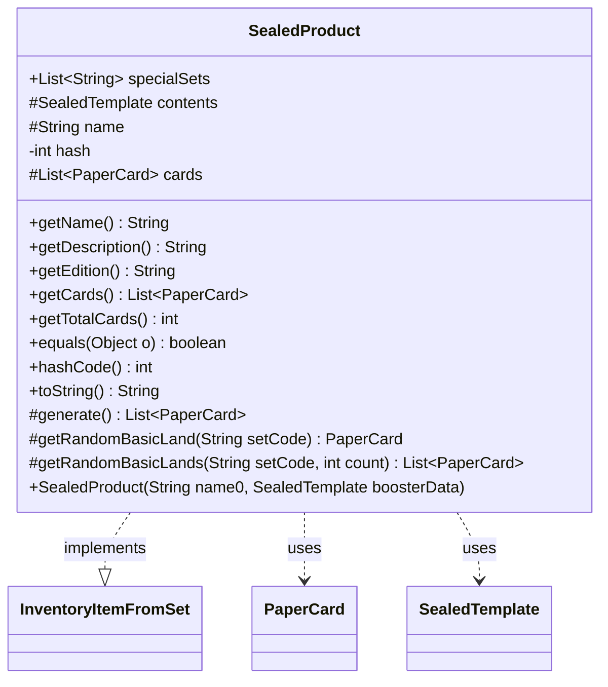

---
aliases:
  - SealedProduct
tags:
  - java/class
  - module/forge-core
  - pkg/forge/item
fqn: forge.item.SealedProduct
package: forge.item
module: forge-core
kind: Class
---

# SealedProduct

**Package:** `forge.item` &nbsp; **Module:** `forge-core` &nbsp; **Kind:** Class



## Relationships
**Implements:**
- [[forge.item.InventoryItemFromSet|InventoryItemFromSet]]
**Uses:**
- [[forge.item.PaperCard|PaperCard]]
- [[forge.item.SealedTemplate|SealedTemplate]]

## Design Description

SealedProduct is an abstract base for sealed Magic products (booster packs and similar) within the `forge.item` package, modeling a named, set-bound collection of cards that can be opened to yield a concrete card list. As an `InventoryItemFromSet` it exposes identity and edition metadata, deriving its name, edition, and description from an immutable `SealedTemplate` that defines the product's contents. It collaborates with `PaperCard` as the cards it produces and delegates actual pack generation to `BoosterGenerator`.

Notable design intent: the card list is lazily generated and cached on first access via `getCards()`, while `equals`/`hashCode` rest on the immutable name and template with a precomputed hash. Subclasses customize behavior through the protected `generate()` hook and basic-land helpers, and a static `specialSets` list enumerates the mono-color special sets.

## Source
`forge-core/src/main/java/forge/item/SealedProduct.java`

```java
/*
 * Forge: Play Magic: the Gathering.
 * Copyright (C) 2011  Forge Team
 *
 * This program is free software: you can redistribute it and/or modify
 * it under the terms of the GNU General Public License as published by
 * the Free Software Foundation, either version 3 of the License, or
 * (at your option) any later version.
 *
 * This program is distributed in the hope that it will be useful,
 * but WITHOUT ANY WARRANTY; without even the implied warranty of
 * MERCHANTABILITY or FITNESS FOR A PARTICULAR PURPOSE.  See the
 * GNU General Public License for more details.
 *
 * You should have received a copy of the GNU General Public License
 * along with this program.  If not, see <http://www.gnu.org/licenses/>.
 */

package forge.item;

import forge.StaticData;
import forge.item.generation.BoosterGenerator;
import forge.util.StreamUtil;

import java.util.ArrayList;
import java.util.List;

public abstract class SealedProduct implements InventoryItemFromSet {

    public static final List<String> specialSets = new ArrayList<>();

    protected final SealedTemplate contents;
    protected final String name;
    private final int hash;
    protected List<PaperCard> cards = null;

    static {
        specialSets.add("Black");
        specialSets.add("Blue");
        specialSets.add("Green");
        specialSets.add("Red");
        specialSets.add("White");
        specialSets.add("Colorless");
    }

    public SealedProduct(String name0, SealedTemplate boosterData) {
        if (null == name0)       { throw new IllegalArgumentException("name0 must not be null"); }
        if (null == boosterData) {
            throw new IllegalArgumentException("boosterData for " + name0 + " must not be null");
        }
        contents = boosterData;
        name = name0;
        hash = name.hashCode() ^ getClass().hashCode() ^ contents.hashCode();
    }

    @Override
    public final String getName() {
        return name + " " + getItemType();
    }

    public String getDescription() {
        return contents.toString();
    }

    @Override
    public final String getEdition() {
        return contents.getEdition();
    }

    public List<PaperCard> getCards() {
        if (null == cards) {
            cards = generate();
        }

        return cards;
    }

    public int getTotalCards() {
        return contents.getNumberOfCardsExpected();
    }

    @Override
    public boolean equals(final Object o) {
        if (this == o) return true;
        if (o == null || getClass() != o.getClass()) return false;

        SealedProduct other = (SealedProduct) o;

        return contents.equals(other.contents) && name.equals(other.name);
    }

    @Override
    public int hashCode() {
        return hash;
    }

    @Override
    public String toString() {
        return getName();
    }

    protected List<PaperCard> generate() {
        return BoosterGenerator.getBoosterPack(contents);
    }

    protected PaperCard getRandomBasicLand(final String setCode) {
        return this.getRandomBasicLands(setCode, 1).get(0);
    }

    protected List<PaperCard> getRandomBasicLands(final String setCode, final int count) {
        return StaticData.instance().getCommonCards().streamAllCards()
                .filter(PaperCardPredicates.printedInSet(setCode))
                .filter(PaperCardPredicates.IS_BASIC_LAND)
                .collect(StreamUtil.random(count));
    }
}
```

## Python
`forge/item/SealedProduct.py`

```python
from forge.StaticData import StaticData
from forge.item.generation.BoosterGenerator import BoosterGenerator
from forge.util.StreamUtil import StreamUtil

from forge.item.InventoryItemFromSet import InventoryItemFromSet
from forge.item.PaperCard import PaperCard
from forge.item.SealedTemplate import SealedTemplate
from forge.item.PaperCardPredicates import PaperCardPredicates


class SealedProduct(InventoryItemFromSet):

    specialSets: list[str] = []

    def __init__(self, name0: str, boosterData: SealedTemplate):
        if name0 is None:
            raise ValueError("name0 must not be null")
        if boosterData is None:
            raise ValueError("boosterData for " + name0 + " must not be null")
        self.contents = boosterData
        self.name = name0
        self.cards: list[PaperCard] = None
        self.hash = hash(self.name) ^ hash(self.__class__) ^ hash(self.contents)

    def getName(self) -> str:
        return self.name + " " + self.getItemType()

    def getDescription(self) -> str:
        return str(self.contents)

    def getEdition(self) -> str:
        return self.contents.getEdition()

    def getCards(self) -> list[PaperCard]:
        if self.cards is None:
            self.cards = self.generate()

        return self.cards

    def getTotalCards(self) -> int:
        return self.contents.getNumberOfCardsExpected()

    def equals(self, o: object) -> bool:
        if self is o:
            return True
        if o is None or self.__class__ != o.__class__:
            return False

        other = o

        return self.contents.equals(other.contents) and self.name == other.name

    def __eq__(self, o: object) -> bool:
        return self.equals(o)

    def hashCode(self) -> int:
        return self.hash

    def __hash__(self) -> int:
        return self.hashCode()

    def toString(self) -> str:
        return self.getName()

    def __str__(self) -> str:
        return self.toString()

    def generate(self) -> list[PaperCard]:
        return BoosterGenerator.getBoosterPack(self.contents)

    def getRandomBasicLand(self, setCode: str) -> PaperCard:
        return self.getRandomBasicLands(setCode, 1)[0]

    def getRandomBasicLands(self, setCode: str, count: int) -> list[PaperCard]:
        return StaticData.instance().getCommonCards().streamAllCards() \
            .filter(PaperCardPredicates.printedInSet(setCode)) \
            .filter(PaperCardPredicates.IS_BASIC_LAND) \
            .collect(StreamUtil.random(count))


specialSets.append("Black")
specialSets.append("Blue")
specialSets.append("Green")
specialSets.append("Red")
specialSets.append("White")
specialSets.append("Colorless")
```
