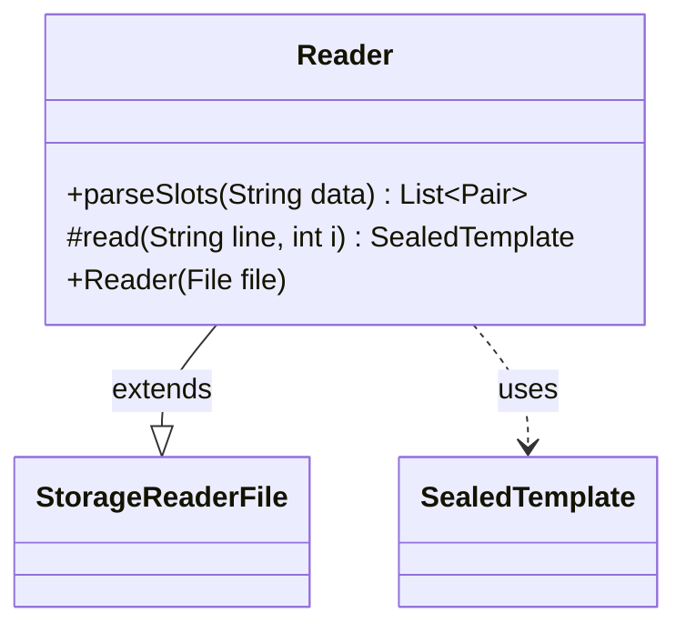

---
aliases:
  - Reader
tags:
  - java/class
  - module/forge-core
  - pkg/forge/item
fqn: forge.item.SealedTemplate.Reader
package: forge.item
module: forge-core
kind: Class
---

# Reader

**Package:** `forge.item`   **Module:** `forge-core`   **Kind:** Class



## Relationships
**Extends:**
- [[forge.util.storage.StorageReaderFile|StorageReaderFile]]
**Uses:**
- [[forge.item.SealedTemplate|SealedTemplate]]

## Design Description

The Reader is a nested static helper that loads SealedTemplate definitions from a text file, serving as the persistence/parsing layer for sealed-deck product templates. Extending StorageReaderFile<SealedTemplate>, it keys each entry by the template's name and overrides read to convert a single colon-delimited line into a SealedTemplate, delegating the booster-slot portion to parseSlots. That helper splits the data into "count name" pairs using parenthesis-aware tokenization, restoring escaped commas (";" back to ",") so slot descriptors containing commas survive the comma-separated format.

By subclassing the generic file-storage reader, Reader inherits iteration and lookup machinery and need only specify how a line maps to a domain object, keeping the format-specific parsing isolated. The public, static parseSlots is exposed independently of the file-reading lifecycle, allowing slot strings to be parsed directly elsewhere.

## Source
`forge-core/src/main/java/forge/item/SealedTemplate.java` — declaration excerpt

```java
    public final static class Reader extends StorageReaderFile<SealedTemplate> {
        public Reader(File file) {
            super(file, (Function<? super SealedTemplate, String>) (Function<SealedTemplate, String>) SealedTemplate::getName);
        }


        public static List<Pair<String, Integer>> parseSlots(String data) {
            final String[] dataz = TextUtil.splitWithParenthesis(data, ',');
            List<Pair<String, Integer>> slots = new ArrayList<>();
            for (String slotDesc : dataz) {
                String[] kv = TextUtil.splitWithParenthesis(slotDesc, ' ', 2);
                slots.add(ImmutablePair.of(kv[1].replace(";", ","), Integer.parseInt(kv[0])));
            }
            return slots;
        }

        @Override
        protected SealedTemplate read(String line, int i) {
            String[] headAndData = TextUtil.split(line, ':', 2);
            return new SealedTemplate(headAndData[0], parseSlots(headAndData[1]));
        }
    }
```

## Python
`forge/item/SealedTemplate/Reader.py`

```python
from forge.util.storage.StorageReaderFile import StorageReaderFile
from forge.item.SealedTemplate import SealedTemplate
from forge.util.TextUtil import TextUtil
from org.apache.commons.lang3.tuple.Pair import Pair
from org.apache.commons.lang3.tuple.ImmutablePair import ImmutablePair


class Reader(StorageReaderFile):
    def __init__(self, file):
        super().__init__(file, SealedTemplate.getName)

    @staticmethod
    def parseSlots(data: str) -> list[Pair]:
        dataz = TextUtil.splitWithParenthesis(data, ',')
        slots: list[Pair] = []
        for slotDesc in dataz:
            kv = TextUtil.splitWithParenthesis(slotDesc, ' ', 2)
            slots.append(ImmutablePair.of(kv[1].replace(";", ","), int(kv[0])))
        return slots

    def read(self, line: str, i: int) -> SealedTemplate:
        headAndData = TextUtil.split(line, ':', 2)
        return SealedTemplate(headAndData[0], Reader.parseSlots(headAndData[1]))
```
