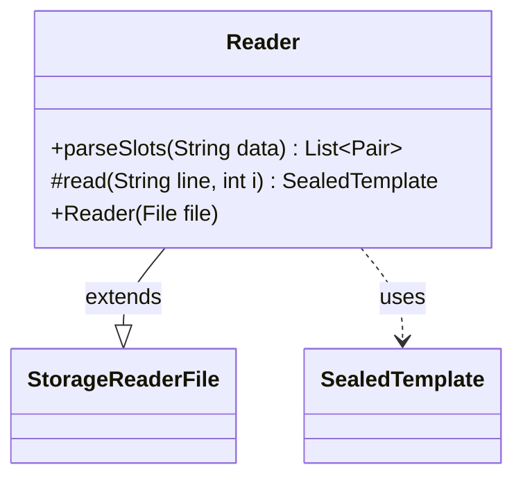

---
aliases:
  - Reader
tags:
  - java/class
  - module/forge-core
  - pkg/forge/item
fqn: forge.item.SealedTemplate.Reader
package: forge.item
module: forge-core
kind: Class
---

# Reader

**Package:** `forge.item` &nbsp; **Module:** `forge-core` &nbsp; **Kind:** Class



## Relationships
**Extends:**
- [[forge.util.storage.StorageReaderFile|StorageReaderFile]]
**Uses:**
- [[forge.item.SealedTemplate|SealedTemplate]]

## Source
`forge-core/src/main/java/forge/item/SealedTemplate.java` — declaration excerpt

```java
    public final static class Reader extends StorageReaderFile<SealedTemplate> {
        public Reader(File file) {
            super(file, (Function<? super SealedTemplate, String>) (Function<SealedTemplate, String>) SealedTemplate::getName);
        }


        public static List<Pair<String, Integer>> parseSlots(String data) {
            final String[] dataz = TextUtil.splitWithParenthesis(data, ',');
            List<Pair<String, Integer>> slots = new ArrayList<>();
            for (String slotDesc : dataz) {
                String[] kv = TextUtil.splitWithParenthesis(slotDesc, ' ', 2);
                slots.add(ImmutablePair.of(kv[1].replace(";", ","), Integer.parseInt(kv[0])));
            }
            return slots;
        }

        @Override
        protected SealedTemplate read(String line, int i) {
            String[] headAndData = TextUtil.split(line, ':', 2);
            return new SealedTemplate(headAndData[0], parseSlots(headAndData[1]));
        }
    }
```
