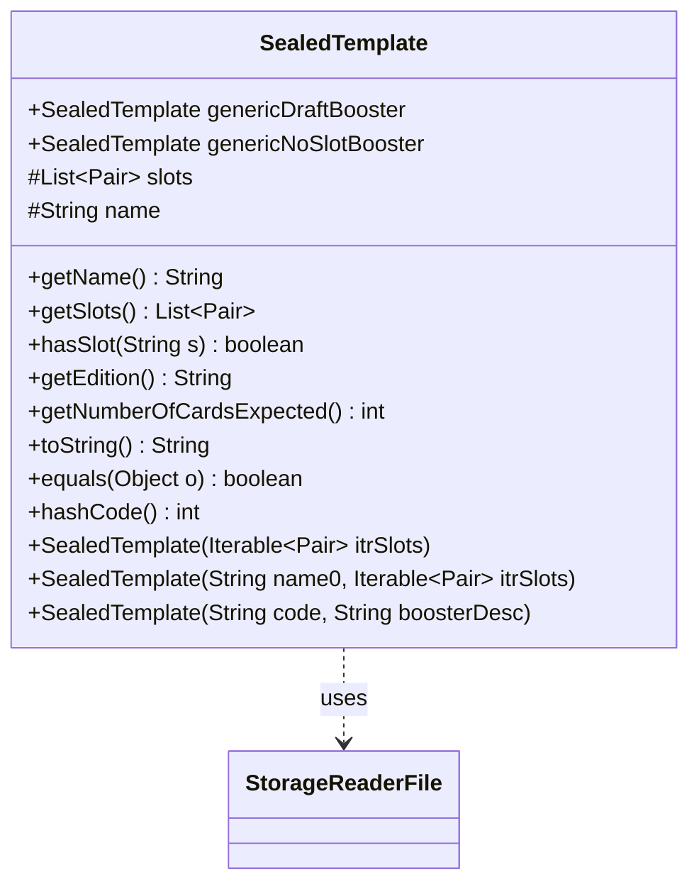

---
aliases:
  - SealedTemplate
tags:
  - java/class
  - module/forge-core
  - pkg/forge/item
fqn: forge.item.SealedTemplate
package: forge.item
module: forge-core
kind: Class
---

# SealedTemplate

**Package:** `forge.item` &nbsp; **Module:** `forge-core` &nbsp; **Kind:** Class



## Relationships
**Uses:**
- [[forge.util.storage.StorageReaderFile|StorageReaderFile]]

## Design Description

SealedTemplate models the composition of a Magic booster pack as an ordered set of weighted slots, each pairing a slot type (e.g. common, uncommon, rare/mythic) with a count. Its responsibility is to describe what a pack should contain rather than to generate it, exposing the slot list, expected card count, and slot-membership queries while remaining an immutable value object with proper equals/hashCode semantics. It ships canonical static instances (genericDraftBooster, genericNoSlotBooster) and parses textual booster descriptions via its nested Reader, which extends StorageReaderFile to load templates from a file keyed by name. Slot definitions reference BoosterSlots constants, and the design favors flexibility through multiple constructors and lenient slot-name matching that strips qualifiers after spaces, colons, or exclamation marks.

## Source
`forge-core/src/main/java/forge/item/SealedTemplate.java`

```java
package forge.item;

import com.google.common.collect.Lists;
import forge.item.generation.BoosterSlots;
import forge.util.TextUtil;
import forge.util.storage.StorageReaderFile;
import org.apache.commons.lang3.tuple.ImmutablePair;
import org.apache.commons.lang3.tuple.Pair;

import java.io.File;
import java.util.ArrayList;
import java.util.List;
import java.util.function.Function;

public class SealedTemplate {

    public final static SealedTemplate genericDraftBooster = new SealedTemplate(null, Lists.newArrayList(
            Pair.of(BoosterSlots.COMMON, 10), Pair.of(BoosterSlots.UNCOMMON, 3),
            Pair.of(BoosterSlots.RARE_MYTHIC, 1), Pair.of(BoosterSlots.BASIC_LAND, 1)
    ));

    // This is a generic cube booster. 15 cards, no rarity slots.
    public final static SealedTemplate genericNoSlotBooster = new SealedTemplate(null, Lists.newArrayList(
            Pair.of(BoosterSlots.ANY, 15)
    ));

    protected final List<Pair<String, Integer>> slots;

    protected final String name;

    public final String getName() {
        return name;
    }

    public final List<Pair<String, Integer>> getSlots() {
        return slots;
    }

    public boolean hasSlot(String s) {
        for (Pair<String, Integer> slot : getSlots()) {
            String slotName = slot.getLeft();
            // Anything after a space or ! or : is not part of the slot's main type
            if (slotName.split("[ :!]")[0].equals(s)) {
                return true;
            }
        }
        return false;
    }

    public final String getEdition() {
        return name;
    }

    public SealedTemplate(Iterable<Pair<String, Integer>> itrSlots) {
        this(null, itrSlots);
    }

    public SealedTemplate(String name0, Iterable<Pair<String, Integer>> itrSlots) {
        slots = Lists.newArrayList(itrSlots);
        name = name0;
    }

    public SealedTemplate(String code, String boosterDesc) {
        this(code, Reader.parseSlots(boosterDesc));
    }

    public int getNumberOfCardsExpected() {
        int sum = 0;
        for(Pair<String, Integer> p : slots) {
            sum += p.getRight();
        }
        return sum;
    }

    @Override
    public String toString() {
        StringBuilder s = new StringBuilder();

        s.append("consisting of ");
        for(Pair<String, Integer> p : slots) {
            s.append(p.getRight()).append(" ").append(p.getLeft()).append(", ");
        }

        // trim the last comma and space
        s.replace(s.length() - 2, s.length(), "");

        // put an 'and' before the previous comma
        int lastCommaIdx = s.lastIndexOf(",");
        if (0 < lastCommaIdx) {
            s.replace(lastCommaIdx+1, lastCommaIdx+1, " and");
        }

        return s.toString();
    }

    @Override
    public boolean equals(final Object o) {
        if (this == o) return true;
        if (o == null || getClass() != o.getClass()) return false;

        SealedTemplate template = (SealedTemplate) o;

        return slots.equals(template.slots) && name.equals(template.name);
    }

    @Override
    public int hashCode() {
        int result = slots.hashCode();
        result = 31 * result + name.hashCode();
        return result;
    }

    public final static class Reader extends StorageReaderFile<SealedTemplate> {
        public Reader(File file) {
            super(file, (Function<? super SealedTemplate, String>) (Function<SealedTemplate, String>) SealedTemplate::getName);
        }


        public static List<Pair<String, Integer>> parseSlots(String data) {
            final String[] dataz = TextUtil.splitWithParenthesis(data, ',');
            List<Pair<String, Integer>> slots = new ArrayList<>();
            for (String slotDesc : dataz) {
                String[] kv = TextUtil.splitWithParenthesis(slotDesc, ' ', 2);
                slots.add(ImmutablePair.of(kv[1].replace(";", ","), Integer.parseInt(kv[0])));
            }
            return slots;
        }

        @Override
        protected SealedTemplate read(String line, int i) {
            String[] headAndData = TextUtil.split(line, ':', 2);
            return new SealedTemplate(headAndData[0], parseSlots(headAndData[1]));
        }
    }
}
```

## Python
`forge/item/SealedTemplate.py`

```python
from forge.item.generation.BoosterSlots import BoosterSlots
from forge.util.TextUtil import TextUtil
from forge.util.storage.StorageReaderFile import StorageReaderFile


class SealedTemplate:

    def __init__(self, *args):
        if len(args) == 1:
            # SealedTemplate(Iterable<Pair<String, Integer>> itrSlots)
            itrSlots = args[0]
            self.slots = list(itrSlots)
            self.name = None
        elif len(args) == 2 and isinstance(args[1], str):
            # SealedTemplate(String code, String boosterDesc)
            code, boosterDesc = args
            self.slots = list(SealedTemplate.Reader.parseSlots(boosterDesc))
            self.name = code
        else:
            # SealedTemplate(String name0, Iterable<Pair<String, Integer>> itrSlots)
            name0, itrSlots = args
            self.slots = list(itrSlots)
            self.name = name0

    def getName(self):
        return self.name

    def getSlots(self):
        return self.slots

    def hasSlot(self, s):
        import re
        for slot in self.getSlots():
            slotName = slot[0]
            # Anything after a space or ! or : is not part of the slot's main type
            if re.split("[ :!]", slotName)[0] == s:
                return True
        return False

    def getEdition(self):
        return self.name

    def getNumberOfCardsExpected(self):
        sum = 0
        for p in self.slots:
            sum += p[1]
        return sum

    def __str__(self):
        s = []

        s.append("consisting of ")
        for p in self.slots:
            s.append(str(p[1]))
            s.append(" ")
            s.append(str(p[0]))
            s.append(", ")

        s = "".join(s)

        # trim the last comma and space
        s = s[:len(s) - 2]

        # put an 'and' before the previous comma
        lastCommaIdx = s.rfind(",")
        if 0 < lastCommaIdx:
            s = s[:lastCommaIdx + 1] + " and" + s[lastCommaIdx + 1:]

        return s

    def __eq__(self, o):
        if self is o:
            return True
        if o is None or type(self) is not type(o):
            return False

        template = o

        return self.slots == template.slots and self.name == template.name

    def __hash__(self):
        result = hash(tuple(self.slots))
        result = 31 * result + hash(self.name)
        return result

    class Reader(StorageReaderFile):
        def __init__(self, file):
            super().__init__(file, SealedTemplate.getName)

        @staticmethod
        def parseSlots(data):
            dataz = TextUtil.splitWithParenthesis(data, ',')
            slots = []
            for slotDesc in dataz:
                kv = TextUtil.splitWithParenthesis(slotDesc, ' ', 2)
                slots.append((kv[1].replace(";", ","), int(kv[0])))
            return slots

        def read(self, line, i):
            headAndData = TextUtil.split(line, ':', 2)
            return SealedTemplate(headAndData[0], SealedTemplate.Reader.parseSlots(headAndData[1]))


SealedTemplate.genericDraftBooster = SealedTemplate(None, [
    (BoosterSlots.COMMON, 10), (BoosterSlots.UNCOMMON, 3),
    (BoosterSlots.RARE_MYTHIC, 1), (BoosterSlots.BASIC_LAND, 1)
])

# This is a generic cube booster. 15 cards, no rarity slots.
SealedTemplate.genericNoSlotBooster = SealedTemplate(None, [
    (BoosterSlots.ANY, 15)
])
```
