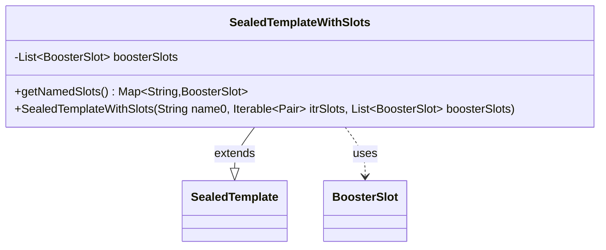

---
aliases:
  - SealedTemplateWithSlots
tags:
  - java/class
  - module/forge-core
  - pkg/forge/item
fqn: forge.item.SealedTemplateWithSlots
package: forge.item
module: forge-core
kind: Class
---

# SealedTemplateWithSlots

**Package:** `forge.item` &nbsp; **Module:** `forge-core` &nbsp; **Kind:** Class



## Relationships
**Extends:**
- [[forge.item.SealedTemplate|SealedTemplate]]
**Uses:**
- [[forge.item.BoosterSlot|BoosterSlot]]

## Design Description

Forge's SealedTemplateWithSlots specializes SealedTemplate to model a booster pack template whose contents are organized into named slots. It extends SealedTemplate, inheriting the base name-and-slot-count configuration (the `Iterable<Pair<String, Integer>>` passed to the superclass), while augmenting it with a list of richer BoosterSlot definitions that describe how each slot is actually filled. Its sole added behavior, getNamedSlots(), exposes those slots as a Map keyed by slot name, derived on demand by streaming the backing list rather than stored redundantly. The boosterSlots field is final, reflecting an immutable, construction-time configuration object whose role is to be queried during sealed-deck or booster generation. The class is deliberately thin, layering slot-resolution capability onto its supertype without altering the established template contract.

## Source
`forge-core/src/main/java/forge/item/SealedTemplateWithSlots.java`

```java
package forge.item;

import org.apache.commons.lang3.tuple.Pair;

import java.util.List;
import java.util.Map;
import java.util.function.Function;
import java.util.stream.Collectors;

public class SealedTemplateWithSlots extends SealedTemplate {
    private final List<BoosterSlot> boosterSlots;

    public SealedTemplateWithSlots(String name0, Iterable<Pair<String, Integer>> itrSlots, List<BoosterSlot> boosterSlots) {
        super(name0, itrSlots);
        this.boosterSlots = boosterSlots;
    }

    public Map<String, BoosterSlot> getNamedSlots() {
        return boosterSlots.stream().collect(Collectors.toMap(BoosterSlot::getSlotName, Function.identity()));
    }
}
```

## Python
`forge/item/SealedTemplateWithSlots.py`

```python
package forge.item

from forge.item.SealedTemplate import SealedTemplate
from forge.item.BoosterSlot import BoosterSlot


class SealedTemplateWithSlots(SealedTemplate):
    def __init__(self, name0: str, itrSlots, boosterSlots: list[BoosterSlot]):
        super().__init__(name0, itrSlots)
        self.boosterSlots = boosterSlots

    def getNamedSlots(self) -> dict[str, BoosterSlot]:
        return {slot.getSlotName(): slot for slot in self.boosterSlots}
```
